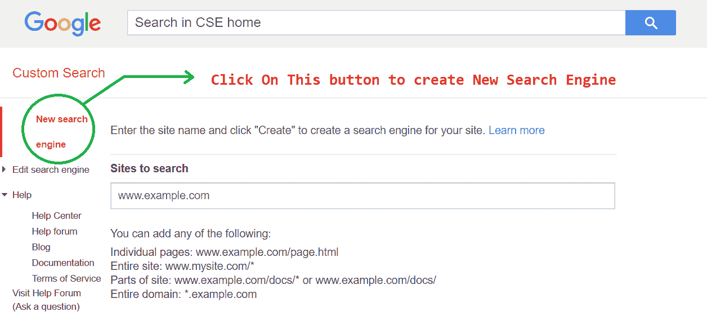
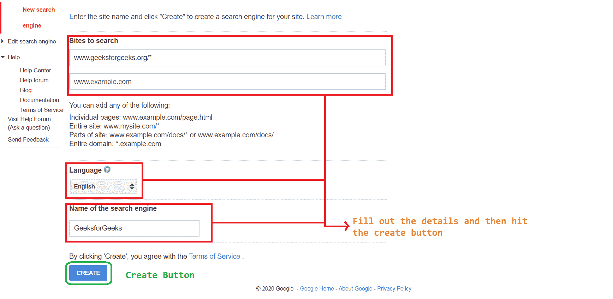

# 如何在网页中添加自定义谷歌搜索栏？

> 原文:[https://www . geesforgeks . org/如何添加-自定义-谷歌-搜索栏-在你的网页中/](https://www.geeksforgeeks.org/how-to-add-custom-google-search-bar-inside-your-web-page/)

一个好的网站需要一个搜索栏。从头开始创建自己的搜索引擎可能是一项困难的任务，但在谷歌的帮助下，这项任务可以跳过。谷歌已经创建了一个网站来创建一个自定义的搜索栏，来创建你自己的检查下面的链接。

*   ```
    https://programmablesearchengine.google.com/about/
    ```

    。

**创建自定义搜索栏:**在这个网站上，任何人只需选择想要搜索的网站，就可以轻松地对其搜索栏进行编程。遵循下面解释的步骤。

*   **第一步:**前往以下 [**站点**](https://programmablesearchengine.google.com/about/) 点击**开始**按钮。
*   **第二步:**选择**新建搜索引擎**按钮新建搜索引擎。
*   **步骤 3:** 按照页面上的指示填写**详细信息，然后单击创建按钮。**
*   **第四步:**点击创建后，点击屏幕上的**获取代码**按钮，您将获得您的**代码**。

**注意:**可以从控制面板修改关于搜索网站、搜索图片、安全搜索的设置，也可以设置在搜索栏搜索时显示广告。

**在网页上嵌入搜索栏:**获取代码后，只需将其粘贴到网页内即可看到工作的搜索栏。

*   **Example:** You can see that the output screen has a search bar with an option to search which shows the result from the sites or domain you have selected while creating this search bar. Moreover, this search option will automatically change as you change the sites from the control panel. Currently, the search results are been shown in the default manner. Apart from that, you can manipulate the result displaying manner and much more as directed on the below links

    ```
    https://developers.google.com/custom-search/docs/element
    ```

    。

    ## 超文本标记语言

    ```
    <!DOCTYPE html>
    <html>
        <head>
            <title>Custom Search-Bar</title>
            <style>
                body {
                    background-image: linear-gradient(to left, white, green);
                    color: lawngreen;
                }
            </style>
        </head>
        <body>
            <h1 style="text-align: center;">GeeksforGeeks</h1>
            <script async src=
    "https://cse.google.com/cse.js?cx=007019498718139788174:amtiepdpgeg">
            </script>
            <div class="gcse-search"></div>
        </body>
    </html>
    ```

*   **输出:** 