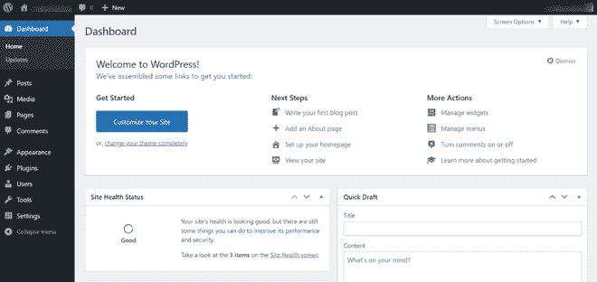
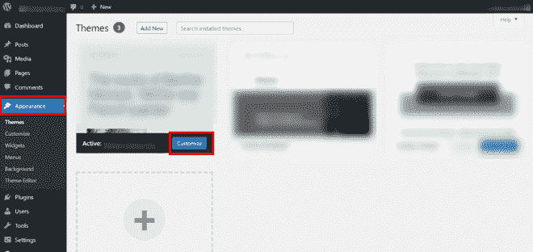
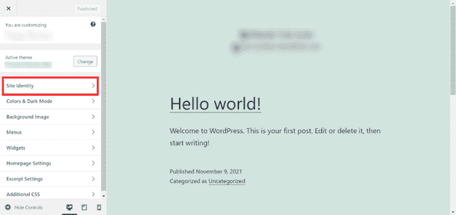
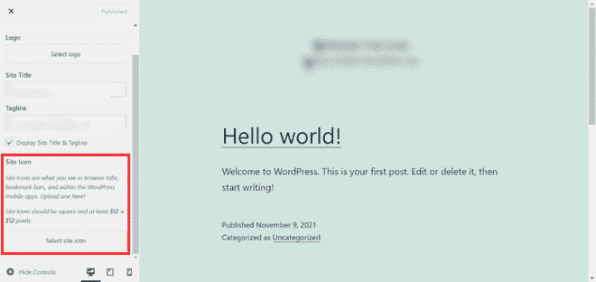
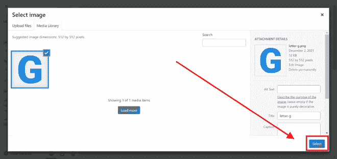
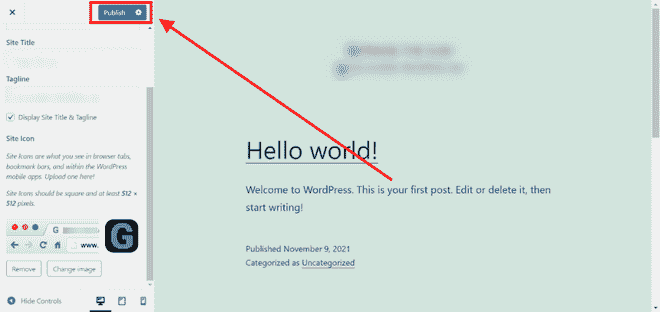

# 如何将 Favicon 添加到你的 WordPress 网站？

> 原文:[https://www . geesforgeks . org/how-add-fav icon-to-your-WordPress-网站/](https://www.geeksforgeeks.org/how-to-add-favicon-to-your-wordpress-website/)

一个[收藏夹图标](https://www.geeksforgeeks.org/what-is-favicon-and-what-is-the-size-of-it-in-html/)是一个充当你网站身份的小符号。它的主要功能是让用户在打开许多标签时更容易找到您的网站。换句话说，收藏夹图标是与特定网页或网站相关联的图标，主要用于我们需要为网页添加书签时。网络浏览器在网址栏、标签和其他有助于直观识别网站的地方使用它。移动设备也可以使用收藏夹图标作为应用程序图标。 Favicons 由于体积小，作为简单图片或一到三个字符的文本表现最好。Favicons 不会被徽标误导，尽管它们偶尔会互换使用。由于其尺寸或分辨率较小，图标可能需要较小的扳手或公司原始标志的一部分。

**如何在你的网站上添加一个 WordPress 收藏夹图标？**

我们将按照以下步骤在网站上添加收藏夹图标。

**第一步:访问你的 WordPress 网站的管理区。**

在你的 [WordPress](https://www.geeksforgeeks.org/introduction-wordpress/) 网站上，你可能希望制作帖子，安装[插件](https://www.geeksforgeeks.org/wordpress-themes-and-plugins/)，或者不时执行其他“后端”任务。这些通常是使用你的写字板完成的。这篇文章将告诉你如何去你的 WordPress 仪表板。

仪表板视图

**第二步:只需导航到侧边栏的外观区域，点击修改按钮。**

外观部分的目的是控制你的主题。主题可以从该页面安装、删除、更新和激活。它的菜单使您能够自定义网站的外观和功能。因为“外观”下的某些选项是基于主题的，所以外观菜单的某些部分可能不会根据主题向您显示。

选择外观

**步骤 3:从侧面菜单中，选择站点标识。**

“站点身份”选项通过给用户更专业的第一印象，使您能够将业务与竞争分开。在 WordPress 中，您的网站的标题、标语、徽标和图标是主要的网站标识选项。

从侧面菜单中选择站点标识

**第 4 步:向下滚动至“站点标识”的站点图标区域，选择“选择站点图标”**

您可以在站点图标下添加、更新或删除收藏夹图标。通过单击选择图像。

上传图标

**第五步:上传站点图标，然后按选择按钮。**

您的 WordPress 媒体库现在应该在您的屏幕上可见。选取“上传文件”选项，然后将您的收藏夹图标图片拖放到框中，或者从电脑中选择它。

选择站点图标

**第六步:按发布按钮。您的站点图标现在应该可以在互联网上看到。**

发布网站页面

现在，你可以预览你的网站，看看你的收藏夹图标看起来怎么样。您也可以在移动设备上访问您的网站，然后从浏览器菜单中单击“添加到主屏幕”。您网站的符号将显示在主屏幕上。