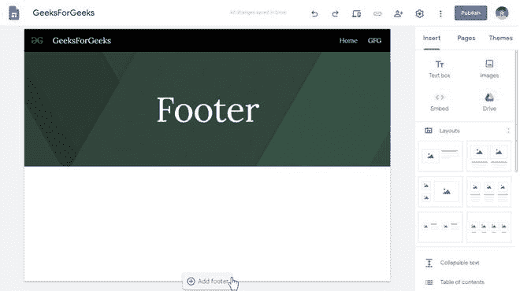
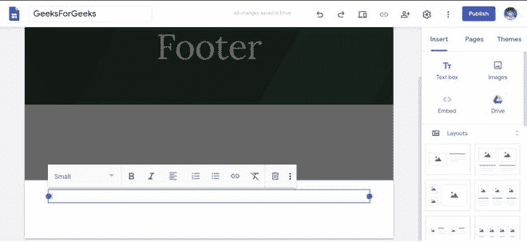

# 如何在新谷歌网站中添加页脚？

> 原文:[https://www . geesforgeks . org/how-add-footer-in-new-Google-sites/](https://www.geeksforgeeks.org/how-to-add-footer-in-new-google-sites/)

页脚是网站最重要的部分，因为它包含了公司或负责人的所有联系信息。没有一个合适的页脚，一个网站是不完整的，你会很高兴知道你可以在谷歌网站平台制作的网站中添加页脚，它的显示是完全可选的。要在您的站点中添加页脚，请执行本文中提到的步骤。

*   转到您的站点编辑器页面，向下滚动到任何一个页面的底部。

*   你会注意到一个添加页脚按钮，点击它可以添加一个页脚。

*   填充页脚后，网站将看起来像。

**注:**

*   您可以随时编辑页脚。
*   您可以将页脚添加到任何页面，它会自动设置到所有页面。
*   您也可以隐藏/显示页脚页面。

**隐藏页脚:**要隐藏页脚，请执行以下步骤:

*   转到页面底部，将鼠标悬停在页脚页面上，您会发现两个按钮，一个用于编辑，一个用于隐藏。

*   单击隐藏页脚按钮隐藏页脚。如果你想显示它，只需点击按钮返回显示页脚。

