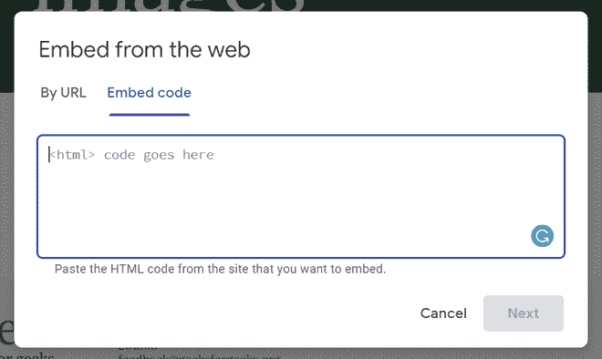
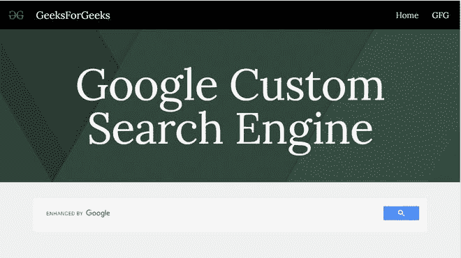

# 如何在新的谷歌网站中添加谷歌定制搜索引擎？

> 原文:[https://www . geesforgeks . org/如何添加-谷歌-自定义-搜索引擎-新的-谷歌-网站/](https://www.geeksforgeeks.org/how-to-add-google-custom-search-engine-in-new-google-sites/)


一个好的网站需要一个搜索栏。从头开始创建自己的搜索引擎可能是一项困难的任务，但在谷歌的帮助下，这项任务可以跳过。谷歌已经创建了一个网站来创建一个自定义的搜索栏，来创建你自己的检查下面的链接。

```
https://programmablesearchengine.google.com/about/

```

您必须在上述网站上创建搜索栏，为此，请遵循下面提到的文章:

#### 网站:[https://www . geeksforgeeks . org/如何添加-自定义-谷歌-搜索栏-你的网页内/](https://www.geeksforgeeks.org/how-to-add-custom-google-search-bar-inside-your-web-page/)

要在谷歌网站中添加自定义谷歌搜索引擎，请从“插入”面板中选择“嵌入”选项，然后转到出现的对话框的“嵌入代码”部分。



在提供的空白处写下你的代码。要添加自定义搜索引擎代码，请执行以下操作:

## 超文本标记语言

```
<html>  
<head>
  <title>Custom Search-Bar</title>  
</head>  
<body>
  <script async src=  
"https://cse.google.com/cse.js?cx=007019498718139788174:amtiepdpgeg">
  </script>  
  <div class="gcse-search"></div>  
</body>  
</html>
```

