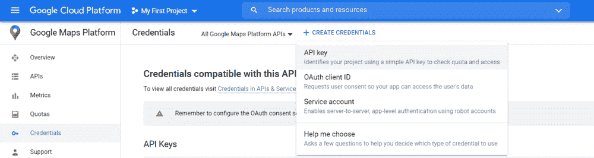
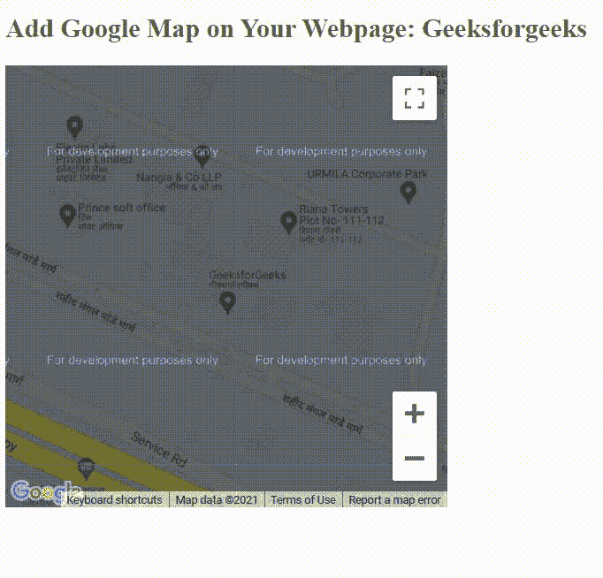

# 如何给网站添加谷歌地图？

> 原文:[https://www . geeksforgeeks . org/如何将谷歌地图添加到网站/](https://www.geeksforgeeks.org/how-to-add-google-maps-to-a-website/)

本文的目的是将谷歌地图添加到网站。以下是将谷歌地图添加到网站的步骤。

1.  生成应用编程接口密钥
2.  创建地图的 HTML 容器
3.  通过谷歌在 HTML 文档中添加外部脚本
4.  编写 JavaScript 代码，将地图放入该容器中。

**1。生成应用编程接口密钥**

要从谷歌地图获取位置数据，首先我们需要一个谷歌地图应用编程接口密钥。需要授权从谷歌地图收集数据。以下是生成谷歌地图应用编程接口密钥的步骤:

*   访问[谷歌云控制台的谷歌地图部分。](https://console.cloud.google.com/project/_/google/maps-apis/overview)
*   转到左侧栏菜单的凭据部分。
*   单击导航栏下方的“创建凭据”按钮。
*   选择“应用编程接口密钥”以生成新的应用编程接口密钥。
*   复制密钥并保存以备将来使用。



**2。为地图创建一个 HTML 容器**

在生成应用编程接口密钥之后，我们将创建一个 HTML div。我们的地图将留在那个分区内。我们将按照以下步骤进行:

*   创建一个新的 HTML 文档。
*   在主体部分中创建一个空的 div，并为其指定一个特定的 ID，以便进行造型。在我们的示例中，给定的特定标识是“地图”，因为它将包含地图。
*   创建一个样式标签并设置 div 的大小。

**3。在 HTML 文档中添加谷歌的外部脚本**

在 HTML 文档中添加以下异步脚本，因为它会立即执行，并且必须在回调中使用的任何 DOM 元素之后。在脚本网址中放入我们之前生成的替代“<your_api_key>”部分的 API 密钥。</your_api_key>

**4。编写 JavaScript 代码，将地图带入该容器**

在创建容器之后，我们必须编写 JavaScript 代码，将地图引入容器。这是我们生成地图的主要部分。

*   初始化一个名为 **initMap()的函数。**名称不可更改，因为该功能名称是谷歌预建的指示器，在网页加载时初始化并添加地图。
*   在该函数中，初始化一个对象，该对象包含我们希望在地图中显示的位置的纬度和经度。
*   创建一个新的 **google.maps.Map** 对象，该对象接受容器元素，该对象存储地图的中心位置和缩放比例。

**示例:**

## 超文本标记语言

```html
<!DOCTYPE html>
<html>

<head>
    <style type="text/css">

        /* Set the size of the div element 
        that contains the map */
        #map {
            height: 400px;
            width: 400px;
        }

        h2 {
            color: #308d46;
        }
    </style>
</head>

<body>
    <h2>
        Add Google Map on Your 
        Webpage: Geeksforgeeks
    </h2>

    <!--The div element for the map -->
    <div id="map"></div>

    <!--Add a script by google -->
    <script src=
"https://maps.googleapis.com/maps/api/js?key=<YOUR_API_KEY>&callback=initMap&libraries=&v=weekly"
        async>
    </script>

    <script>

        // Initialize and add the map
        function initMap() {

            // The location of Geeksforgeeks office
            const gfg_office = {
                lat: 28.50231,
                lng: 77.40548
            };

            // Create the map, centered at gfg_office
            const map = new google.maps.Map(
                    document.getElementById("map"), {

                // Set the zoom of the map
                zoom: 17.56,
                center: gfg_office,
            });
        }
    </script>
</body>

</html>
```

**输出:**

