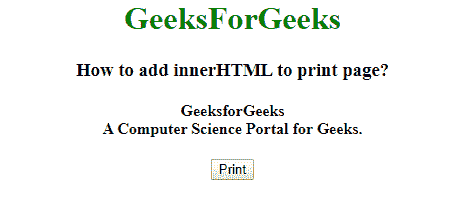
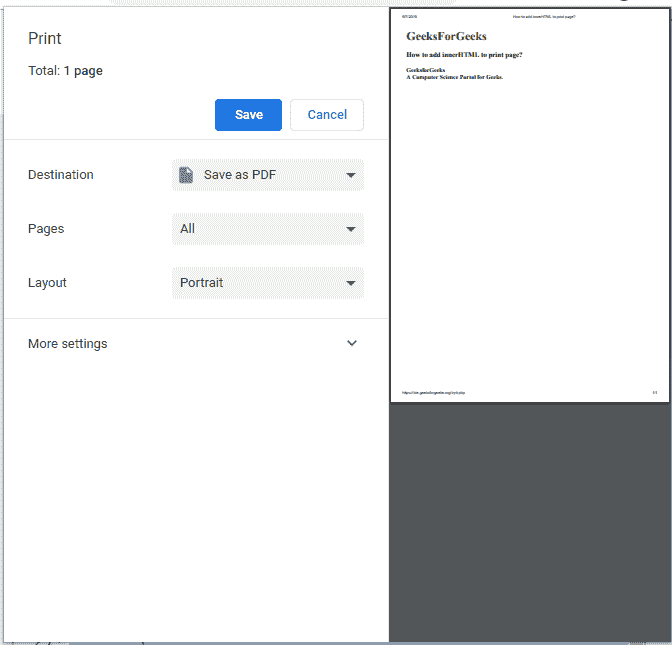
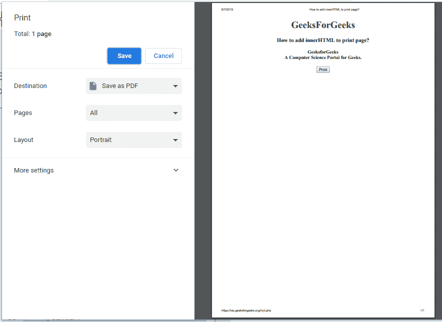

# 如何给打印页面添加 innerHTML？

> 原文:[https://www . geesforgeks . org/how-add-innerhtml-to-print-page/](https://www.geeksforgeeks.org/how-to-add-innerhtml-to-print-page/)

下面是将 innerHTML 添加到打印页面的任务。在这里，我们将在**的帮助下，使用 **document.body** 更改 **< body >** 元素中的当前内容，并将其设置为新的指定内容。innerHTML** 指定要打印的内容。我们要讨论几个方法。

**示例 1:** 在本例中，位于 div **内部的指定内容(id="printThis")** 通过 innerHTML。而且，正文内容也是通过 innerHTML 设置为上面指定的内容。

```
<!DOCTYPE html>
<html>

<head>
    <title>How to add innerHTML 
      to print page?</title>
    <script src="https://code.jquery.com/jquery-1.12.4.min.js">
  </script>
</head>

<body>
    <center>
        <div id="printThis">
            <h1 style="color:green;"> 
        GeeksForGeeks 
        </h1>
            <h3>How to add innerHTML to print page?
        </h3>
            <h4>
            GeeksforGeeks<br>
            A Computer Science Portal for Geeks.
        </h4>
        </div>
        <input type="button"
               onclick="printArea('printThis');" 
               Value="Print">

        <script type="text/javascript">
            function printArea(areaName) {
                var newcontent =
                    document.getElementById(areaName).innerHTML;
                var actContents = document.body.innerHTML;
                document.body.innerHTML = newcontent;
                window.print();
                document.body.innerHTML = actContents;
            }
        </script>
    </center>
</body>

</html>
```

**输出:**
**点击按钮前:**

**点击按钮后:**


**示例 2:** 在本例中，位于 **<体内的指定内容>** 最初是通过内部 HTML 获取的。并且，打印正文内容。

```
<!DOCTYPE html>
<html>

<head>
    <title>How to add innerHTML
      to print page?</title>
    <script src="https://code.jquery.com/jquery-1.12.4.min.js">
  </script>
</head>

<body>
    <center>
        <div id="printThis">
            <h1 style="color:green;"> 
        GeeksForGeeks 
        </h1>
            <h3>How to add innerHTML to print page?
        </h3>
            <h4>
            GeeksforGeeks<br>
            A Computer Science Portal for Geeks.
        </h4>
        </div>
        <input type="button" 
               onclick="printArea('printThis');" 
               Value="Print">

        <script type="text/javascript">
            function printArea(areaName) {
                var actContents = document.body.innerHTML;
                document.body.innerHTML = actContents;
                window.print();
            }
        </script>
    </center>
</body>

</html>
```

**输出:**
**点击按钮前:**

**点击按钮后:**
