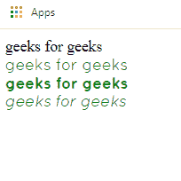
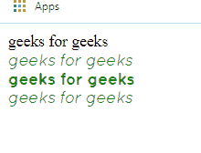

# 同一字体如何添加多个字体文件？

> 原文:[https://www . geesforgeks . org/如何为同一字体添加多个字体文件/](https://www.geeksforgeeks.org/how-to-add-multiple-font-files-for-the-same-font/)

**[@font-face](https://www.geeksforgeeks.org/css-font-face-rule/)**
在 CSS 中，指定自定义字体是一个规则。这使我们能够将范围扩展到网络安全字体之外。
在这个规则中，必须先定义@font-face，然后可以根据需要让网页元素引用它。

**目的:**
在同一字体名称下定义多个字体文件。
以一种更容易理解的方式框架化这一点，我们在这里试图做的是，如果我们想以多种其他方式显示特定的字体，如粗体、斜体等。传统上我们必须分别定义它们。但是，这里我们将研究一种将这些字体文件组合成一个字体名称的方法。

以下示例显示了如何使用相同的不同字体文件:

**例 1:**

```html
<!DOCTYPE html>
<html>
   <head>
    <style>
        @font-face {
            font-family: "quicksandregular";
            src: url("quicksand-regular-webfont.woff2") 
              format("woff2"), 
              url("quicksand-regular-webfont.woff")
              format("woff");
            font-weight: normal;
            font-style: normal;
        }

        @font-face {
            font-family: "quicksandbold";
            src: url("quicksand-bold-webfont.woff2") 
              format("woff2"),
              url("quicksand-bold-webfont.woff") 
              format("woff");
            font-weight: normal;
            font-style: normal;
        }

        @font-face {
            font-family: "quicksanditalic";
            src: url("quicksand-italic-webfont.woff2") 
              format("woff2"), 
              url("quicksand-italic-webfont.woff") 
              format("woff");
            font-weight: normal;
            font-style: normal;
        }

        .first {
            font-family: "quicksandregular";
            color: green;
        }

        .second {
            font-family: "quicksandbold";
            color: green;
        }

        .third {
            font-family: "quicksanditalic";
            color: green;
        }
    </style>
    </head>
    <body>
        geeks for geeks
        <div class="first">geeks for geeks</div>
        <div class="second">geeks for geeks</div>
        <div class="third">geeks for geeks</div>
    </body>
</html>
```

**输出:**


在上面的程序中，对于相同字体的每个字体文件，我们必须定义多个不同名称的文件，然后相应地引用它们。

这段代码描述了如何仅通过使用一个字体名称就可以使用多个文件。
这些修改需要在提取的特定字体文件的 CSS 文件中完成。

**例 2:**

```html
<!DOCTYPE html>
<html>
    <head>
        <style>
            @font-face {
                font-family: "quicksand";
                src: url("quicksand-regular-webfont.woff2") 
                  format("woff2"), 
                  url("quicksand-regular-webfont.woff") 
                  format("woff");
                font-weight: normal;
                font-style: normal;
            }

            @font-face {
                font-family: "quicksand";
                src: url("quicksand-bold-webfont.woff2")
                  format("woff2"), 
                  url("quicksand-bold-webfont.woff") 
                  format("woff");
                font-weight: bold;
                font-style: normal;
            }

            @font-face {
                font-family: "quicksand";
                src: url("quicksand-italic-webfont.woff2") 
                  format("woff2"), 
                  url("quicksand-italic-webfont.woff")
                  format("woff");
                font-weight: normal;
                font-style: normal;
            }

            .first {
                font-family: "quicksand";
                color: green;
            }

            .second {
                font-family: "quicksand";
                font-weight: bold;
                color: green;
            }

            .third {
                font-family: "quicksand";
                font-style: italic;
                color: green;
            }
        </style>
    </head>
    <body>
        geeks for geeks
        <div class="first">geeks for geeks</div>
        <div class="second">geeks for geeks</div>
        <div class="third">geeks for geeks</div>
    </body>
</html>
```

**输出:**
