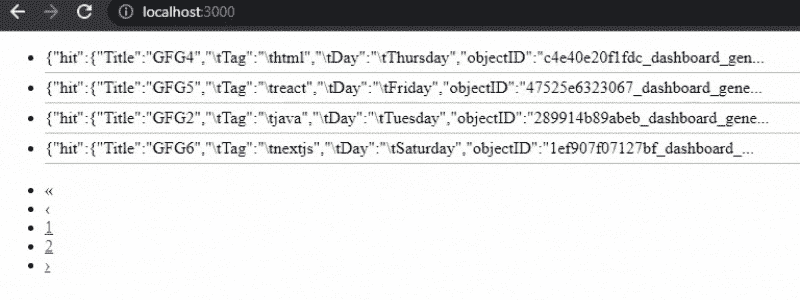

# 如何使用 Algolia 在 Nextjs 中添加分页？

> 原文:[https://www . geesforgeks . org/how-add-paging-in-next js-using-algolia/](https://www.geeksforgeeks.org/how-to-add-pagination-in-nextjs-using-algolia/)

在本文中，我们将学习如何使用 Algolia 在 NextJS 项目中添加分页。NextJS 是一个基于 React 的框架。它有能力为不同的平台开发漂亮的网络应用程序，如视窗、Linux 和 mac。动态路径的链接有助于有条件地呈现您的 NextJS 组件。

**方法:**要添加我们的搜索功能，首先我们要在 algolia 创建一个帐户，使我们能够在几毫秒内搜索内容。之后，我们将获得我们稍后将在应用程序中使用的应用编程接口密钥。然后我们将创建一个新的索引来上传我们的数据。在我们应用程序的主页上，我们将使用 API 键和 algoliasearch 模块从 algolia 获取带有搜索小部件的数据。

**创建下一个应用程序:**

**步骤 1:** 您可以使用以下命令创建一个新的 NextJs 项目:

```
npx create-next-app gfg
```

**步骤 2:** 为了在我们的项目中添加 Algolia 搜索，我们将安装两个模块:

```
npm install algoliasearch react-instantsearch-dom
```

**项目结构:**如下图。


**步骤 3:** 设置 Algolia。Algolia 使开发人员能够构建下一代应用程序，这些应用程序的 API 可以在几毫秒内提供相关内容。所以要使用 algolia，首先创建一个免费账户，并获取该账户的 API 密钥。

1.获取应用编程接口密钥转到**设置** > **应用编程接口密钥**


2.之后，创建一个索引并上传您想要搜索的数据。您可以以 json、csv 格式或使用它们的 API 上传数据。


对于这个例子，我正在上传下面的数据。

```
Title, Tag, Day
GFG1, python, Monday
GFG2, java, Tuesday
GFG3, css, Wednesday
GFG4, html, Thursday
GFG5, react, Friday
GFG6, nextjs, Saturday
```


**第 4 步:**现在我们可以使用 API 在 NextJs Project 中添加分页功能了。之后，为了使用我们的分页，我们将在 **index.js** 文件中添加下面的代码。

```
import algoliasearch from "algoliasearch/lite";
import { InstantSearch, Pagination , Configure , Hits } 
       from "react-instantsearch-dom";

const searchClient = algoliasearch(
  APPLICATION_API_KEY,
  SEARCH_ONLY_API_KEY,
);

export default function SearchBar() {
  return (
    <>
      <InstantSearch 
        searchClient={searchClient} 
        indexName="gfg_dev">
        <Configure  hitsPerPage={4}/>
        <Hits />
        <Pagination/>
      </InstantSearch>
    </>
  );
}
```

**运行应用程序的步骤:**之后，使用以下代码运行应用程序:-

```
npm run dev
```

### 输出:-

