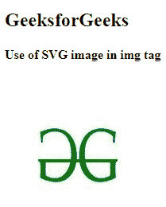
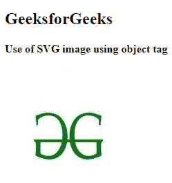
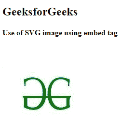
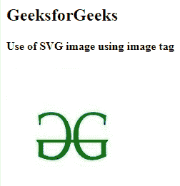

# 如何在网页中添加可伸缩矢量图形？

> 原文:[https://www . geeksforgeeks . org/如何将可扩展矢量图形添加到您的网页/](https://www.geeksforgeeks.org/how-to-add-scalable-vector-graphics-to-your-web-page/)

在本文中，我们将学习如何将[可伸缩矢量图形(SVG)](https://www.geeksforgeeks.org/html-svg-basics/) 添加到我们的网页中&还将通过示例了解其实现。SVG 是一种用 XML 编写的基于矢量图形的图像格式。SVG 文件中的每个元素和每个属性都可以被动画化。可缩放矢量图形图像在调整大小或缩放时不会失去质量。有许多方法可以将支持向量机添加到我们的网页中。

与其他图像格式(如 JPG、PNG、GIF 等)相比，使用 SVG 有几个好处。):

*   这些图像可以用任何文本编辑器轻松创建和编辑。
*   可以搜索、索引、编写脚本和压缩 SVG 图像。
*   这些图像是可缩放的&可以在任何分辨率下以高质量显示。

有几种方法可以在 HTML 中使用 SVG 图像。下面讨论一些方法:

**一个< img >标签**中的 SVG:这是将 SVG 图像插入网页的基本&简单方法。对于这种方法，我们可以简单地使用 [< img >标记](https://www.geeksforgeeks.org/html-img-tag/#:~:text=HTML%20tag%20is%20used,Attention%20reader!)，然后在 *src* 属性中指定文件路径或图像链接。要使用这种方法，我们应该已经下载了 SVG 图像文件或 SVG 图像链接。

**语法:**

```html

```

**示例:**该示例说明了使用< img >标签添加 SVG 图像。不指定 SVG 图像大小，将占用 SVG 图像的原始大小。

## 超文本标记语言

```html
<!DOCTYPE html>
<html>

<head>
    <title>SVG Image</title>
</head>

<body>
    <h2>GeeksforGeeks</h2>
    <h4>Use of SVG image in img tag</h4> 
     
</body>

</html>
```

**输出:**



**一个<对象中的 SVG>标签:**我们可以使用 [<对象>标签](https://www.geeksforgeeks.org/html-object-tag/)通过使用*数据*属性指定该对象将使用的资源的网址来插入 SVG 图像。宽度和高度可用于指定 SVG 图像的大小。

**语法:**

```html
<object data="svgImage.svg"> </object>
```

**示例:**该示例说明了使用<对象>标签添加 SVG 图像。

## 超文本标记语言

```html
<!DOCTYPE html>
<html>

<head>
    <title>SVG Image</title>
</head>

<body>
    <h2>GeeksforGeeks</h2>
    <h4>Use of SVG image using object tag</h4>
    <object data=
"https://media.geeksforgeeks.org/wp-content/uploads/20211022130449/svg.png"> 
    </object>
</body>

</html>
```

**输出:**



**中的 SVG 嵌入>标签**:我们可以使用 [<嵌入>标签](https://www.geeksforgeeks.org/html-embed-tag/)通过指定 *src* 属性中的链接来插入 SVG 图像。虽然<嵌入>标签现在已经被弃用，并且在大多数现代浏览器中取消了对浏览器插件的支持。

**语法:**

```html
<embed src="svgImage.svg" />
```

**示例:**该示例说明了使用<嵌入>标签添加 SVG 图像。

## 超文本标记语言

```html
<!DOCTYPE html>
<html>

<head>
    <title>SVG Image</title>
</head>

<body>
    <h2>GeeksforGeeks</h2>
    <h4>Use of SVG image using embed tag</h4>
    <embed src=
"https://media.geeksforgeeks.org/wp-content/uploads/20211022130449/svg.png" />
</body>

</html>
```

**输出:**



**图像中的 SVG<标签:**[<图像>](https://www.geeksforgeeks.org/svg-image-tag/) SVG 元素包括 SVG 文档中的图像。它可以显示光栅图像文件或其他 SVG 文件。SVG 软件唯一支持的图像格式是 JPEG、PNG 和其他 SVG 文件。

**语法:**

```html
<svg>
    <image attributes="values" >
</svg>
```

**示例:**该示例说明了使用<图像>标签添加 SVG 图像。

## 超文本标记语言

```html
<!DOCTYPE html>
<html>

<head>
    <title>SVG Image</title>
</head>

<body>
    <h2>GeeksforGeeks</h2>
    <h4>Use of SVG image using image tag</h4>
    <svg width="200" height="200" xmlns="http://www.w3.org/2000/svg">
        <image href=
"https://media.geeksforgeeks.org/wp-content/uploads/20211022130449/svg.png" 
               height="200" 
               width="200" />
    </svg>
</body>

</html>
```

**输出:**

