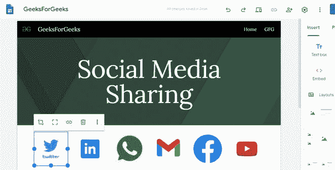
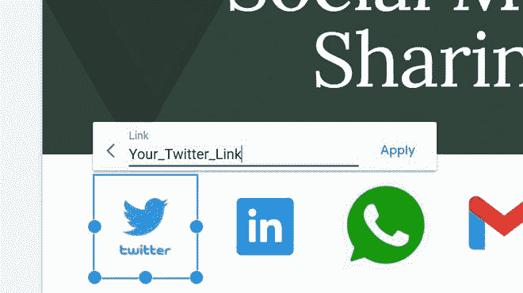
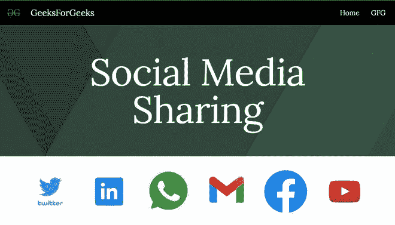

# 如何在谷歌新网站中添加社交媒体分享按钮？

> 原文:[https://www . geesforgeks . org/how-add-social-media-share-button-in-new-Google-sites/](https://www.geeksforgeeks.org/how-to-add-social-media-share-buttons-in-new-google-sites/)

现在社交媒体已经成为这个世界不可分割的一部分。如今，在网站上添加社交媒体分享按钮非常重要。如果一个网站缺少这些分享按钮，你就不能指望它是完整的。您不能直接将这些按钮添加到谷歌网站，但您可以为这些按钮添加图像，然后添加它们的链接。给这篇文章添加按钮。

*   首先，添加您想要显示的共享按钮的图像。

*   获取您各自社交帐户的链接，并将它们添加到您添加的所有图像中。

*   之后，只要发布网站，看看它的效果。您可以根据需要添加更多共享选项。

