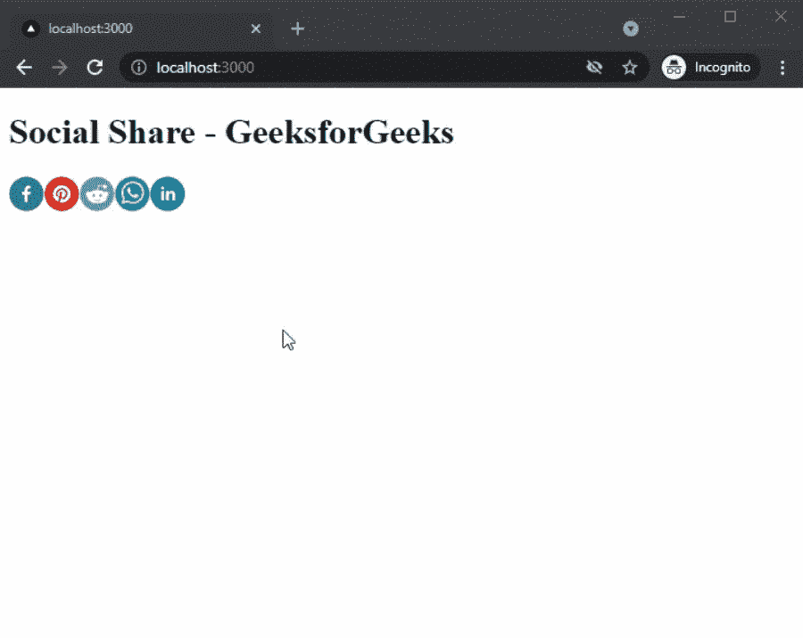

# 如何在 NextJS 中添加社交分享按钮？

> 原文:[https://www . geesforgeks . org/how-add-social-share-button-in-nextjs/](https://www.geeksforgeeks.org/how-to-add-social-share-buttons-in-nextjs/)

在本文中，我们将学习如何在 NextJs 中添加社交分享按钮。使用社交分享按钮，用户可以在不同的社交媒体网站上分享你的内容。

NextJS 是一个基于 React 的框架。它有能力为不同的平台开发漂亮的网络应用程序，如视窗、Linux 和 mac。动态路径的链接有助于有条件地呈现您的 NextJS 组件。

**方法:**要添加我们的社交分享按钮，我们将使用下一个分享包。下一个分享包帮助我们整合了 19 个社交媒体网站，用户可以通过点击分享你的内容。首先，我们将安装下一个分享包，然后我们将使用下一个分享包在主页上添加不同的社交分享按钮。

**创建 NextJS 应用程序:**您可以使用以下命令创建一个新的 NextJs 项目:

```
npx create-next-app gfg
```

**安装所需的包:**现在我们将使用以下命令安装下一个共享包:

```
npm i next-share
```

**项目结构:**会是这样的。


**添加社交分享按钮:**安装下一个分享包后，我们可以在 app 的任意页面轻松添加不同的社交分享按钮。对于这个例子，我们将在主页上添加社交分享按钮。

在 **index.js** 文件中添加以下内容:

## index.js

```
import React from 'react'
import {
  FacebookShareButton,
  FacebookIcon,
  PinterestShareButton,
  PinterestIcon,
  RedditShareButton,
  RedditIcon,
  WhatsappShareButton,
  WhatsappIcon,
  LinkedinShareButton,
  LinkedinIcon,
} from 'next-share';

export default function Text() {
  return (
    <div>
      <h1>Social Share - GeeksforGeeks</h1>
      <FacebookShareButton
        {/* Url you want to share */}
        url={'http://localhost:3000'} >
        <FacebookIcon size={32} round />
      </FacebookShareButton>
      <PinterestShareButton
        {/* Url you want to share */}
        url={'http://localhost:3000'} >
        <PinterestIcon size={32} round />
      </PinterestShareButton>
      <RedditShareButton
        {/* Url you want to share */}
        url={'http://localhost:3000'} >
        <RedditIcon size={32} round />
      </RedditShareButton>
      <WhatsappShareButton
        {/* Url you want to share */}
        url={'http://localhost:3000'} >
        <WhatsappIcon size={32} round />
      </WhatsappShareButton>
      <LinkedinShareButton
        {/* Url you want to share */}
        url={'http://localhost:3000'} >
        <LinkedinIcon size={32} round />
      </LinkedinShareButton>
    </div>
  )
}
```

**解释:**在上面的例子中，首先我们从下一个分享包中导入不同的社交分享按钮，然后我们在文本组件中使用这些按钮。您可以在每个按钮的 URL 参数中添加您想要共享的 URL。

**运行应用的步骤:**在终端运行下面的命令运行应用。

```
npm run dev
```

### 输出:

