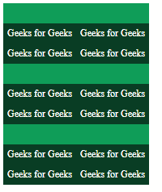
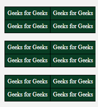

# 元素之间如何添加空间？

> 原文:[https://www . geesforgeks . org/如何在元素之间添加空格/](https://www.geeksforgeeks.org/how-to-add-space-between-elements/)

我们可以使用普通的 CSS 来改变表格，这里我们将使用 border 属性来给出不同 tbody 元素之间的间距。

不需要事先和深刻的知识，这只是基本的 CSS 和 HTML 技巧。

**注意:**唯一需要注意的是，tbody 标签里面必须有一个“tr”标签。

**示例 1:** 下面给出了使用 border-top 属性给出元素间距的代码。

```htmlhtml
<!DOCTYPE html>
<html lang="en">
<head>
  <meta charset="UTF-8">
  <meta name="viewport" 
        content="width=device-width, initial-scale=1.0">
  <title>Document</title>
</head>
<style>
  body{
    color: #fff;
    font-size:12px;
  }
  table {
    border-collapse: collapse;
  }
  table td{
    padding: 5px;
    background-color: #093d24;
  }
  .tbody {
    border-top: 25px solid #0f9d58;
  }
  </style>
<body>
    <table>
      <tbody class="tbody">
          <tr>
            <td>Geeks for Geeks</td>
            <td>Geeks for Geeks</td>
          </tr>
          <tr>
            <td>Geeks for Geeks</td>
            <td>Geeks for Geeks</td>
          </tr>
      </tbody>
      <tbody class="tbody">
          <tr>
            <td>Geeks for Geeks</td>
            <td>Geeks for Geeks</td>
          </tr>
          <tr>
            <td>Geeks for Geeks</td>
            <td>Geeks for Geeks</td>
          </tr>
      </tbody>
      <tbody class="tbody">
          <tr>
            <td>Geeks for Geeks</td>
            <td>Geeks for Geeks</td>
          </tr>
          <tr>
            <td>Geeks for Geeks</td>
            <td>Geeks for Geeks</td>
          </tr>
      </tbody>
    </table>
</body>
</html>
```

**输出:**


**示例 2:** 在下面给出的示例中，我们使用了 Before 选择器属性。这有助于在 tbody 元素之间留出余量，因此下面给出了相关代码。我们还在表中使用了**溢出:隐藏**属性来防止 before 元素溢出。

```htmlhtml
<!DOCTYPE html>
<html lang="en">
<head>
  <meta charset="UTF-8">
  <meta name="viewport" 
        content="width=device-width, initial-scale=1.0">
  <title>Document</title>
</head>
<style>
  body{
    color: #fff;
    font-size:12px;
    background-color: #f2f2f2;
  }
  table {
    overflow: hidden;
    border-collapse: collapse;
    position: relative;
  }
  table td{
    padding: 5px;
    border: 1px solid #000;
    background-color: #093d24;
  }
  .tbody::before{
    content: "";
    margin:10px;
  }
  </style>
<body>
    <table>
      <tbody class="tbody">
          <tr>
            <td>Geeks for Geeks</td>
            <td>Geeks for Geeks</td>
          </tr>
          <tr>
            <td>Geeks for Geeks</td>
            <td>Geeks for Geeks</td>
          </tr>
      </tbody>
      <tbody class="tbody">
          <tr>
            <td>Geeks for Geeks</td>
            <td>Geeks for Geeks</td>
          </tr>
          <tr>
            <td>Geeks for Geeks</td>
            <td>Geeks for Geeks</td>
          </tr>
      </tbody>
      <tbody class="tbody">
          <tr>
            <td>Geeks for Geeks</td>
            <td>Geeks for Geeks</td>
          </tr>
          <tr>
            <td>Geeks for Geeks</td>
            <td>Geeks for Geeks</td>
          </tr>
      </tbody>
    </table>
</body>
</html>
```

**输出:**
