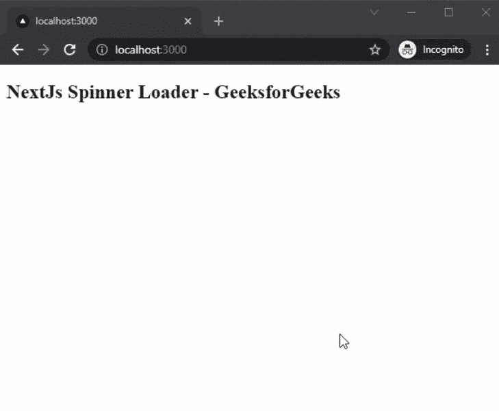

# 如何在 NextJS 中添加 Spinner Loader？

> 原文:[https://www . geesforgeks . org/how-add-spinner-loader-in-next js/](https://www.geeksforgeeks.org/how-to-add-spinner-loader-in-nextjs/)

在本文中，我们将学习如何在 NextJs 中添加 spinner loader。NextJS 是一个基于 React 的框架。它有能力为不同的平台开发漂亮的网络应用程序，如视窗、Linux 和 mac。

**方法:**要添加我们的旋转加载器，我们将使用反应加载器旋转包。react-loader-spinner 包帮助我们在应用程序中集成 spinner loader。首先，我们将安装 react-loader-spinner 包，然后我们将在主页上添加一个 spinner loader。

**创建 NextJS 应用程序:**您可以使用以下命令创建一个新的 NextJs 项目:

```
npx create-next-app gfg
```

**安装所需的包:**现在我们将使用以下命令安装反应加载器旋转器包:

```
npm i react-loader-spinner
```

**项目结构:**会是这样的。


**添加 Spinner Loader:** 安装完软件包后，我们可以在应用的任何页面上轻松添加 Spinner Loader。对于这个例子，我们将添加一个加载器到我们的主页。

## index.js

```
import React from 'react';
import Loader from "react-loader-spinner";
import "react-loader-spinner/dist/loader/css/react-spinner-loader.css";

export default function SpinnerLoading(){
  return (
    <div>
      <h2>NextJs Spinner Loader - GeeksforGeeks</h2>
      <Loader
        type="Puff"
        color="#00BFFF"
        height={100}
        width={100}
        timeout={3000} 
      /> 
    </div>
  )
}
```

**解释:**在上面的例子中，首先，我们导入了 Loader 组件，然后，我们在一个新的函数中使用 Loader 组件来添加我们的 Spinner 加载器。还可以在加载器组件中设置颜色、高度、重量和超时。

**运行应用的步骤:**在终端运行下面的命令运行应用。

```
npm run dev
```

### 输出:

