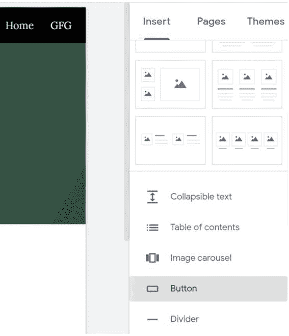
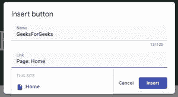
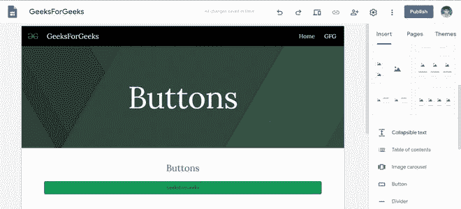
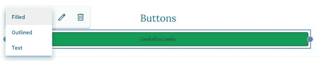
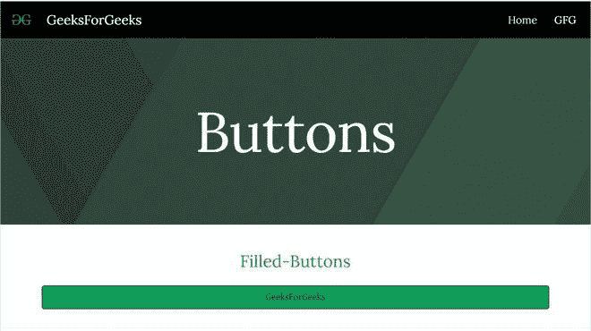
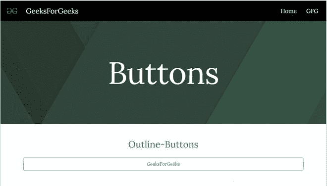
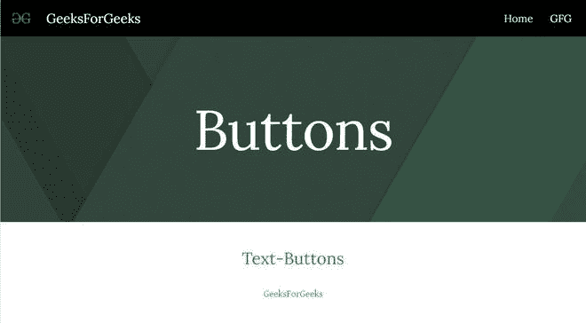

# 如何在谷歌新网站中添加样式按钮？

> 原文:[https://www . geesforgeks . org/how-add-style-button-in-new-Google-sites/](https://www.geeksforgeeks.org/how-to-add-style-buttons-in-new-google-sites/)

按钮是网页中最常用的元素之一。按钮用于事件处理和与用户交互。从提交表单到查看一些信息，我们必须点击按钮。在谷歌网页中添加按钮。

*   转到插入面板并滚动到按钮选项。

*   单击它可以添加网站上的按钮。将名称添加到按钮并指定链接。链接可以是页面，也可以是任何外部链接。

*   点击插入插入按钮，然后将按钮放在页面上您喜欢的位置并调整大小。

按钮可用的样式:

*   填充按钮

*   大纲按钮

*   文本按钮

