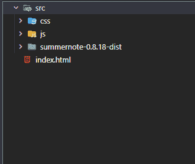
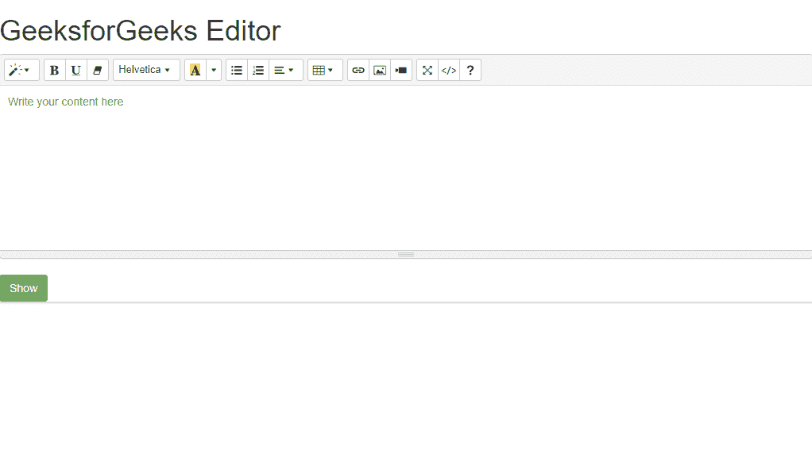

# 如何在网页中添加 Summernote 编辑器？

> 原文:[https://www . geesforgeks . org/how-add-summer note-editor-in-网页/](https://www.geeksforgeeks.org/how-to-add-summernote-editor-in-webpage/)

在本文中，我们将了解 Summernote 编辑器&它的用法，并通过示例了解它的实现。Summernote 编辑器是一个基于 Bootstrap & jQuery 的免费开源超级简单的所见即所得编辑器。这是一个 JavaScript 库，可用于在线构建所见即所得编辑器。它是由一个大型社区在麻省理工学院许可下维护的。它很容易使用&包含许多可定制的选项。它可以很容易地在任何框架中实现，如 React、Django、Angular 等。

**特征:**

*   轻量级富文本编辑器
*   易于安装
*   易于与任何框架集成
*   简单用户界面
*   大量定制可用。
*   免费和开源
*   交互式所见即所得编辑

在我们的网页上有两种方法可以使用 Summernote 编辑器:

*   使用从他们的[官方](https://summernote.org/getting-started/#compiled-css-js)网站下载的预编译和缩小版本的 CSS 和 JavaScript 文件。
*   使用可用的 [CDN 链接](https://summernote.org/getting-started/#embed)进行 summary note CSS&js、jQuery 和 Bootstrap。

我们可以使用这两种方法中的任何一种来构建带有文本编辑器和内容的静态网站。

**进场:**

*   首先，从官方网站下载 Summernote 的缩小预编译版本。
*   提取它并将其放在当前工作文件夹中。
*   创建一个 index.html 文件，并在标签中声明引导和 jQuery 链接。
*   完成这些步骤后，项目结构将如下图所示。



**导入总结备注:**

*   首先，让我们从 index.html 文件中的 cdn 导入引导。以下所有代码都应放在**头标内。**

> <链接 href = " https://stack path . bootstracdn . com/bootstrap/3 . 4 . 1/CSS/bootstrap . min . CSS " rel = " style sheet "/><脚本 src = " https://code . jquery . com/jquery-3 . 5 . 1min . js ">t8]

*   接下来导入 summernote CSS 和 JS 文件。

> <src = "/src/summonenote-0 . 8 . 18-dist/summonenote-bs 4 . min . js "></script>

*   现在在标签中，初始化 summernote 编辑器。

```html
<script>
$(document).ready(function() {
    $("#myeditor").summernote({
        placeholder: "Write your content here",
        height: 200,
    });
});
</script>
```

现在，我们的文本编辑器已经初始化。

**示例**:这个示例说明了如何使用 Summernote 编辑器来构建&以方便网页中的编辑器。

## 超文本标记语言

```html
<!DOCTYPE html>
<html lang="en">

<head>
    <meta charset="UTF-8" />
    <meta http-equiv="X-UA-Compatible" content="IE=edge" />
    <meta name="viewport" 
          content="width=device-width, initial-scale=1.0" />
    <title>GeeksforGeeks Editor</title>
    <link href=
"https://stackpath.bootstrapcdn.com/bootstrap/3.4.1/css/bootstrap.min.css" 
          rel="stylesheet" />
    <script src=
"https://code.jquery.com/jquery-3.5.1.min.js">
    </script>
    <script src=
"https://stackpath.bootstrapcdn.com/bootstrap/3.4.1/js/bootstrap.min.js">
    </script>
    <link rel="stylesheet" 
          href="/src/summernote-0.8.18-dist/summernote-bs4.min.css" />
    <script src="/src/summernote-0.8.18-dist/summernote-bs4.min.js"></script>
    <link rel="stylesheet" 
          href="/src/summernote-0.8.18-dist/summernote.css" />
    <script src="/src/summernote-0.8.18-dist/summernote.js"></script>
</head>

<body>
    <h1>GeeksforGeeks Editor</h1>
    <div id="myeditor"></div>
    <button type="button" 
            class="btn btn-success" 
            onclick="showContent()"> Show 
    </button>

    <div id="myContent" class="container"></div>

    <script>
    $(document).ready(function() {
        $("#myeditor").summernote({
            placeholder: "Write your content here",
            height: 200,
        });
    });

    function showContent() {
        document.getElementById("myContent").innerHTML = 
        $("#myeditor").summernote("code");
    }
    </script>
</body>

</html>
```

**输出:**



**支持的浏览器:**

*   谷歌 Chrome
*   火狐浏览器
*   微软边缘
*   微软公司出品的 web 浏览器
*   歌剧
*   旅行队

参考:[https://summernote.org/](https://summernote.org/)