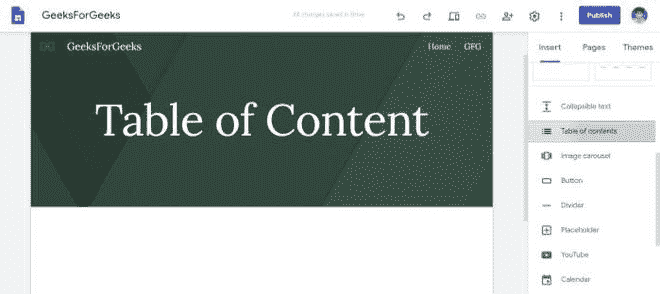
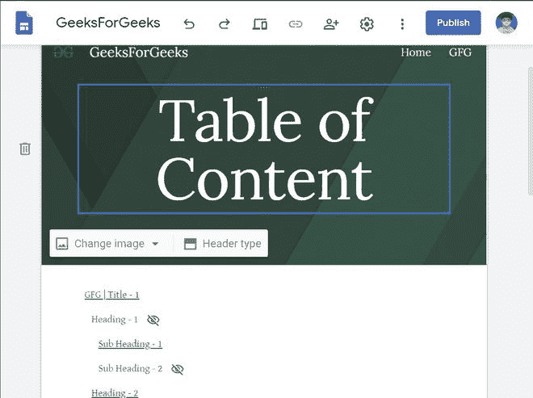
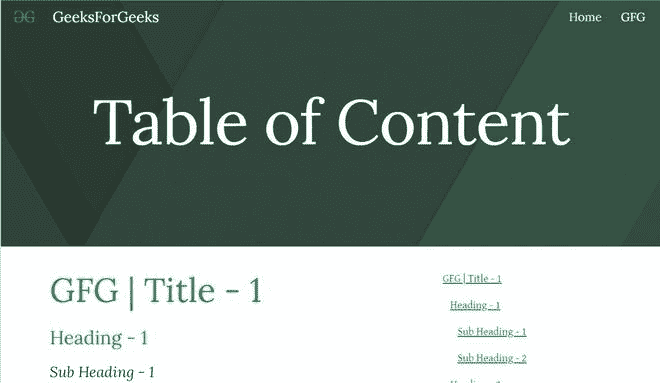

# 如何在新的谷歌网站中添加内容列表？

> 原文:[https://www . geeksforgeeks . org/如何添加新谷歌网站目录/](https://www.geeksforgeeks.org/how-to-add-table-of-content-in-new-google-sites/)

有时你有一个非常大的网页，当其他用户试图从你的网页上阅读内容时，他们可能会发现很难找到他们正在寻找的内容，这可能会严重影响你的用户群。这个问题可以通过简单地放置一个合适的内容表来给出当前页面内容的要点来解决。要添加内容表，请执行以下步骤:

*   转到插入面板并向下滚动到选择内容列表选项。

*   您可以看到，当您在页面上插入标题或标题时，内容列表会自动更新。

您可以看到普通文本不会被添加到内容列表中。除此之外，它还有一些特性，例如:

1.  您可以设置显示或不显示缩进。
2.  您还可以设置显示或不显示哪个标题。

最终网站将如下所示:

