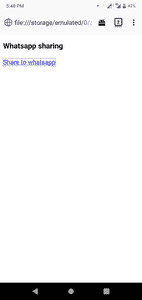
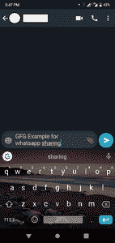
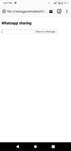

# 如何在网站上添加 whatsapp 分享按钮？

> 原文:[https://www . geesforgeks . org/how-add-whatsapp-share-button-on-a-site/](https://www.geeksforgeeks.org/how-to-add-whatsapp-share-button-on-a-website/)

WhatsApp 是最受欢迎的消息应用。本文介绍了如何在网站中添加 WhatsApp 共享按钮。

**注意:**只有在安装了 WhatsApp 的手机中打开网站时，此功能才会起作用。

**第一步:**设计一个简单的网页，上面有一个超链接。当用户点击此链接时，将完成共享。

## 超文本标记语言

```html
<!DOCTYPE html>
<html>

<head>
    <meta http-equiv="content-type" 
        content="text/html;charset=utf-8" />

    <title>
        How to add WhatsApp share 
        button on website?
    </title>
</head>

<body>
    <h3>Whatsapp sharing</h3>

    <a>Share to whatsapp</a>
</body>

</html>
```

**第二步:**这在台式机\笔记本电脑上是行不通的，所以我们添加 CSS 在大屏幕上隐藏。为此，使用了 CSS @media 查询。

```html
<style type="text/css">
    @media screen and (min-width: 500px) {
        a {
            display: none
        }
    }
</style>

```

**示例 1:** 该示例使用以上两个步骤实现。注意 href 属性指定了位置，这个请求被发送到 WhatsApp 应用程序。

**语法:**

```html
href="whatsapp://send?text=Your message here"

```

## 超文本标记语言

```html
<!DOCTYPE html>
<html>

<head>
    <meta http-equiv="content-type" 
        content="text/html;charset=utf-8" />
    <meta name="viewport" content=
        "width=device-width, initial-scale=1.0">

    <title>
        How to add WhatsApp share
        button on website?
    </title>

    <style type="text/css">
        @media screen and (min-width: 500px) {
            a {
                display: none
            }
        }
    </style>
</head>

<body>
    <h3>Whatsapp sharing</h3>

    <a href=
"whatsapp://send?text=GFG Example for whatsapp sharing"
        data-action="share/whatsapp/share"
        target="_blank">
        Share to whatsapp
    </a>
</body>

</html>
```

保存此文件并在手机中打开。

**输出:**

 

**示例 2:** 在本例中，我们将从用户处获取输入，并使用 JavaScript 发送该消息。在这个例子中，我们定义了一个只在手机上显示内容的类。

## 超文本标记语言

```html
<!DOCTYPE html>
<html>

<head>
    <meta http-equiv="content-type" 
        content="text/html;charset=utf-8" />

    <meta name="viewport" content=
        "width=device-width, initial-scale=1.0">

    <title>
        How to add whatsapp share 
        button on website?
    </title>

    <style type="text/css">

        /* To show on small size screen only */
        @media screen and (min-width: 500px) {
            .mobileShow {
                display: none
            }
        }
    </style>
</head>

<body>
    <h3>Whatsapp sharing</h3>

    <input class="mobileShow" 
        type="text" name="message">
    <button onclick="share()" class="mobileShow">
        Share to whatsapp
    </button>

    <script src=
"https://cdnjs.cloudflare.com/ajax/libs/jquery/3.2.1/jquery.js">
    </script>

    <script type="text/javascript">

        // Function to share on whatsapp
        function share() {

            // Getting user input
            var message = $("input[name=message]").val();

            // Opening URL
            window.open(
                "whatsapp://send?text=" + message,

                // This is what makes it 
                // open in a new window.
                '_blank' 
            );
        }
    </script>
</body>

</html>
```

**输出:**

 

HTML 是网页的基础，通过构建网站和网络应用程序用于网页开发。您可以通过以下 [HTML 教程](https://www.geeksforgeeks.org/html-tutorials/)和 [HTML 示例](https://www.geeksforgeeks.org/html-examples/)从头开始学习 HTML。

CSS 是网页的基础，通过设计网站和网络应用程序用于网页开发。你可以通过以下 [CSS 教程](https://www.geeksforgeeks.org/css-tutorials/)和 [CSS 示例](https://www.geeksforgeeks.org/css-examples/)从头开始学习 CSS。