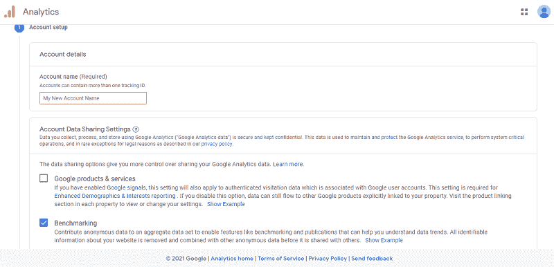
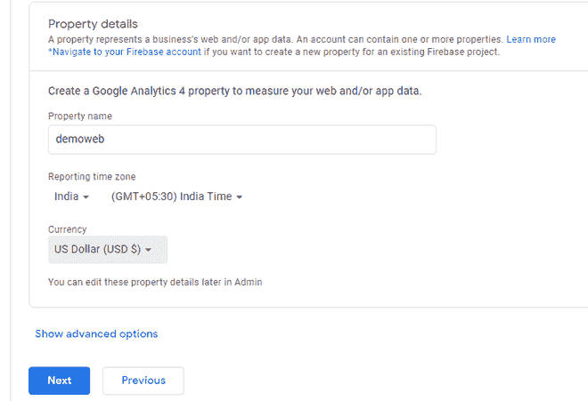
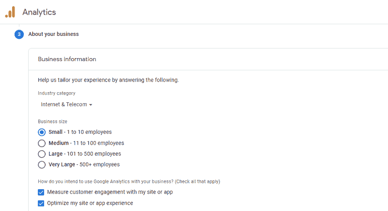
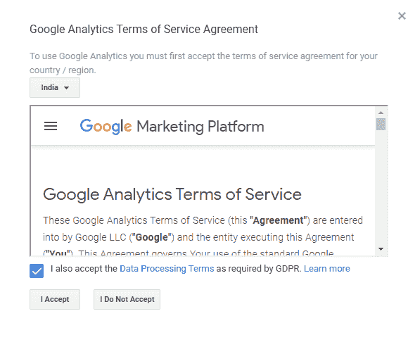
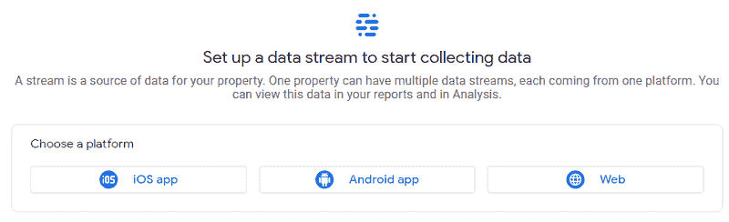
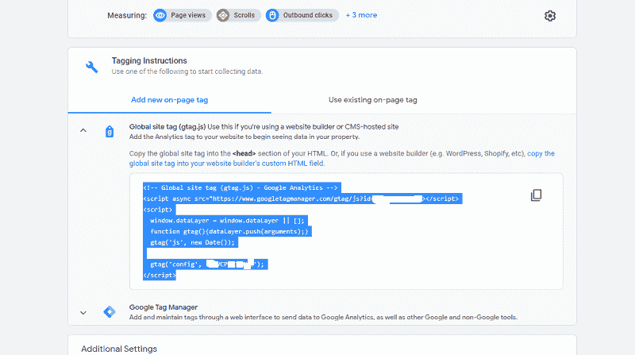
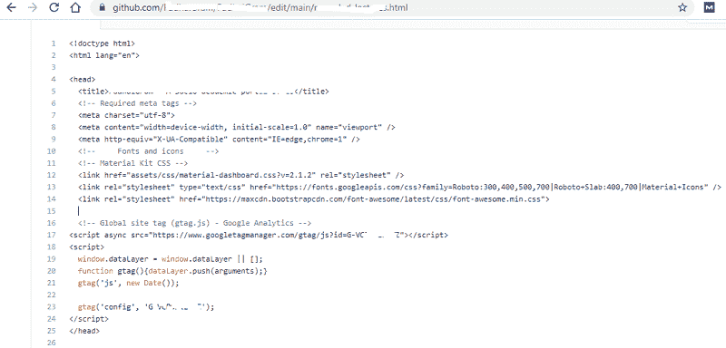

# 如何将你的网站添加到谷歌分析？

> 原文:[https://www . geeksforgeeks . org/如何将您的网站添加到谷歌分析/](https://www.geeksforgeeks.org/how-to-add-your-website-to-google-analytics/)

谷歌为网站管理员提供了一些很好的服务，这无疑有助于管理一个网络应用程序或一个静态网站。它提供了谷歌广告词关键词规划器、谷歌搜索控制台、谷歌页面速度测试、谷歌广告感知，谷歌分析也是其中之一。在 2005 年收购顽童软件公司后，谷歌推出了名为谷歌分析的服务。

谷歌平台提供了网站所有者扩大网站规模所需的所有统计数据。它按国家、设备和操作系统提供用户跟踪报告。它还提供了点击率、跳出率、会话持续时间，以及许多更有用、更高效的东西。

据专家称，这是 2020 年世界上使用最多的网络分析服务。2008 年 5 月，Pingdom 发布了一项调查，称 Alexa 排名前 500 名网站中有 161 个网站使用了谷歌分析服务。2020 年，谷歌发布了谷歌分析的第四个最新版本，即 GA4。作为一个全栈网络开发者，我们应该知道如何添加一个网站并在谷歌分析上使用它。

在这篇文章中，我们将学习如何将我们的网站添加到谷歌分析。

**分步实施:**

**第一步:首先**，进入[谷歌分析](https://analytics.google.com)，用你的谷歌账号登录，之后免费点击设置。

**第二步:**在点击开始测量后的下一页，输入你的帐户名，帐户名可以是你的名字或昵称。现在，将所有内容保留为默认值，并在页面底部单击下一步。

**第三步:**现在，选择你的物业名称，最好给出网站名称作为物业名称。此外，选择您的时区和货币，并点击下一步。

**第四步:**之后，你必须选择你的业务或行业类别、业务规模，还必须选择你将如何为你的网站使用谷歌分析。

仔细填写所有信息后，点击创建按钮。

**第五步:**选择您的国家，阅读所有谷歌分析服务条款和谷歌测量控制器数据保护条款，并接受这些条款。

**第 6 步:**在下一页，您将有选择 iOS、安卓和网站的选项。显然，我们是为网站做的，所以选择它，并输入网址和网站名称。

最后，点击创建流。

**第八步:**现在，从标注说明中复制全局站点标签，然后登录到你的网站 cPanel。

**第九步:**转到你的 HTML 或任何其他你使用过 **<头>** 部分的文件，将代码粘贴到 **[<头>](https://www.geeksforgeeks.org/html-head-tag/)** 标签的任何地方。

**注意:**我们这里使用的是 GitHub 搭配 Heroku，使用的是直播部署部署我们的网站。这意味着，如果我们在 GitHub 上更改代码，它将立即部署在 Heroku 上，我们可以在互联网上的网站上进行实时更改。

如果你也想这么做，参考[如何将一个基本静态 HTML 网站部署到 Heroku。](https://www.geeksforgeeks.org/how-to-deploy-a-basic-static-html-website-to-heroku/)

您已将您的网站添加到谷歌分析。您可以通过谷歌分析管理和扩展您的网站。