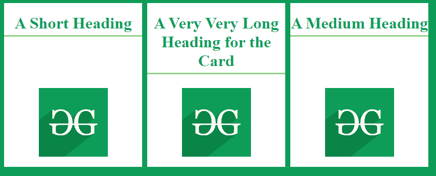

# 如何将卡片中的图像与动态标题对齐？

> 原文:[https://www . geesforgeks . org/如何将卡片中的图像与动态标题对齐/](https://www.geeksforgeeks.org/how-to-align-images-in-card-with-dynamic-title/)

很多时候需要以卡片的形式在网站上显示信息。卡片基本上是包含标题、图像和可选描述的组件。我们对齐卡片中的图像、标题和文本的方式定义了美学，也就是卡片的外观和感觉。

然而，当卡片的标题可能动态变化并且还包含即使标题长度不同也应该正确显示的图像时，设计这样的卡片可能会有问题。

这个问题可以使用 **[CSS flexbox](https://www.geeksforgeeks.org/advance-css-layout-with-flexbox/)** 及其相关属性在创建卡片时对齐标题和图像来解决。在下面的例子中，我们创建了一个带有标题和图像的卡片，可以处理标题的动态变化。

**示例:**

## 超文本标记语言

```
<!DOCTYPE html>
<html lang="en">
<head>
  <meta charset="UTF-8">
  <meta name="viewport" 
        content="width=device-width, 
                 initial-scale=1.0">
  <title>
    Dynamic Title with Cards
  </title>
  <style>
    body {
      background-color: #0f9d58;
    }

    /* Style the wrapper that would be
    around all the cards */
    .wrapper {
      width: 100%;
      display: flex;
      flex-wrap: wrap;
    }

    /* Style the card itself */
    .card {
      display: flex;
      flex-direction: column;
      text-align: center;
      color: #0f9d58;
      background-color: white;
      width: 20%;
      margin-right: 10px;
      padding-bottom: 10px;
    }

    /* Use flexbox on the title text */
    .title {
      flex: 1;
    }

    /* Use flexbox on the heading
    of the card */
    .heading {
      display: flex;
      flex: 1;
      flex-direction: column;
    }

    /* Style the heading of the card */
    .card h1 {
      padding-bottom: 5px;
      border-bottom: rgb(140, 216, 140) solid 3px;
    }

    /* Style the image of the card */  
    .card img {
      height: 90%;
      width: 50%;
      margin: 2%;
    }

  </style>
</head>
<body>
  <div class="wrapper">
    <div class="card">
      <div class="heading">
        <div class="title">
          <h1>A Short Heading</h1>
        </div>
        <div class="image">
          
        </div>
      </div>
    </div>
    <div class="card">
      <div class="heading">
        <div class="title">
          <h1>A Very Very Long Heading for the Card</h1>
        </div>
        <div class="image">
          
        </div>
      </div>
    </div>
    <div class="card">
      <div class="heading">
        <div class="title">
          <h1>A Medium Heading</h1>
        </div>
        <div class="image">
          
        </div>
      </div>
    </div>
  </div>
</body>
</html>
```

**输出:**

