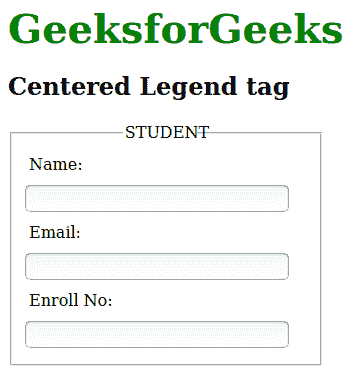

# 如何将<legend>标签文本居中对齐？</legend>T3】

> 原文:[https://www . geesforgeks . org/如何对齐-图例-标签-文本到中心/](https://www.geeksforgeeks.org/how-to-align-legend-tag-text-to-center/)

[**<图例>标记**](https://www.geeksforgeeks.org/html-legend-tag/) 用于定义子内容的标题。图例元素是父元素。该标签用于定义<字段集>元素的标题。
HTML 中的 [**<图例>对齐**](https://www.geeksforgeeks.org/html-legend-align-attribute/) 属性用于指定<字段集>元素中标题的对齐方式。除 Opera 12 及更早版本外，其他主要浏览器都支持<图例>元素的左右对齐。任何浏览器都不支持底部对齐。
我们可以使用 CSS 将<图例>标签元素对中。 [CSS 左边距属性](https://www.geeksforgeeks.org/css-margin-left-property/)将在此扮演重要角色，使图例元素居中。
以下示例实现了上述方法:
**示例:**

## 超文本标记语言

```htmlhtml
<!DOCTYPE html>
<html>

<head>
    <title>
        How to Align legend Tag
        Text to Center?
    </title>

    <style>
        form {
            width: 50%;
        }

        label {
            display: inline-block;
            float: left;
            clear: left;
            width: 90px;
            margin: 5px;
            text-align: left;
        }

        input[type="text"] {
            width: 250px;
            margin: 5px 0px;
        }

        .gfg {
            font-size: 40px;
            color: green;
            font-weight: bold;
        }

        legend {
            width: 70px;
            padding: 2px;
            margin-left: calc(50% - 35px - 8px);
        }
    </style>
</head>

<body>
    <div class="gfg">GeeksforGeeks</div>
    <h2>Centered Legend tag</h2>
    <form>
        <fieldset>
            <legend>STUDENT</legend>
            <label>Name:</label>
            <input type="text">
            <br>
            <label>Email:</label>
            <input type="text">
            <br>
            <label>Enroll No:</label>
            <input type="text">
        </fieldset>
    </form>
</body>

</html>
```

**输出:**

