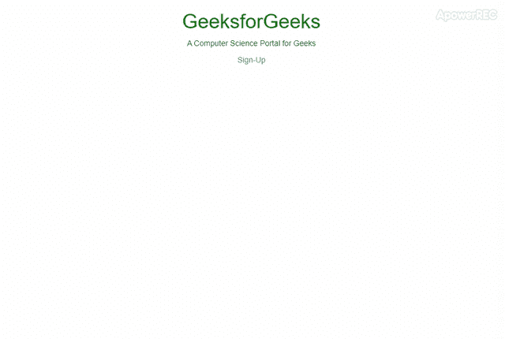

# 如何将模态内容框与任意屏幕中心对齐？

> 原文:[https://www . geesforgeks . org/如何对齐-模式-内容-框到任意屏幕中心/](https://www.geeksforgeeks.org/how-to-align-modal-content-box-to-center-of-any-screen/)

引导模式插件是一个对话框/弹出窗口，显示在当前页面的顶部。默认情况下，引导模式窗口与页面顶部对齐，并留有一些空白。但是可以使用 **[CSS 垂直对齐属性](https://www.geeksforgeeks.org/css-vertical-align-property/)** 在页面中间垂直对齐。我们也可以使用 JavaScript 来居中模态
下面的例子说明了这种方法:

**示例 1:** 首先，我们将为注册设计模态内容，然后通过使用 CSS，我们将该模态居中对齐(垂直对齐)。使用垂直对齐属性，垂直对齐属性设置元素的垂直对齐方式。

```htmlhtml
<!DOCTYPE html>
<html>

<head>
    <title>Bootstrap Modal Alignment</title>
    <link rel="stylesheet" href=
"https://maxcdn.bootstrapcdn.com/font-awesome/4.7.0/css/font-awesome.min.css" />
    <link rel="stylesheet" href=
"https://maxcdn.bootstrapcdn.com/bootstrap/3.3.7/css/bootstrap.min.css"
          integrity=
"sha384-BVYiiSIFeK1dGmJRAkycuHAHRg32OmUcww7on3RYdg4Va+PmSTsz/K68vbdEjh4u" 
          crossorigin="anonymous">
    <script src=
"https://ajax.googleapis.com/ajax/libs/jquery/1.12.4/jquery.min.js">
    </script>
    <script src=
"https://maxcdn.bootstrapcdn.com/bootstrap/3.3.7/js/bootstrap.min.js">
    </script>

    <style>

        /* Text alignment for body */
        body {
            text-align: center;
        }

        /* Styling h1 tag */
        h1 {
            color: green;
            text-align: center;
        }

        /* Styling modal */
        .modal:before {
            content: '';
            display: inline-block;
            height: 100%;
            vertical-align: middle;
        }

        .modal-dialog {
            display: inline-block;
            vertical-align: middle;
        }

        .modal .modal-content {
            padding: 20px 20px 20px 20px;
            -webkit-animation-name: modal-animation;
            -webkit-animation-duration: 0.5s;
            animation-name: modal-animation;
            animation-duration: 0.5s;
        }

        @-webkit-keyframes modal-animation {
            from {
                top: -100px;
                opacity: 0;
            }
            to {
                top: 0px;
                opacity: 1;
            }
        }

        @keyframes modal-animation {
            from {
                top: -100px;
                opacity: 0;
            }
            to {
                top: 0px;
                opacity: 1;
            }
        }
    </style>
</head>

<body>

    <h1>
      GeeksforGeeks
    </h1>
    <p>
      A Computer Science Portal for Geeks
    </p>
    <a href="#signupModal" data-toggle="modal">
      Sign-Up</a>

    <div class="modal" id="signupModal"
         role="dialog" aria-labelledby="myModalLabel"
         aria-hidden="true">

        <div class="modal-dialog">
            <div class="modal-content">

                <!-- Modal root -->
                <div class="m-header">
                    <button class="close" data-dismiss="modal">
                        ×
                    </button>
                    <h2 class="myModalLabel"> Sign Up </h2>
                </div>

                <!-- Modal body -->
                <div class="inputs">

                    <!-- username input -->
                    <div class="form-group input-group">
                        <label for="username" class="sr-only">
                          Username
                        </label>
                        <span class="input-group-addon">
                          <i class="fa fa-user"></i>
                        </span>
                        <input type="text" class="form-control" 
                               id="username" placeholder="Username">
                    </div>

                    <!-- Email input -->
                    <div class="form-group input-group">
                        <span class="input-group-addon">
                          <i class="fa fa-envelope"></i>
                        </span>
                        <label for="email" class="sr-only">
                          Email
                        </label>
                        <input type="email" class="form-control" 
                               id="email" placeholder="Email Address">
                    </div>

                    <!-- Password -->
                    <div class="form-group input-group">
                        <span class="input-group-addon">
                          <i class="fa fa-lock"></i>
                        </span>
                        <label for="password" class="sr-only">
                          Password
                        </label>
                        <input type="password" class="form-control"
                               id="password" placeholder="Choose a password">
                    </div>

                    <!-- Confirm Password -->
                    <div class="form-group input-group">
                        <span class="input-group-addon">
                          <i class="fa fa-lock"></i>
                        </span>
                        <label for="password2" class="sr-only">
                          Confirm Password
                        </label>
                        <input type="password" class="form-control" 
                               id="password2" placeholder="Confirm password">
                    </div>
                </div>

                <!-- Modal footer -->
                <div class="footer">
                    <button type="submit">Sign Up</button>
                    <p>
                        Already have an account?!
                        <a href="#loginModal" data-toggle="modal"
                           data-dismiss="modal">
                           Login!
                        </a>
                    </p>
                </div>

            </div>
        </div>
    </div>

</body>

</html>
```

**输出:**


**示例 2:** 类似地，我们首先为注册创建一个模态内容，然后我们将使用 JavaScript 将模态居中(垂直)。我们将使用 CSS 进行设计。在本例中，首先使用 **[find()方法](https://www.geeksforgeeks.org/javascript-array-find-method/)** 找出模态对话框。然后从窗口高度减去模态高度，并将其分成两半，将模态放在中间(垂直)。该解决方案将动态调整模式的对齐。

```htmlhtml
<!DOCTYPE html>
<html>

<head>
    <title>Center Align Bootstrap Modal Vertically</title>
    <link rel="stylesheet" href=
"https://maxcdn.bootstrapcdn.com/font-awesome/4.7.0/css/font-awesome.min.css" />
    <link rel="stylesheet" href=
"https://maxcdn.bootstrapcdn.com/bootstrap/3.3.7/css/bootstrap.min.css" 
          integrity=
"sha384-BVYiiSIFeK1dGmJRAkycuHAHRg32OmUcww7on3RYdg4Va+PmSTsz/K68vbdEjh4u" 
          crossorigin="anonymous">
    <script src=
"https://ajax.googleapis.com/ajax/libs/jquery/1.12.4/jquery.min.js">
    </script>
    <script src=
"https://maxcdn.bootstrapcdn.com/bootstrap/3.3.7/js/bootstrap.min.js">
    </script>

    <style>

        /* Text alignment for body */
        body {
            text-align: center;
        }

        /* Styling h1 tag */
        h1 {
            color: green;
            text-align: center;
        }

        /* Styling modal */
        .modal .modal-content {
            padding: 20px 20px 20px 20px;
            -webkit-animation-name: modal-animation;
            -webkit-animation-duration: 0.5s;
            animation-name: modal-animation;
            animation-duration: 0.5s;
        }

        @-webkit-keyframes modal-animation {
            from {
                top: -100px;
                opacity: 0;
            }
            to {
                top: 0px;
                opacity: 1;
            }
        }

        @keyframes modal-animation {
            from {
                top: -100px;
                opacity: 0;
            }
            to {
                top: 0px;
                opacity: 1;
            }
        }
    </style>
</head>

<body>

    <h1>
      GeeksforGeeks
    </h1>
    <p>
      A Computer Science Portal for Geeks
    </p>
    <a href="#signupModal" data-toggle="modal">
      Sign-Up
    </a>

    <div class="modal" id="signupModal"
         role="dialog" aria-labelledby="myModalLabel"
         aria-hidden="true">

        <div class="modal-dialog">
            <div class="modal-content">

                <!-- Modal root -->
                <div class="m-header">
                    <button class="close" data-dismiss="modal">
                        ×
                    </button>
                    <h2 class="myModalLabel">Sign Up</h2>
                </div>

                <!-- Modal body -->
                <div class="inputs">

                    <!-- username input -->
                    <div class="form-group input-group">
                        <label for="username" class="sr-only">
                          Username
                        </label>
                        <span class="input-group-addon">
                          <i class="fa fa-user"></i>
                        </span>
                        <input type="text" class="form-control" 
                               id="username" placeholder="Username">
                    </div>

                    <!-- Email input -->
                    <div class="form-group input-group">
                        <span class="input-group-addon">
                          <i class="fa fa-envelope"></i>
                        </span>
                        <label for="email" class="sr-only">
                          Email
                        </label>
                        <input type="email" class="form-control" 
                               id="email" placeholder="Email Address">
                    </div>

                    <!-- Password -->
                    <div class="form-group input-group">
                        <span class="input-group-addon">
                          <i class="fa fa-lock"></i>
                        </span>
                        <label for="password" class="sr-only">
                          Password
                        </label>
                        <input type="password" class="form-control"
                               id="password" placeholder="Choose a password">
                    </div>

                    <!-- Confirm Password -->
                    <div class="form-group input-group">
                        <span class="input-group-addon">
                          <i class="fa fa-lock"></i>
                        </span>
                        <label for="password2" class="sr-only">
                          Confirm Password
                        </label>
                        <input type="password" class="form-control" 
                               id="password2" placeholder="Confirm password">
                    </div>
                </div>

                <!-- MOdal footer -->
                <div class="footer">
                    <button type="submit">Sign Up</button>
                    <p>
                        Already have an account?!
                        <a href="#loginModal" data-toggle="modal"
                           data-dismiss="modal">
                           Login!
                        </a>
                    </p>
                </div>

            </div>
        </div>
    </div>

    <script>
        $(document).ready(function() {

            /* Centering the modal vertically */
            function alignModal() {
                var modalDialog = $(this).find(".modal-dialog");
                modalDialog.css("margin-top", Math.max(0, 
                ($(window).height() - modalDialog.height()) / 2));
            }
            $(".modal").on("shown.bs.modal", alignModal);

            /* Resizing the modal according the screen size */
            $(window).on("resize", function() {
                $(".modal:visible").each(alignModal);
            });
        });
    </script>

</body>

</html>
```

**输出:**


HTML 是网页的基础，通过构建网站和网络应用程序用于网页开发。您可以通过以下 [HTML 教程](https://www.geeksforgeeks.org/html-tutorials/)和 [HTML 示例](https://www.geeksforgeeks.org/html-examples/)从头开始学习 HTML。

CSS 是网页的基础，通过设计网站和网络应用程序用于网页开发。你可以通过以下 [CSS 教程](https://www.geeksforgeeks.org/css-tutorials/)和 [CSS 示例](https://www.geeksforgeeks.org/css-examples/)从头开始学习 CSS。