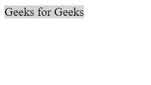
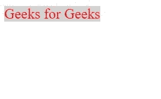

# 如果 Haml 中条件为真，如何追加类？

> 原文:[https://www . geesforgeks . org/how-to-append-class-if-condition-true-in-haml/](https://www.geeksforgeeks.org/how-to-append-class-if-condition-is-true-in-haml/)

我们将根据某个条件的评估，研究将类附加到元素的两种方法。本质上，两者背后的逻辑是一样的。

*   使用三元运算符
*   使用“除非”条件检查

**初始代码:**首先我们来写一些基本的 **[HAML](https://www.geeksforgeeks.org/haml-html-pre-processor/)** 代码。它将在**头部**部分包含一个**样式**元素。**样式**元素将包含为类定义的所有样式。最初，在**主体**部分有一个锚元素，它有一个类“添加背景”。在**样式**元素中为此类定义的样式将为锚点元素的文本提供浅灰色背景。

*   **程序:**

    ```html
    %head 
        %title Appending class based on condition evaluation

        -# defining styles for the classes
        %style
            /.add-background{ background-color: lightgrey; }

    %body
        -# an anchor element with class "add-background"
        %a{ :class => "add-background" } Geeks for Geeks
    ```

*   **输出:** 

**方法 1:** 假设我们有一个名为“make-red”的类要追加。在`style`元素中为该类定义的样式将使文本的颜色变为红色。只有当某个条件评估为真时，这个类才会被追加到已经存在的“添加背景”中。
我们取一个布尔变量“flag”。只有当“flag”的值为真时，才会追加“make-red”类，否则不会追加。

*   **程序:**

    ```html
    %head 
        %title Appending class based on condition evaluation

        -# defining styles for the classes
        %style
            /.add-background{ background-color: lightgrey; }
            /.make-red{ color: red; }

    %body
        -# declaring local boolean type variable 
        - flag = true

        -# using ternary operator to append class to the anchor element
        -# if "flag" is true, "make-red" class is appended
        -# else nothing is appended
        %a{ :class => "add-background" + ((flag == true) ? " make-red" : "") } 
        GeeksforGeeks
    ```

*   **输出:** 

**方法 2:** 使用“除非”条件检查。只要某个条件为**而非**为真，这种类型的检查可确保执行某项操作。因此，如下所示，在这种情况下，如果“flag”为 false 且计算结果不为 true，则将追加类“make-red”。也就是说，如果“flag”为 false，则不会追加类，否则将追加类。

*   **程序:**

    ```html
    %head 
        %title Appending class based on condition evaluation

        -# defining styles for the classes
        %style
            /.add-background{ background-color: lightgrey; }
            /.make-red{ color: red; }

    %body
        -# declaring local boolean type variable 
        - flag = true

        -# using the "unless" conditional check to append class to the anchor element
        -# if the "flag" is true, "make-red" class is appended
        -# else nothing is appended
        %a{ :class => "add-background" + (" make-red" unless (flag == false)) } 
        Geeks for Geeks
    ```

*   **输出:**
    