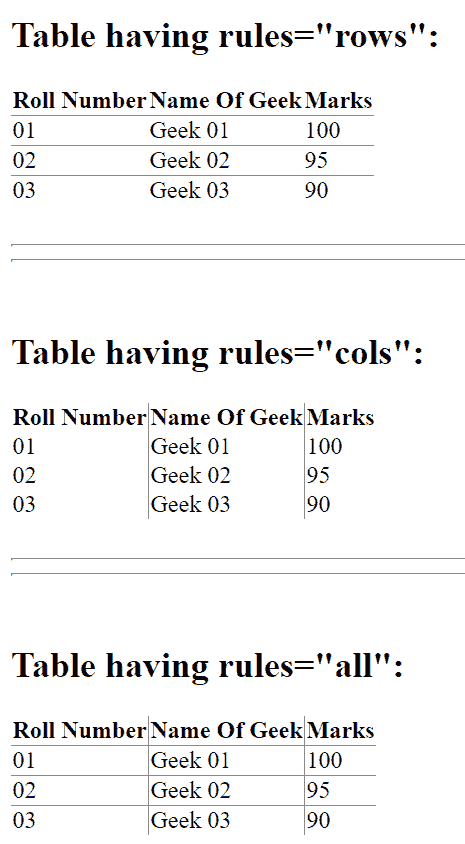
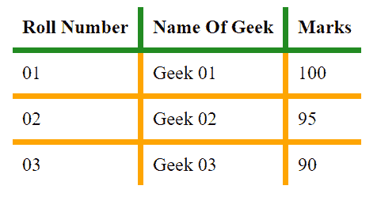
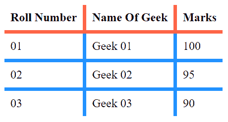

# 如何在表格内部应用边框？

> 原文:[https://www . geeksforgeeks . org/如何应用表格内边框/](https://www.geeksforgeeks.org/how-to-apply-border-inside-a-table/)

有**两种方式**在 HTML 中应用表格内部的边框。

*   仅使用 HTML
*   使用 HTML 和 CSS

**仅使用 HTML:** 在这种情况下，我们将使用表的 [**规则属性**](https://www.geeksforgeeks.org/html-table-rules-attribute/) 。规则是 HTML 表格中的属性，它允许用户只在表格的边框内显示，边框可以只在行、列或全部中选择。

**示例:**

## 超文本标记语言

```htmlhtml
<!-- Table contains border from
        inside only -->
<!DOCTYPE html>
<html>
<head>
    <title>Table In HTML</title>
</head>

<body>
    <h2>Table having rules="rows":</h2>
    <table rules="rows">

        <!--table containing only
            border of rows-->
        <tr>
            <th>Roll Number</th>
            <th>Name Of Geek</th>
            <th>Marks</th>
        </tr>
        <tr>
            <td>01</td>
            <td>Geek 01</td>
            <td>100</td>
        </tr>
        <tr>
            <td>02</td>
            <td>Geek 02</td>
            <td>95</td>
        </tr>
        <tr>
            <td>03</td>
            <td>Geek 03</td>
            <td>90</td>
        </tr>
    </table>

    <br>
    <hr><hr>
    <br>

    <h2>Table having rules="cols":</h2>

    <!--table containing only
        border of columns-->
    <table rules="cols">
        <tr>
            <th>Roll Number</th>
            <th>Name Of Geek</th>
            <th>Marks</th>
        </tr>
        <tr>
            <td>01</td>
            <td>Geek 01</td>
            <td>100</td>
        </tr>
        <tr>
            <td>02</td>
            <td>Geek 02</td>
            <td>95</td>
        </tr>
        <tr>
            <td>03</td>
            <td>Geek 03</td>
            <td>90</td>
        </tr>
    </table>

    <br>
    <hr><hr>
    <br>

    <h2>Table having rules="all":</h2>

    <!--table containing borders of
        both row and column-->
    <table rules="all">
        <tr>
            <th>Roll Number</th>
            <th>Name Of Geek</th>
            <th>Marks</th>
        </tr>
        <tr>
            <td>01</td>
            <td>Geek 01</td>
            <td>100</td>
        </tr>
        <tr>
            <td>02</td>
            <td>Geek 02</td>
            <td>95</td>
        </tr>
        <tr>
            <td>03</td>
            <td>Geek 03</td>
            <td>90</td>
        </tr>
    </table>
</body>

</html>
```

**输出:**



**使用 HTML 和 CSS:**

*   **示例 1:**CSS 中的边框样式是表格内部显示边框的另一种方式。此属性帮助用户操作表格的外部边框。

## 超文本标记语言

```htmlhtml
<!-- Using border-style in CSS -->
<!DOCTYPE html>
<html>

<head>
    <title>Table In HTML</title>

    <style media="screen">
        table {
            margin: 0 auto;
            border-collapse: collapse;
            border-style: hidden;
            /*Remove all the outside
            borders of the existing table*/
        }
        table td {
            padding: 0.5rem;
            border: 5px solid orange;
        }
        table th {
            padding: 0.5rem;
            border: 5px solid ForestGreen;
        }
    </style>
</head>

<body>
    <table>
        <tr>
            <th>Roll Number</th>
            <th>Name Of Geek</th>
            <th>Marks</th>
        </tr>
        <tr>
            <td>01</td>
            <td>Geek 01</td>
            <td>100</td>
        </tr>
        <tr>
            <td>02</td>
            <td>Geek 02</td>
            <td>95</td>
        </tr>
        <tr>
            <td>03</td>
            <td>Geek 03</td>
            <td>90</td>
        </tr>
    </table>
</body>

</html>
```

**输出:**



*   **示例 2:** 在 CSS 中使用子概念另一种获得带有内部边框的表格的方法是移除表格中所有不需要的边框。它可以通过在 CSS 中使用第一个孩子和最后一个孩子来实现。这里，我们选择第一列并移除其左侧边框，然后选择第一行并移除其顶部边框，然后选择最后一列并移除其右侧边框，最后选择最后一行并移除其底部边框。这样，我们移除了表格的所有外部边框，只剩下内部边框。

## 超文本标记语言

```htmlhtml
<!DOCTYPE html>
<html>

<head>
    <title>Table In HTML</title>

    <style media="screen">
        table {
            margin: 0 auto;
            border-collapse: collapse;
        }
        table td {
            padding: 0.5rem;
            border: 5px solid DodgerBlue;
        }
        table th {
            padding: 0.5rem;
            border: 5px solid Tomato;
        }

        /* Removing all unwanted border
        from left hand side by calling
        all the elements in the first
        column and removing their left
        border*/
        table tr td:first-child, th:first-child{
            border-left: none;
        }

        /* Removing all unwanted border
        from top of the table by calling
        all the elements in first row and
        removing their top border*/
        table tr:first-child th{
            border-top: none;
        }

        /* Removing all unwanted border
        from right hand side by calling
        all the elements in last row and
        removing their right border*/
        table tr td:last-child, th:last-child{
            border-right: none;
        }

        /* Removing all unwanted border
        from bottom of the table by
        calling all the elements in
        last column and removing their
        bottom border*/
        table tr:last-child td{
            border-bottom: none;
        }
    </style>
</head>

<body>
    <table>
        <tr>
            <th>Roll Number</th>
            <th>Name Of Geek</th>
            <th>Marks</th>
        </tr>
        <tr>
            <td>01</td>
            <td>Geek 01</td>
            <td>100</td>
        </tr>
        <tr>
            <td>02</td>
            <td>Geek 02</td>
            <td>95</td>
        </tr>
        <tr>
            <td>03</td>
            <td>Geek 03</td>
            <td>90</td>
        </tr>
    </table>
</body>

</html>
```

**输出:**

