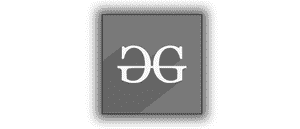
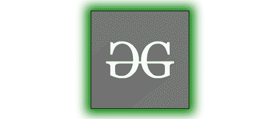
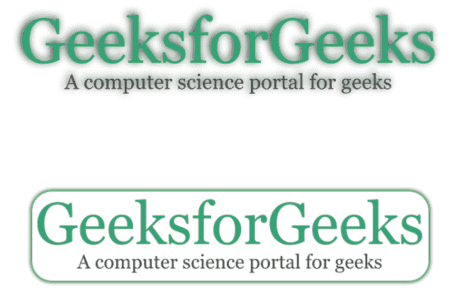

# 如何对灰度图像应用彩色阴影和边框属性？

> 原文:[https://www . geesforgeks . org/如何将彩色阴影和边框属性应用于灰度图像/](https://www.geeksforgeeks.org/how-to-apply-colored-shadow-and-border-properties-to-a-grayscale-image/)

有一种非常简单的方法可以将灰度效果应用于图像。使用**滤镜()**属性，我们可以对任何 HTML 元素应用灰度效果。当我们对具有灰度属性的图像应用彩色框阴影时，阴影也会变成灰度。例如:

## 超文本标记语言

```html
<!DOCTYPE html>
<html>

<head>
    <style>
        #logo {
            width: 200px;
            height: auto;
            z-index: none;
            filter: grayscale(100%);
            border: 1px solid black;
            box-shadow: 0px 0px 20px 10px green;
        }

        .center {
            margin: 0 auto;
            text-align: center;
            justify-content: center;
        }
    </style>
</head>

<body class="center">
    <br /><br /><br />
    <div id="logo-shadow">
        
    </div>
</body>

</html>
```

**输出:**



您可以观察到，在 CSS 中，阴影是为绿色定义的，但它显示为灰度。

这可以通过包装图像并将阴影属性应用于包装分割来防止。例如:

## 超文本标记语言

```html
<!DOCTYPE html>
<html>

<head>
    <style>
        #logo {
            width: 200px;
            height: auto;
            z-index: none;
            filter: grayscale(100%);
            transition: filter 1s, border-radius 1s;
        }

        #logo-shadow {
            display: inline-block;
            border: 1px solid black;
            box-shadow: 0px 0px 20px 10px green;
            transition: border-radius 1s;
        }

        .center {
            margin: 0 auto;
            text-align: center;
            justify-content: center;
        }
    </style>
</head>

<body class="center">
      <br /><br /><br />
    <div id="logo-shadow">
        
    </div>
</body>

</html>
```

**输出:**现在可以观察到阴影是彩色的，而图像还是灰度。



您可以使用这三个属性(灰度()、框阴影、边框)的组合来创建一些更有趣的 CSS 效果。下面是一些例子:

**示例 1:** 您可以使用下面的代码，在鼠标指针悬停时将按钮#1 转换为按钮#2。

## 超文本标记语言

```html
<!DOCTYPE html>
<html>

<head>
    <style>
        #logo {
            width: 200px;
            height: auto;
            z-index: none;
            filter: grayscale(100%);
            transition: filter 1s, border-radius 1s;
        }

        #logo-shadow {
            display: inline-block;
            border: 1px solid black;
            box-shadow: 0px 0px 20px 10px green;
            transition: border-radius 1s;
        }

        #logo:hover {
            border-radius: 50px;
            filter: unset;
        }

        #logo-shadow:hover {
            border-radius: 50px;
            border: none;
        }

        .center {
            margin: 0 auto;
            text-align: center;
            justify-content: center;
        }
    </style>
</head>

<body class="center">
    <br /><br /><br />
    <div id="logo-shadow">
        
    </div>
</body>

</html>
```

**Output:**

**示例 2:** 您也可以使用这些效果将 PNG 图像转换为可区分的按钮。这些效果主要用于创建三维透视图和最小视图。

## 超文本标记语言

```html
<!DOCTYPE html>
<html>

<head>
    <title>GFG Article</title>
    <style>
        #logo2 {
            display: inline-block;
            height: auto;
            z-index: none;
            filter: drop-shadow(-2px -2px 5px #212121);
            transition: filter 1s, box-shadow 1s, border-radius 1s;
        }

        #logo2:hover {
            filter: unset;
            border-radius: 30px;
            box-shadow: 0px 0px 5px 2px green;
        }

        .center {
            margin: 0 auto;
            text-align: center;
            justify-content: center;
        }
    </style>
</head>

<body class="center">
    <br /><br />
    <div>
        
    </div>
</body>

</html>
```

**Output:**