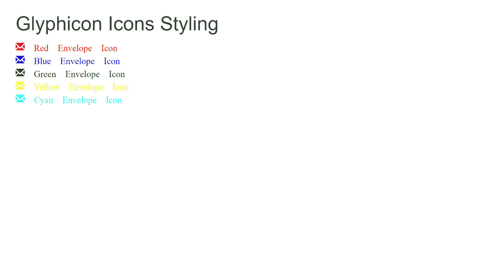

# 如何将自定义颜色应用于嵌入到用 Bootstrap 设计的链接中的字体图标？

> 原文:[https://www . geesforgeks . org/how-apply-custom-color-to-glyphicon-icon-embed-in-a-link-style-with-boostratp/](https://www.geeksforgeeks.org/how-to-apply-custom-color-to-glyphicon-icon-embed-within-a-link-styled-with-boostratp/)

给定一个带有相关引导图的 HTML 文档，任务是将自定义颜色应用于它们。

**方法:**首先，我们需要将 *id* 属性分配给您需要使用 CSS 进行自定义的特定字体。我们可以将*颜色*属性应用于特定的 *id* ，并通过使用十六进制值或普通颜色来更改图标颜色。

*id* 是用于访问整个标签的属性。*颜色*是元素的属性，用于更改特定元素的颜色，它将该值作为十六进制值或颜色名称。

**语法:**

```html
#id_name {
    color: red;
}
```

**示例:**

## 超文本标记语言

```html
<!DOCTYPE html>
<html>

<head>
    <meta name="viewport" content=
        "width=device-width, initial-scale=1">

    <link rel="stylesheet" href=
"https://maxcdn.bootstrapcdn.com/bootstrap/3.4.0/css/bootstrap.min.css">

    <script src=
"https://ajax.googleapis.com/ajax/libs/jquery/3.5.1/jquery.min.js">
    </script>

    <script src=
"https://maxcdn.bootstrapcdn.com/bootstrap/3.4.0/js/bootstrap.min.js">
    </script>

    <style>
        #red_e {
            color: red;
        }

        #blue_e {
            color: blue;
        }

        #green_e {
            color: green;
        }

        #yellow_e {
            color: yellow;
        }

        #cyan_e {
            color: cyan;
        }
    </style>
</head>

<body>
    <div class="container">
        <h2>Glyphicon Icons Styling</h2>

        <a href="#">
            <span class="glyphicon glyphicon-envelope" id="red_e">
                Red Envelope Icon</span>
        </a> <br>

        <a href="#">
            <span class="glyphicon glyphicon-envelope" id="blue_e">
                Blue Envelope Icon</span>
        </a> <br>

        <a href="#">
            <span class="glyphicon glyphicon-envelope" id="green_e">
                Green Envelope Icon</span>
        </a> <br>

        <a href="#">
            <span class="glyphicon glyphicon-envelope" id="yellow_e">
                Yellow Envelope Icon</span>
        </a> <br>

        <a href="#">
            <span class="glyphicon glyphicon-envelope" id="cyan_e">
                Cyan Envelope Icon</span>
        </a> <br>
    </div>
</body>

</html>
```

**输出:**



造型引导 Glyficon

**支持的浏览器:**

*   谷歌 Chrome
*   微软公司出品的 web 浏览器
*   火狐浏览器
*   歌剧
*   旅行队