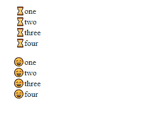
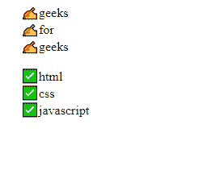

# 列表式类型如何应用表情十六进制代码创建自定义列表点？

> 原文:[https://www . geesforgeks . org/how-apply-emoji-hex-code-in-list-style-type-to-create-custom-list-point/](https://www.geeksforgeeks.org/how-to-apply-emoji-hex-code-in-list-style-type-to-create-custom-list-point/)

可以在 [*列表样式类型*](https://www.geeksforgeeks.org/css-list-style-type-property/) 中为有序和无序[列表](https://www.geeksforgeeks.org/html-lists/)传递表情符号十六进制代码，创建自定义列表点。

我们在 CSS 中使用以下语法。你需要在你的 CSS *列表样式类型*属性中写表情符号的十六进制代码。你可以参考 [HTML 表情符号](https://www.geeksforgeeks.org/html-emojis/)文章来了解表情符号的十六进制代码。

**语法:**

```html
ul,ol{
  list-style-type: "\write correct hex code";
}
```

使用这种风格后，我们的列表不会以数字开头，而是用表情符号来代替。

**注意:**需要在每个十六进制代码前插入“\”。

**例 1:**

## 超文本标记语言

```html
<!DOCTYPE html>
<html lang="en">
<head>
    <meta charset="UTF-8">
    <meta name="viewport" 
          content="width=device-width, initial-scale=1.0">

    <style>
        ul{
           list-style-type: "\231B";
        }
        ol
        {
            list-style-type: "\1F604";
        }
    </style>
</head>
<body>
    <ul>
        <li>one</li>
        <li>two</li>
        <li>three</li>
        <li>four</li>
    </ul>
    <ol>
        <li>one</li>
        <li>two</li>
        <li>three</li>
        <li>four</li>
    </ol>
</body>
</html>
```

**输出:**



**例 2:**

## 超文本标记语言

```html
<!DOCTYPE html>
<html lang="en">
<head>
    <meta charset="UTF-8">
    <meta name="viewport" 
          content="width=device-width, initial-scale=1.0">

    <style>
        ul
        {
            list-style-type: "\270D";
        }
        ol
        {
            list-style-type: "\2705";
        }
    </style>
</head>
<body>
    <ul>
        <li>geeks</li>
        <li>for</li>
        <li>geeks</li>
    </ul>
    <ol>
        <li>html</li>
        <li>css</li>
        <li>javascript</li>
    </ol>
</body>
</html>
```

**输出:**

