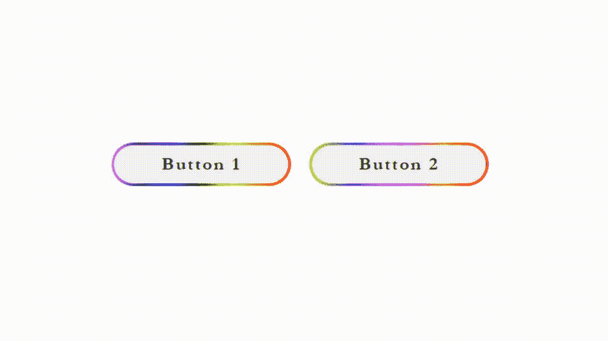

# 如何使用 SASS 在按钮上应用悬停效果？

> 原文:[https://www . geesforgeks . org/how-apply-how-how-悬停-effect-over-button-using-sass/](https://www.geeksforgeeks.org/how-to-apply-hover-effect-over-button-using-sass/)

动画让用户体验更加美好，印象更加深刻。随着 HTML(超文本标记语言)元素和 SASS(语法上令人敬畏的样式表)的使用，我们将设计按钮，为它们提供丰富多彩的边框和动画效果。我们将使用 [**Sass**](https://www.geeksforgeeks.org/css-preprocessor-sass/) ，因为它是 CSS 的更好替代品，也是 CSS 的超集。 **Sass** 为所有浏览器提供了 100%的兼容性，并通过编译的 CSS 文件提供了更好的语法。 **Sass** 提供两个文件扩展名“**SCSS**”(Sassy Css)和“ **SASS** ”(缩进语法)。我们将使用 **SCSS** 延伸和 **SCSS** 的各种功能。

**方法:**我们将介绍按钮元素，并给出 HTML 页面的结构。我们将使用**萨斯**的特性为他们提供造型、使用线性渐变的边框设计和动画效果。

**分步实施:**

**第一步:** 首先，我们将使用 HTML 的按钮标签设计简单的按钮。我们将从创建一个 **HTML** 文件开始。在 HTML 头部标签中，我们将包含元链接和外部文件，以包含后备字体。在主体标签中，我们将包括属性、类和 Id，为它们提供设计和按钮标签，使其可点击。

## 超文本标记语言

```htmlhtml
<!DOCTYPE html>
<html lang="en">

<head>
    <meta charset="UTF-8">
    <meta name="viewport" 
          content="width=device-width, initial-scale=1.0">
    <link rel="stylesheet" href="index.css">
    <link href=
"https://fonts.googleapis.com/css2?family=Cormorant+Garamond:wght@600&display=swap"
          rel="stylesheet">
</head>

<body>
    <div class="container">
        <div class="border_btn1 border_btn1_animate">
            <button class="container_button1 
                           btn1-hover btn1-hover-animate">
                Button 1
            </button>
        </div>
        <div class="border_btn2 border_btn2_animate">
            <button class="container_button2 
                           btn2-hover btn2-hover-animate">
                Button 2
            </button>
        </div>
    </div>
</body>
</html>
```

**步骤 2:** 我们将创建一个文件扩展名为**的 **SCSS** 文件。scss** 。我们将包括 **SCSS** 的各种功能。以“{content}”开头的变量。以分号结尾的美元符号是一个更好的工具，可以在一个地方更改属性，而不是在整个代码中搜索，嵌套包括父类，我们还将使用扩展元素来帮助继承元素的属性。

**SCS 代码:**

## index . scss

```htmlhtml
/* Declaring variables */
$range: 88vh;
$background_color: #f3f3f3;
$text-color: black;

/* Declaring a mixin function by 
   passing a actual argument */
@mixin center($align) {
  display: flex;
  justify-content: center;
  align-items: center;
  flex-direction: $align;
}
*,
*::before,
*::after {
  padding: 0px;
  margin: 0px;
  box-sizing: inherit;
}

.container {

  /* Calling a mixin function name center
     by passing row as a information to
     it's actual argument */
  @include center(row);

  /* Accessing variable using a '{content}apos; dollar sign */
  height: $range;
  button {
    border: none;
    @include center(row);
    box-sizing: border-box;
    cursor: pointer;
    font-size: 21px;
    font-weight: bold;
    letter-spacing: 2px;
    width: 200px;
    height: 46px;
    background-color: $background_color;
    color: $text-color;
    font-family: "Cormorant", "Garamond";
    margin-left: 23px;
    border-radius: 24px;
  }

  .border_btn1 {
    width: 200px;
    height: 44px;
    padding: 3px;
    border-radius: 41px;
    margin-left: 21px;
  }
  .border_btn1_animate {
    background: linear-gradient(
      to left,
      red,
      orange,
      yellow,
      green,
      blue,
      indigo,
      violet
    );
  }

  #{&}_button1 {
    margin-left: 0px;
    height: 44px;
    display: inline-block;
    position: relative;
  }
  .border_btn2 {
    width: 200px;
    height: 44px;
    padding: 3px;
    border-radius: 41px;
    margin-left: 21px;
  }
  .border_btn2_animate {
    background: linear-gradient(
      to right,
      chartreuse,
      #6161fd,
      #fd31fd,
      #ffb03a,
      red
    );
  }

  #{&}_button2 {

       /* Inheriting the properties 
          of container_button1 */
       @extend .container_button1;
  }
}
.btn1-hover:hover:before,
.btn2-hover:hover:before {
  position: absolute;
  left: 0px;
  top: 0px;
  line-height: 2.1;
  min-width: 49px;
  font-size: 100%;
  border-radius: 24px;
  background: rgba(0, 0, 0, 0.1);
}

.btn1-hover:hover:before,
.btn2-hover:hover:before {
  content: url("");
}
.btn1-hover-animate:hover:before,
.btn2-hover-animate:hover:before {
  transition: width 0.5ms ease-in-out;
  animation: change 1s forwards 1;
}

@keyframes change {
  0% {
    width: 1px;
  }
  100% {
    width: 200px;
  }
}
```

**第三步:用 **SCSS** 编译 CSS** 或层叠样式表。 **SCSS** 最棒的地方在于它为编译后的 CSS 提供了浏览器支持，这使得它可以兼容各种主流浏览器。

我们使用 CSS 灵活的方块布局使按钮居中显示，*线性渐变*为按钮的边框提供渐变的触感，然后“向左”方向指示颜色开始。动画和*关键帧*用于显示光标在按钮上时的效果，增加了动画速记属性“*动画:向前改变 1s 1*”后跟*动画-名称-改变，动画-延迟-功能:1s，动画-填充-模式:向前改变*(在最后一个关键帧后停止动画)*动画-迭代-计数-功能:1* 。

当悬停按钮背景颜色的不透明度时，它会根据使用 CSS 关键帧实现的按钮宽度，从 1px 略微增加到 200px。它不允许在 CSS 文件中进行任何更改，因为它会自动将 SASS 或 SCSS 文件编译为 CSS。

**编译后的 CSS 代码:**

## index.css

```htmlhtml
/* Declaring variables */
/* Declaring a mixin function by passing a actual argument */
*,
*::before,
*::after {
  padding: 0px;
  margin: 0px;
  box-sizing: inherit;
}

.container {
  /* Calling a mixin function name center by 
     passing row as a information
     to it's actual argument */
  display: flex;
  justify-content: center;
  align-items: center;
  flex-direction: row;
  /* Accessing variable using a '{content}apos; dollar sign */
  height: 88vh;
}
.container button {
  border: none;
  display: flex;
  justify-content: center;
  align-items: center;
  flex-direction: row;
  box-sizing: border-box;
  cursor: pointer;
  font-size: 21px;
  font-weight: bold;
  letter-spacing: 2px;
  width: 200px;
  height: 46px;
  background-color: #f3f3f3;
  color: black;
  font-family: "Cormorant", "Garamond";
  margin-left: 23px;
  border-radius: 24px;
}
.container .border_btn1 {
  width: 200px;
  height: 44px;
  padding: 3px;
  border-radius: 41px;
  margin-left: 21px;
}
.container .border_btn1_animate {
  background: linear-gradient(
    to left,
    red,
    orange,
    yellow,
    green,
    blue,
    indigo,
    violet
  );
}
.container .container_button1,
.container .container_button2 {
  margin-left: 0px;
  height: 44px;
  display: inline-block;
  position: relative;
}
.container .border_btn2 {
  width: 200px;
  height: 44px;
  padding: 3px;
  border-radius: 41px;
  margin-left: 21px;
}
.container .border_btn2_animate {
  background: linear-gradient(
    to right,
    chartreuse,
    #6161fd,
    #fd31fd,
    #ffb03a,
    red
  );
}
.container .container_button2 {
  /* Inheriting the properties of container_button1 */
}

.btn1-hover:hover:before,
.btn2-hover:hover:before {
  position: absolute;
  left: 0px;
  top: 0px;
  line-height: 2.1;
  min-width: 49px;
  font-size: 100%;
  border-radius: 24px;
  background: rgba(0, 0, 0, 0.1);
}

.btn1-hover:hover:before,
.btn2-hover:hover:before {
  content: url("");
}

.btn1-hover-animate:hover:before,
.btn2-hover-animate:hover:before {
  transition: width 0.5ms ease-in-out;
  animation: change 1s forwards 1;
}

@keyframes change {
  0% {
    width: 1px;
  }
  100% {
    width: 200px;
  }
}
```

**输出:**

