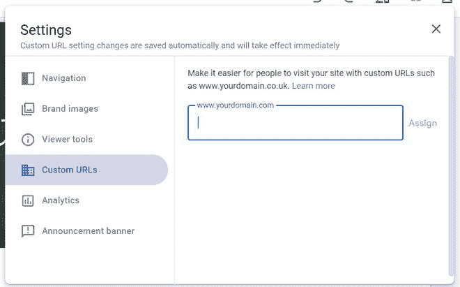
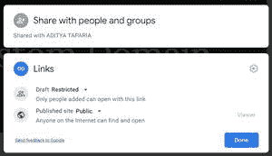

# 如何在新谷歌网站中分配自定义 URL 域网址？

> 原文:[https://www . geesforgeks . org/如何分配-自定义-URL-域-新网址-google-sites/](https://www.geeksforgeeks.org/how-to-assign-custom-url-domain-web-address-in-new-google-sites/)

你可能认为你不能托管你在你的域名上创建的谷歌网站，但是你会惊讶于你可以。一个人可以在一个自定义域上托管他的网站。在你的自定义域名上托管网站。

**先决条件:**您必须有一个自定义域网址来托管该网站。

*   转到设置。

*   然后进入*自定义网址*部分，进入你的域名。示例域可以像**或**一样。记得先核实你的域名地址。****

如果您在网站对用户可见性方面遇到任何问题，请检查网站发布者设置，并将网站设置为公共的，这将使网站公开。

