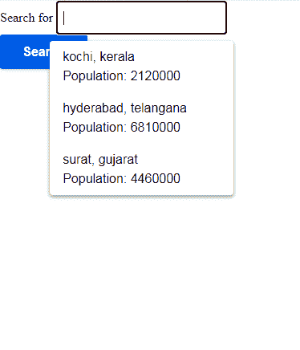

# 如何在谷歌 AMP 搜索时自动建议丰富的内容？

> 原文:[https://www . geeksforgeeks . org/如何在谷歌搜索时自动建议丰富的内容-amp/](https://www.geeksforgeeks.org/how-to-auto-suggest-rich-contents-while-searching-in-google-amp/)


网站中的大多数自动建议都是普通的字符串，但有时用户会寻找更多的内容，这些内容会成为有用的丰富内容自动建议，提供更多的信息和清晰度。谷歌 AMP 让开发人员使用 amp-autocomplete 更容易使用这个选项。

**Required Scripts:**

*   **导入放大器自动完成组件。**

    ```htmlhtml
    <script async custom-element="amp-autocomplete" 
            src=
    "https://cdn.ampproject.org/v0/amp-autocomplete-0.1.js">
    </script>
    ```

    *   **Importing the amp-form component.**

    ```htmlhtml
    <script async custom-element="amp-form" 
            src="https://cdn.ampproject.org/v0/amp-form-0.1.js">
    </script>
    ```

    为了使用 amp-autocomplete 建议丰富的内容，我们将数据传递到如下所示的项目中的 JsonObjects 数组中

    ```htmlhtml
    { "items" : [
        {
            "city" : "Albany",
            "state" : "New York", 
            "areaCode" : 518,
            "population" : 98251
        }, {
            "city" : "Annapolis",
            "state" : "Maryland",
            "areaCode" : 410,
            "population" : 39321
        }, {
            "city" : "Trenton",
            "state" : "New Jersey",
            "areaCode" : 609,
            "population" : 84964
        }
    ] }
    ```

    这些数据的显示通过下面给出的模板给出

    ```htmlhtml
    <template type="amp-mustache" id="amp-template-custom">
      <div class="city-item" data-value="{{city}}, {{state}}">
          <div>{{city}}, {{state}}</div>
          <div class="custom-population">Population: {{population}}</div>
      </div>
    </template>
    ```

    **示例:**

    ```htmlhtml
    <!DOCTYPE html>
    <html ⚡>
        <head>
            <meta charset="utf-8" />
            <link rel="canonical" 
                  href=
    "https://amp.dev/documentation/examples/components/amp-autocomplete/index.html" />
            <meta name="viewport"
                  content="width=device-width,
                           minimum-scale=1,
                           initial-scale=1" />
            <script async custom-element="amp-autocomplete" 
                    src=
    "https://cdn.ampproject.org/v0/amp-autocomplete-0.1.js">
          </script>
            <script async custom-element="amp-form" 
                    src=
    "https://cdn.ampproject.org/v0/amp-form-0.1.js">
          </script>
            <title>geeksforgeeks | amp-autocomplete
          </title>
            <style amp-custom>
                :root {
                    --space-1: 0.5rem;
                    --space-3: 1.5rem;
                    --space-4: 2rem;
                    --color-text-light: #fff;
                    --color-primary: #005af0;
                    --box-shadow-1: 
                      0 1px 1px 0 rgba(0, 0, 0, 0.14), 
                      0 1px 1px -1px rgba(0, 0, 0, 0.14),
                      0 1px 5px 0 rgba(0, 0, 0, 0.12);
                }

                .sample-form input[type="submit"] {
                    -webkit-appearance: none;
                    border: none;
                    background-color: var(--color-primary);
                    color: var(--color-text-light);
                    margin: var(--space-2);
                    font-family: "Poppins", sans-serif;
                    font-weight: 700;
                    line-height: 1.2em;
                    font-size: 1em;
                    padding: 0.75em 1.75em;
                    text-decoration: none;
                    text-align: center;
                    border-radius: 3px;
                    border: none;
                    box-shadow: var(--box-shadow-1);
                }
                .sample-form {
                    padding: var(--space-2);
                }
            </style>
            <style amp-boilerplate>
                body {
                    -webkit-animation: 
                      -amp-start 8s steps(1, end) 0s 1 normal both;
                    -moz-animation: 
                      -amp-start 8s steps(1, end) 0s 1 normal both;
                    -ms-animation: 
                      -amp-start 8s steps(1, end) 0s 1 normal both;
                    animation: 
                      -amp-start 8s steps(1, end) 0s 1 normal both;
                }
                @-webkit-keyframes -amp-start {
                    from {
                        visibility: hidden;
                    }
                    to {
                        visibility: visible;
                    }
                }
                @-moz-keyframes -amp-start {
                    from {
                        visibility: hidden;
                    }
                    to {
                        visibility: visible;
                    }
                }
                @-ms-keyframes -amp-start {
                    from {
                        visibility: hidden;
                    }
                    to {
                        visibility: visible;
                    }
                }
                @-o-keyframes -amp-start {
                    from {
                        visibility: hidden;
                    }
                    to {
                        visibility: visible;
                    }
                }
                @keyframes -amp-start {
                    from {
                        visibility: hidden;
                    }
                    to {
                        visibility: visible;
                    }
                }
            </style>
            <noscript>
                <style amp-boilerplate>
                    body {
                        -webkit-animation: none;
                        -moz-animation: none;
                        -ms-animation: none;
                        animation: none;
                    }
                </style>
            </noscript>
            <script async src="https://cdn.ampproject.org/v0.js">
          </script>
            <script async custom-template="amp-mustache" 
                    src=
    "https://cdn.ampproject.org/v0/amp-mustache-0.2.js">
          </script>
        </head>
        <body>
            <form class="sample-form"
                  method="post" 
                  action-xhr=
    "https://amp.dev/documentation/examples/api/echo" target="_top">
                <label>
                    <span>Search for</span>
                    <amp-autocomplete filter="token-prefix" 
                                      filter-value="city"
                                      min-characters="0">
                        <input type="search" name="city" />
                        <script type="application/json">
                            {
                                "items": [
                                    {
                                        "city": "kochi",
                                        "state": "kerala",
                                        "population": 2120000
                                    },
                                    {
                                        "city": " hyderabad",
                                        "state": "telangana",
                                        "population": 6810000
                                    },
                                    {
                                        "city": "surat",
                                        "state": "gujarat",
                                        "population": 4460000
                                    }
                                ]
                            }
                        </script>
                        <template type="amp-mustache"
                                  id="amp-template-custom">
                            <div class="city-item" 
                                 data-value="{{city}}, {{state}}">
                                <div>{{city}}, {{state}}</div>
                                <div class="custom-population">
                                    Population: {{population}}
                                </div>
                            </div>
                        </template>
                    </amp-autocomplete>
                </label>
                <input type="submit" value="Search" />
                <div submit-success>
                    <template type="amp-mustache">
                        Successfully submitted {{city}}!
                    </template>
                </div>
                <div submit-error>
                    Error!
                </div>
            </form>
        </body>
    </html>
    ```

    **输出:**

    