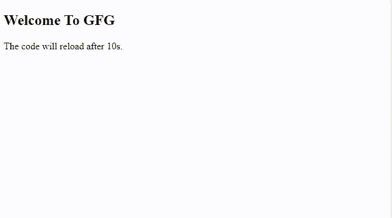
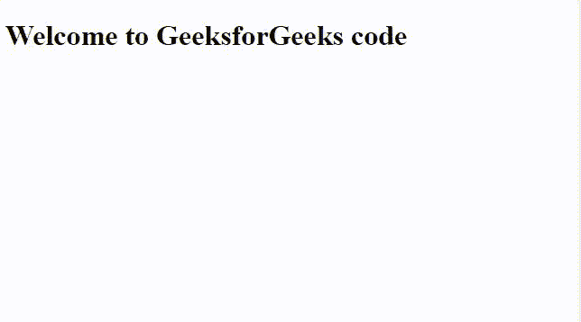

# 如何在固定时间内自动刷新网页？

> 原文:[https://www . geesforgeks . org/如何在固定时间内自动刷新网页/](https://www.geeksforgeeks.org/how-to-automatic-refresh-a-web-page-in-fixed-time/)

假设我们给出了一个 HTML 文档，任务是在网页浏览器中一段时间后自动刷新网页。我们将预定义一个时间段，浏览器会自动刷新网页。

**示例:**您正在创建一个自动刷新网站，该网站需要在某个较小的时间段后进行刷新。因此，在这种情况下，您可以使用 meta http-equiv 标记来刷新网页。这个 http-equiv 标签的另一个例子是，它可以用来重新加载一个天气网站，该网站需要在每隔一小段时间更新一次，以显示天气的微小变化。

**方法 1:** 可以使用 http-equiv 属性，使用 HTML 头部元素中的元标签自动刷新网页。它是 HTML 5 的一个内置属性。可以使用元标签中的内容属性进一步添加刷新的时间段。

HTTP equiv 属性可用于模拟 HTTP 响应头。该属性得到了谷歌 Chrome、Mozilla Firefox、微软 Edge、Safari、Opera Mini 等所有主要网络浏览器的支持。

**语法:**

```htmlhtml
<meta http-equiv="refresh" content="10">
```

**示例:**

```htmlhtml
<!DOCTYPE html>
<html>

<head>
    <title>Page Title</title>
    <meta http-equiv="refresh" content="10">
</head>

<body>
    <h2>Welcome To GFG</h2>
    <p>The code will reload after 10s.</p>
</body>

</html>
```

**输出**:



**方法二:** **使用 setInterval()方法:**访问网页自动刷新属性的另一种方法是使用下面的 JavaScript 代码，直到调用 ClearInterval()为止，setInterval()将继续不断地调用自身。

**语法:**

```htmlhtml
<script>
    function autoRefresh() {
        window.location = window.location.href;
    }
    setInterval('autoRefresh()', 5000);
</script>
```

**示例:**

```htmlhtml
<!DOCTYPE html>
<html>

<head>
    <title>
        Reloading page after 5 seconds
    </title>

    <script>
        function autoRefresh() {
            window.location = window.location.href;
        }
        setInterval('autoRefresh()', 2000);
    </script>
</head>

<body>
    <h1>Welcome to GeeksforGeeks code</h1>
</body>

</html>
```

**输出:**

