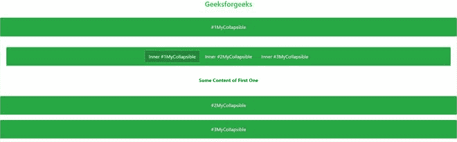

# 关闭手风琴时，如何自动关闭手风琴内部所有可折叠的元素？

> 原文:[https://www . geeksforgeeks . org/如何在关闭手风琴时自动关闭手风琴内部的所有可折叠元件/](https://www.geeksforgeeks.org/how-to-automatically-close-all-collapsible-elements-inside-of-the-accordion-when-closing-the-accordion/)

折叠插件提供了一种快速显示和隐藏内容的方法。它通过几个类和 Bootstrap 4 JavaScript 插件将内容的可感知性翻转到程序上。

翻转(切换)内容需要连接到 **href** 属性，或者带有**数据目标**属性的按钮。在这两种情况下，都需要**数据开关。**

**语法:**

与 **href** 属性链接。

```htmlhtml
<a data-toggle="collapse" href="#collapseExample" ...>
    <!--Write your link name -->
</a>

```

**或**

带有**数据目标**属性的按钮。

```htmlhtml
<button class="btn btn-primary" type="button" 
    data-toggle="collapse" 
    data-target="#collapseExample" ...>
    <!--Write your button name-->
</button>

```

**显示卡片:**

```htmlhtml
<div class="collapse" id="collapseExample">
    <div class="card card-body">
        <h5 class="card-title"><!--Write title name--></h5>
        <!--Write content here -->
    </div>
</div>

```

**示例:**

## 超文本标记语言

```htmlhtml
<!doctype html>
<html lang="en">

<head>
    <!-- Required meta tags -->
    <meta charset="utf-8">
    <meta name="viewport" content="width=device-width,
            initial-scale=1, shrink-to-fit=no">

    <!-- Bootstrap CSS -->
    <link rel="stylesheet" href=
"https://stackpath.bootstrapcdn.com/bootstrap/4.5.0/css/bootstrap.min.css"
        integrity=
"sha384-9aIt2nRpC12Uk9gS9baDl411NQApFmC26EwAOH8WgZl5MYYxFfc+NcPb1dKGj7Sk"
        crossorigin="anonymous">

    <!-- Optional JavaScript -->
    <!-- jQuery first, then Popper.js, 
        then Bootstrap JS -->
    <script src="https://code.jquery.com/jquery-3.5.1.slim.min.js"
        integrity=
"sha384-DfXdz2htPH0lsSSs5nCTpuj/zy4C+OGpamoFVy38MVBnE+IbbVYUew+OrCXaRkfj"
        crossorigin="anonymous">
    </script>

    <script src=
"https://cdn.jsdelivr.net/npm/popper.js@1.16.0/dist/umd/popper.min.js"
        integrity=
"sha384-Q6E9RHvbIyZFJoft+2mJbHaEWldlvI9IOYy5n3zV9zzTtmI3UksdQRVvoxMfooAo"
        crossorigin="anonymous">
    </script>

    <script src=
"https://stackpath.bootstrapcdn.com/bootstrap/4.5.0/js/bootstrap.min.js"
        integrity=
"sha384-OgVRvuATP1z7JjHLkuOU7Xw704+h835Lr+6QL9UvYjZE3Ipu6Tp75j7Bh/kR0JKI"
        crossorigin="anonymous">
    </script>

    <title>
        How to automatically close all
        collapsible elements inside of 
        the accordion when closing the
        accordion?
    </title>
</head>

<body>
    <center>
        <h4><a class="text-success" 
            style="text-decoration: none;" href="#">
                Geeksforgeeks
            </a>
        </h4><br>

        <a class="text-success" data-toggle="collapse"
            href="#collapseExample" aria-expanded="false"
            aria-controls="collapseExample">
            Connect with href
        </a>
        <br /><br />

        <button class="btn btn-success" type="button"
                data-toggle="collapse" 
                data-target="#collapseExample"
                aria-expanded="false" 
                aria-controls="collapseExample">
            Button with data-target
        </button>

        <div class="collapse" id="collapseExample">
            <div class="card card-body">
                <h5 class="card-title">
                    Basic Example
                </h5>

                <p>
                    Collapse plugin provides a quick 
                    way of revealing and hiding content.
                    It toggle the visibility of content
                    across your program project with a
                    few classes and Bootstrap4
                    JavaScript plugins.
                </p>

            </div>
        </div>
    </center>
</body>

</html>
```

**输出:**


** **注意**:这里内容放在中心，如果不想要，那就去掉<中心>标签。

**多个目标:** 多个 **<按钮>** 或 **<一个>** 元素可以显示或隐藏组件，以防它们用其 **href** 或 **data-target** 属性引用该组件。 **<按钮>** 或 **< a >** 可以通过在其 **href** 或 **data-target** 属性中使用 jQuery 选择器来显示和隐藏多个元素。

**例:**

## 超文本标记语言

```htmlhtml
<!doctype html>
<html lang="en">

<head>
    <!-- Required meta tags -->
    <meta charset="utf-8">
    <meta name="viewport" content="width=device-width,
            initial-scale=1, shrink-to-fit=no">

    <!-- Bootstrap CSS -->
    <link rel="stylesheet" href=
"https://stackpath.bootstrapcdn.com/bootstrap/4.5.0/css/bootstrap.min.css"
        integrity=
"sha384-9aIt2nRpC12Uk9gS9baDl411NQApFmC26EwAOH8WgZl5MYYxFfc+NcPb1dKGj7Sk"
        crossorigin="anonymous">

    <!-- Optional JavaScript -->
    <!-- jQuery first, then Popper.js, 
         then Bootstrap JS -->
    <script src="https://code.jquery.com/jquery-3.5.1.slim.min.js"
        integrity=
"sha384-DfXdz2htPH0lsSSs5nCTpuj/zy4C+OGpamoFVy38MVBnE+IbbVYUew+OrCXaRkfj"
        crossorigin="anonymous">
    </script>

    <script src=
"https://cdn.jsdelivr.net/npm/popper.js@1.16.0/dist/umd/popper.min.js"
        integrity=
"sha384-Q6E9RHvbIyZFJoft+2mJbHaEWldlvI9IOYy5n3zV9zzTtmI3UksdQRVvoxMfooAo"
        crossorigin="anonymous">
    </script>

    <script src=
"https://stackpath.bootstrapcdn.com/bootstrap/4.5.0/js/bootstrap.min.js"
        integrity=
"sha384-OgVRvuATP1z7JjHLkuOU7Xw704+h835Lr+6QL9UvYjZE3Ipu6Tp75j7Bh/kR0JKI"
        crossorigin="anonymous">
    </script>

    <title>Multiple Collapse</title>
</head>

<body>
    <center>
        <h4><a class="text-success" 
            style="text-decoration: none;" href="#">
                Geeksforgeeks
            </a>
        </h4><br>

        <a class="text-success" data-toggle="collapse" 
            href="#multiCollapseExample1" 
            aria-expanded="false"
            aria-controls="multiCollapseExample1">
            Flip first card
        </a>

        <button class="btn btn-success" type="button" 
            data-toggle="collapse" 
            data-target="#multiCollapseExample2"
            aria-expanded="false" 
            aria-controls="multiCollapseExample2">
            Flip second card
        </button>

        <button class="btn btn-success" type="button" 
            data-toggle="collapse" 
            data-target=".multi-collapse"
            aria-expanded="false" 
            aria-controls="multiCollapseExample1
                multiCollapseExample2">
            Flip third card
        </button>

        <div class="row">
            <div class="col">
                <div class="collapse multi-collapse" 
                    id="multiCollapseExample1">
                    <div class="card card-body text-success">
                        <h5 class="card-title">
                            Multiple collapse
                        </h5>
                        Collapse plugin provides a quick 
                        way of revealing and hiding content.
                        It toggle the visibility of content 
                        across your program project with a 
                        few classes and Bootstrap4 JavaScript
                        plugins.
                    </div>
                </div>
            </div>
            <div class="col">
                <div class="collapse multi-collapse" 
                        id="multiCollapseExample2">
                    <div class="card card-body text-success">
                        <h5 class="card-title">
                            Multiple collapse
                        </h5>
                        Collapse plugin provides a quick way 
                        of revealing and hiding content.
                        It toggle the visibility of content 
                        across your program project with a 
                        few classes and Bootstrap4 JavaScript 
                        plugins.
                    </div>
                </div>
            </div>
        </div>
    </center>
</body>

</html>
```

**输出:**


**手风琴:** 利用**卡**组件，您将能够扩展默认折叠行为以形成手风琴。

**例**:

## 超文本标记语言

```htmlhtml
<!doctype html>
<html lang="en">

<head>
    <!-- Required meta tags -->
    <meta charset="utf-8">
    <meta name="viewport" content="width=device-width,
            initial-scale=1, shrink-to-fit=no">

    <!-- Bootstrap CSS -->
    <link rel="stylesheet" href=
"https://stackpath.bootstrapcdn.com/bootstrap/4.5.0/css/bootstrap.min.css"
        integrity=
"sha384-9aIt2nRpC12Uk9gS9baDl411NQApFmC26EwAOH8WgZl5MYYxFfc+NcPb1dKGj7Sk"
        crossorigin="anonymous">

    <!-- Optional JavaScript -->
    <!-- jQuery first, then Popper.js, 
        then Bootstrap JS -->
    <script src="https://code.jquery.com/jquery-3.5.1.slim.min.js"
        integrity=
"sha384-DfXdz2htPH0lsSSs5nCTpuj/zy4C+OGpamoFVy38MVBnE+IbbVYUew+OrCXaRkfj"
        crossorigin="anonymous">
    </script>

    <script src=
"https://cdn.jsdelivr.net/npm/popper.js@1.16.0/dist/umd/popper.min.js"
        integrity=
"sha384-Q6E9RHvbIyZFJoft+2mJbHaEWldlvI9IOYy5n3zV9zzTtmI3UksdQRVvoxMfooAo"
        crossorigin="anonymous">
    </script>

    <script src=
"https://stackpath.bootstrapcdn.com/bootstrap/4.5.0/js/bootstrap.min.js"
        integrity=
"sha384-OgVRvuATP1z7JjHLkuOU7Xw704+h835Lr+6QL9UvYjZE3Ipu6Tp75j7Bh/kR0JKI"
        crossorigin="anonymous">
    </script>

    <title>Accordion</title>
</head>

<body>
    <center>
        <h4><a class="text-success" 
            style="text-decoration: none;" href="#">
                Geeksforgeeks
            </a>
        </h4><br>

        <div id="accordion">
            <div class="card">
                <div class="card-header text-white 
                    mb-3 bg-success" id="headingOne">
                    <h5 class="mb-0">
                        <button class="btn btn-success" 
                            data-toggle="collapse" 
                            data-target="#collapseOne"
                            aria-expanded="true" 
                            aria-controls="collapseOne">
                            #1MyCollapsible
                        </button>
                    </h5>
                </div>
                <div id="collapseOne" class="collapse show" 
                    aria-labelledby="headingOne" 
                    data-parent="#accordion">

                    <div class="card-body">
                        <b>
                            Collapse plugin provides a 
                            quick way of revealing and 
                            hiding content. It toggle 
                            the visibility of content 
                            across your program project
                            with a few classes and
                            Bootstrap4 JavaScript plugins.
                            Using the card component, you 
                            can extend the default collapse
                            behavior to create an
                            accordion.
                        </b>
                    </div>
                </div>
            </div>
            <div class="card">
                <div class="card-header text-white 
                    mb-3 bg-success" id="headingTwo">
                    <h5 class="mb-0">
                        <button class="btn btn-success collapsed"
                            data-toggle="collapse" 
                            data-target="#collapseTwo"
                            aria-expanded="false" 
                            aria-controls="collapseTwo">
                            #2MyCollapsible
                        </button>
                    </h5>
                </div>
                <div id="collapseTwo" class="collapse" 
                    aria-labelledby="headingTwo" 
                    data-parent="#accordion">

                    <div class="card-body">
                        <b>
                            Collapse plugin provides a quick 
                            way of revealing and hiding content.
                            It toggle the visibility of content 
                            across your program project with a 
                            few classes and Bootstrap4 JavaScript
                            plugins. Using the card component, 
                            you can extend the default collapse 
                            behavior to create an accordion.
                        </b>
                    </div>
                </div>
            </div>
            <div class="card">
                <div class="card-header text-white 
                    mb-3 bg-success" id="headingThree">
                    <h5 class="mb-0">
                        <button class="btn btn-success collapsed" 
                            data-toggle="collapse" 
                            data-target="#collapseThree"
                            aria-expanded="false" 
                            aria-controls="collapseThree">
                            #3MyCollapsible
                        </button>
                    </h5>
                </div>
                <div id="collapseThree" class="collapse" 
                    aria-labelledby="headingThree" 
                    data-parent="#accordion">

                    <div class="card-body">
                        <b>
                            Collapse plugin provides a quick 
                            way of revealing and hiding content.
                            It toggle the visibility of content
                            across your program project with a 
                            few classes and Bootstrap4 JavaScript
                            plugins. Using the card component, 
                            you can extend the default collapse 
                            behavior to create an accordion.
                        </b>
                    </div>
                </div>
            </div>
        </div>
    </center>
</body>

</html>
```

**输出:**


**关闭手风琴时如何自动关闭手风琴内部所有可折叠的元素？**T3】

**例:**

## 超文本标记语言

```htmlhtml
<!doctype html>
<html lang="en">

<head>
    <!-- Required meta tags -->
    <meta charset="utf-8">
    <meta name="viewport" content="width=device-width,
            initial-scale=1, shrink-to-fit=no">

    <!-- Bootstrap CSS -->
    <link rel="stylesheet" href=
"https://stackpath.bootstrapcdn.com/bootstrap/4.5.0/css/bootstrap.min.css"
        integrity=
"sha384-9aIt2nRpC12Uk9gS9baDl411NQApFmC26EwAOH8WgZl5MYYxFfc+NcPb1dKGj7Sk"
        crossorigin="anonymous">

    <!-- Optional JavaScript -->
    <!-- jQuery first, then Popper.js, 
        then Bootstrap JS -->
    <script src="https://code.jquery.com/jquery-3.5.1.slim.min.js"
        integrity=
"sha384-DfXdz2htPH0lsSSs5nCTpuj/zy4C+OGpamoFVy38MVBnE+IbbVYUew+OrCXaRkfj"
        crossorigin="anonymous">
    </script>

    <script src="https://cdn.jsdelivr.net/npm/popper.js@1.16.0/dist/umd/popper.min.js"
        integrity=
"sha384-Q6E9RHvbIyZFJoft+2mJbHaEWldlvI9IOYy5n3zV9zzTtmI3UksdQRVvoxMfooAo"
        crossorigin="anonymous">
    </script>

    <script src=
"https://stackpath.bootstrapcdn.com/bootstrap/4.5.0/js/bootstrap.min.js"
        integrity=
"sha384-OgVRvuATP1z7JjHLkuOU7Xw704+h835Lr+6QL9UvYjZE3Ipu6Tp75j7Bh/kR0JKI"
        crossorigin="anonymous">
    </script>
    <title>Accordion</title>
</head>

<body>
    <center>
        <h4><a class="text-success" 
            style="text-decoration: none;" href="#">
                Geeksforgeeks
            </a>
        </h4><br>

        <div id="accordion">
            <div class="card">
                <div class="card-header text-white 
                    mb-3 bg-success" id="headingOne">
                    <h5 class="mb-0">
                        <button class="btn btn-success" 
                            data-toggle="collapse" 
                            data-target="#collapseOne"
                            aria-expanded="true" 
                            aria-controls="collapseOne">
                            #1MyCollapsible
                        </button>
                    </h5>
                </div>
                <div id="collapseOne" 
                    class="main collapse show" 
                    aria-labelledby="headingOne" 
                    data-parent="#accordion">

                    <div class="card-body">
                        <div id="accordionRecommendation">
                            <div class="card-header border 
                                text-white mb-3 bg-success" 
                                id="headingRecommendation">

                                <h5 class="mb-0">
                                    <button class=
                                        "btn btn-success collapsed" 
                                        data-toggle="collapse"
                                        data-target="#collapseOne1" 
                                        aria-expanded="false" 
                                        aria-controls="collapseOne1">
                                        Inner #1MyCollapsible
                                    </button>

                                    <button class="btn btn-success 
                                        collapsed" data-toggle="collapse"
                                        data-target="#collapseTwo1"
                                        aria-expanded="false" 
                                        aria-controls="collapseTwo1">
                                        Inner #2MyCollapsible
                                    </button>

                                    <button class="btn btn-success 
                                        collapsed" data-toggle="collapse"
                                        data-target="#collapseThree1" 
                                        aria-expanded="false"
                                        aria-controls="collapseThree1">
                                        Inner #3MyCollapsible
                                    </button>
                                </h5>
                            </div>

                            <div class="karte">
                                <div id="collapseOne1" class="collapse" 
                                    aria-labelledby="headingRecommendation"
                                    data-parent="#accordionRecommendation">
                                    <div class="card-body">
                                        <b>Some Content of First One</b>
                                    </div>
                                </div>
                            </div>

                            <div class="karte">
                                <div id="collapseTwo1" class="collapse" 
                                    aria-labelledby="headingRecommendation"
                                    data-parent="#accordionRecommendation">
                                    <div class="card-body">
                                        <b>Some Content of First Two</b>
                                    </div>
                                </div>
                            </div>

                            <div class="karte">
                                <div id="collapseThree1" class="collapse"
                                    aria-labelledby="headingRecommendation"
                                    data-parent="#accordionRecommendation">
                                    <div class="card-body">
                                        <b>Some Content of First Three</b>
                                    </div>
                                </div>
                            </div>
                        </div>
                    </div>
                </div>
            </div>
            <div class="card">
                <div class="card-header text-white mb-3 
                        bg-success" id="headingTwo">
                    <h5 class="mb-0">
                        <button class="btn btn-success collapsed"
                            data-toggle="collapse" 
                            data-target="#collapseTwo"
                            aria-expanded="false" 
                            aria-controls="collapseTwo">
                            #2MyCollapsible
                        </button>
                    </h5>
                </div>

                <div id="collapseTwo" class="collapse" 
                    aria-labelledby="headingTwo" 
                    data-parent="#accordion">

                    <div class="card-body">
                        Collapse plugin provides a quick 
                        way of revealing and hiding content.
                        It toggle the visibility of content
                        across your program project with a 
                        few classes and Bootstrap4 JavaScript
                        plugins. Using the card component, 
                        you can extend the default collapse
                        behavior to create an accordion.
                    </div>
                </div>
            </div>

            <div class="card">
                <div class="card-header text-white 
                    mb-3 bg-success" id="headingThree">
                    <h5 class="mb-0">
                        <button class="btn btn-success
                            collapsed" data-toggle="collapse"
                            data-target="#collapseThree"
                            aria-expanded="false" 
                            aria-controls="collapseThree">
                            #3MyCollapsible
                        </button>
                    </h5>
                </div>
                <div id="collapseThree" class="collapse" 
                    aria-labelledby="headingThree" 
                    data-parent="#accordion">

                    <div class="card-body">
                        Collapse plugin provides a quick 
                        way of revealing and hiding content.
                        It toggle the visibility of content
                        across your program project with a 
                        few classes and Bootstrap4 JavaScript
                        plugins. Using the card component, 
                        you can extend the default collapse 
                        behavior to create an accordion.
                    </div>
                </div>
            </div>
        </div>
    </center>
</body>

</html>
```

**输出:**



**我们为什么用** **咏叹调-展开和咏叹调-控制？**

将**咏叹调扩展的**添加到控制组件中。这种质量明确地将绑定到控件的可折叠组件的当前状态传递给屏幕阅读器和类似的辅助技术。默认情况下，如果可折叠组件关闭，控件组件上的属性应该具有(set)**aria-expanded = " false "**的属性。如果您已经使用 show 类将可折叠组件设置为默认打开，则在控件脚背上设置 **aria-expanded="true"** 。插件将根据可折叠组件是否已被打开或关闭(通过 JavaScript，或者由于客户端激活了另一个与同一可折叠组件绑定的控件组件)，在控件上翻转(切换)这一特性。如果控制元素的 HTML 组件不是一个**按钮**(例如一个<一个>或者< div >，那么属性**角色=“按钮”**应该包含到组件中。

如果您的控制组件关注单个可折叠组件，即**数据目标**属性向 id 选择器指示，您应该将 **aria-controls** 属性包含到控制组件中，包含可折叠组件的 **id** 。高级屏幕阅读器和比较辅助进步(技术)利用了这一特性，为客户提供了额外的替代路线，直接探索可折叠组件本身。

我们可以通过数据属性使用折叠和折叠**，或者通过 javascript 使用**。****

**通过数据属性:** 折叠插件利用多个类来处理压倒性的提升:

*   **。折叠**掩盖内容
*   **.塌陷.显示**出现的内容
*   **。折叠**在过渡开始时包括在内，当它结束时排出。

将**数据-toggle=“折叠”**和**数据-目标**添加到组件中，以自然地分配对一个或多个可折叠组件的控制。**数据目标**属性确认应用折叠的 CSS 选择器。毫无疑问，将类折叠包含到可折叠组件中。万一你想让它默认打开，包括额外的课堂展示。

要将类似手风琴的**集合管理包含在可折叠范围内，请包含信息属性**数据-父=“#选择器”**。**

**通过 JavaScript:**

```htmlhtml
$('.collapse').collapse()

```

**方法:**

*   **。折叠(选项):**将内容设置为可折叠组件。确认可选的替代对象。选项有父选项和切换选项。《出埃及记》$(' # my callable ')。折叠({切换:false})
*   **。折叠(“切换”):**将可折叠组件翻转到出现或隐藏的位置。
*   **。折叠(“显示”):**显示一个可折叠的组件。
*   **。折叠(“隐藏”):**隐藏可折叠组件。
*   **。折叠(' dispose'):** 破坏组件的折叠。