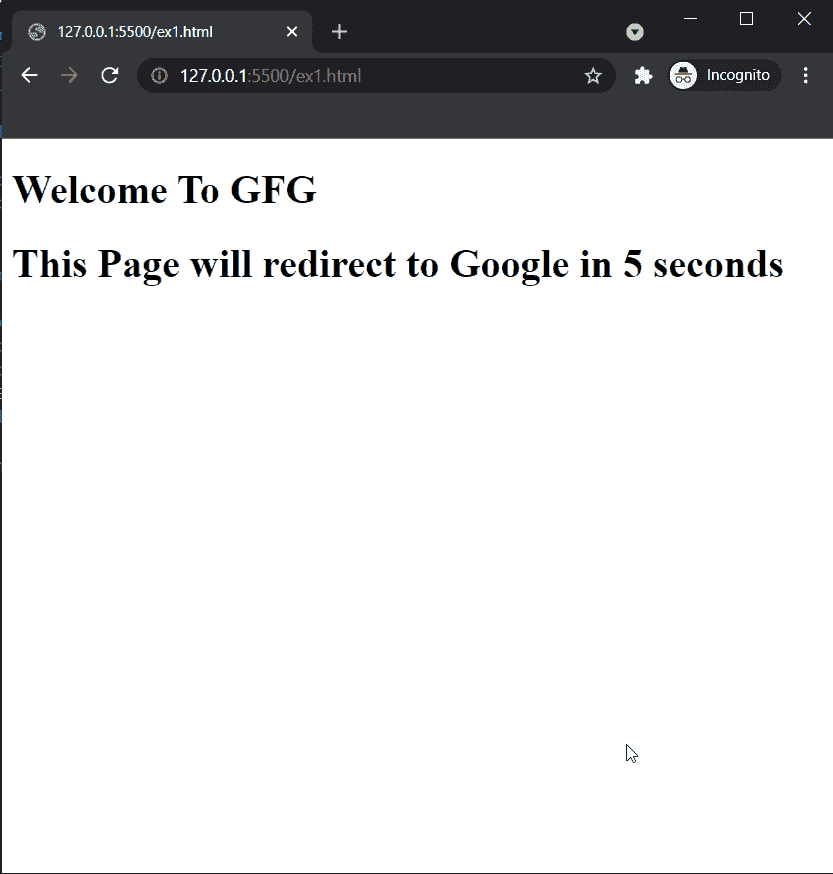

# 如何自动将访客转移到新的网页？

> 原文:[https://www . geesforgeks . org/如何自动将访问者转移到新网页/](https://www.geeksforgeeks.org/how-to-automatically-transfer-visitors-to-a-new-web-page/)

这篇文章是关于我们如何将网页访问者转移到另一个网页。这可能是必要的情况下，当需要做一个临时改变我们的网站，或者我们已经永久地把我们的网站转移到一个新的网站。我们可以使用这种方法来自动重定向我们的用户，或者通过将他们重定向到新网站来告诉搜索引擎。

**方法:**HTML 中有这么多方法可以做到这一点，但是我们将讨论 [**meta** 标签](https://www.geeksforgeeks.org/html-meta-tag/)。这是最简单和最容易的方法自动转移您的网页到任何网址。

**语法:**

```htmlhtml
<meta
     http-equiv="refresh"
     content="0;
     url='https://www.geeksforgeeks.org/'"
/>
```

**参数:***<元>* 标签需要三个属性来将用户重定向到另一个页面，如下所示:

*   **http-equiv:** 用于指示网页浏览器自动刷新当前网页。
*   **内容:**用于指定要重定向到新页面的延迟时间。
*   **url:** 这是用来告诉在哪个网页我们要转发我们的旧网站。

以下示例将演示如何使用标签来重定向页面。

**示例 1:** 这段代码会在 2 秒后将我们的网页重定向到 GeeksforGeeks 网站。

## 超文本标记语言

```htmlhtml
<!DOCTYPE html>
<html>

<head>
    <!-- Added meta tag-->
    <meta http-equiv="refresh" 
          content="2; 
          url='https://www.geeksforgeeks.org/'" />
</head>

<body>
    <h1>Welcome To GFG</h1>
    <h2>This Page will redirect to
        Geeksforgeeks.org in 2 seconds
    </h2>
</body>

</html>
```

**输出:**


**示例 2:** 这段代码会在 2 秒后将我们的网页重定向到 Google。

## 超文本标记语言

```htmlhtml
<!DOCTYPE html>
<html>

<head>

    <!-- Added meta tag-->
    <meta http-equiv="refresh" content="5; 
      url='http://google.com/'" />

</head>

<body>
    <h1>Welcome To GFG</h1>
    <h1>This Page will redirect to
    Google in 5 seconds</h1>
</body>

</html>
```

**输出:**

