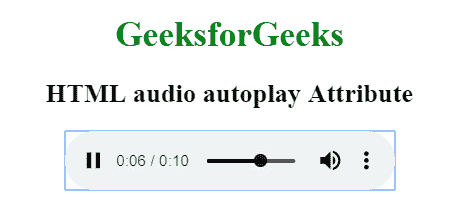

# 如何在 chrome 上自动播放音频？

> 原文:[https://www . geeksforgeeks . org/how-autoplay-chrome 上的音频/](https://www.geeksforgeeks.org/how-to-autoplay-audio-on-chrome/)

在这里，我们将学习如何在网页中的选定设备上自动播放音频。要在网页中加载音频，我们使用 [<音频>](https://www.geeksforgeeks.org/html-audio-autoplay-attribute/) 标签。

这个“音频”标签有一些属性:

*   **控件:**该功能用于音频在网页上可见的控件。使用此功能后，我们可以暂停或播放音乐，高或低音乐。
*   **自动播放:**此功能用于音频在页面加载时开始音频剪辑。如果你运行一个网页，音频文件会被加载，只有音频会自动播放。

**示例:**

```htmlhtml
<!DOCTYPE html> 
<html> 

<head> 
    <title> 
        HTML audio autoplay Attribute 
    </title> 
</head> 

<body style="text-align: center"> 

    <h1 style="color: green"> 
        GeeksforGeeks 
    </h1> 

    <h2>HTML audio autoplay Attribute</h2> 

    <audio controls autoplay> 
        <source src="GFG.ogg" type="audio/ogg"> 
        <source src="GFG.mp3" type="audio/mpeg"> 
    </audio> 
</body> 

</html>
```

**输出:**

