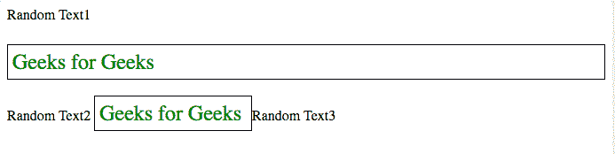
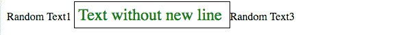

# 如何避免出现带标签的新行？

> 原文:[https://www . geeksforgeeks . org/如何避免带标签的新线路/](https://www.geeksforgeeks.org/how-to-avoid-a-new-line-with-tag/)

HTML 中的 p 标记代表一个段落。它是一个块级元素，这意味着段落标记中的文本被视为一个块，并占据了可用的全部宽度。默认情况下，浏览器在 p 标记前后应用换行符来分隔段落。
**我们可以通过添加以下样式定义来实现:**

```htmlhtml
p {
   display:inline;
}
```

**示例 1:**
在这段代码中，我们使用了 display 属性，并将其设置为 inline，这将改变段落标记的默认行为，使其表现得像一个 inline 元素。通过使用 inline 属性，我们可以避免新行。

## 超文本标记语言

```htmlhtml
<!DOCTYPE html>
<html lang="en">
<head>
    <meta charset="UTF-8">
    <meta name="viewport" content="width=device-width, initial-scale=1.0">
    <meta http-equiv="X-UA-Compatible" content="ie=edge">
    <title>Document</title>
     <style>
         p {
            padding:5px;
            border:1px solid black;
            color:green;
            font-size:24px;

          }
         #p2{
             display:inline;
          }

     </style>
</head>
<body>
    Random Text1
    <p id="p1">Geeks for Geeks</p>

    Random Text2
    <p id="p2">Geeks for Geeks </p>

    Random Text3

</body>
<script>

</script>
</html>
```

**输出:**



**示例 2:**
在这段代码中，我们使用了内联样式来避免带有段落的新行。方法同上

## 超文本标记语言

```htmlhtml
<!DOCTYPE html>
<html lang="en">
<head>
    <meta charset="UTF-8">
    <meta name="viewport" content="width=device-width, initial-scale=1.0">
    <meta http-equiv="X-UA-Compatible" content="ie=edge">
    <title>Document</title>
     <style>
         p {
            padding:5px;
            border:1px solid black;
            color:green;
            font-size:24px;

          }

     </style>
</head>
<body>
    Random Text1
    <p id="p2" style="display:inline">Text without new line </p>

    Random Text3

</body>
<script>

</script>
</html>
```

**输出:**



**支持的浏览器:**

*   谷歌 Chrome
*   微软公司出品的 web 浏览器
*   火狐浏览器
*   歌剧
*   旅行队