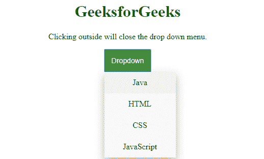
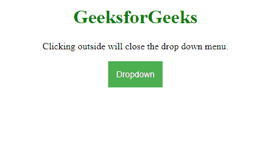

# 如何避免下拉菜单点击内部关闭菜单项？

> 原文:[https://www . geesforgeks . org/如何避免-下拉菜单-关闭-菜单项-点击-内部/](https://www.geeksforgeeks.org/how-to-avoid-dropdown-menu-to-close-menu-items-on-clicking-inside/)

下拉菜单的默认行为是在内部单击时关闭菜单列表项。在本文中，我们将使用*菜单传播*方法来防止下拉菜单关闭菜单列表。

**stopperpagation():**stopperpagation()方法用于停止事件调用的传播，即父事件被调用，我们可以通过使用 stopperpagation()方法停止调用其子事件的传播，反之亦然。

**语法:**

```
*event*.stopPropagation();
```

**示例:**

```
<!DOCTYPE html>
<html>

<head>
    <title>
        How to avoid dropdown menu to close
        menu items on click inside ?
    </title>

    <style>
        .dropbutton {
            background-color: #4CAF50;
            color: white;
            padding: 14px;
            font-size: 14px;
            border: none;
            cursor: pointer;
        }

        .dropbutton:hover, .dropbutton:focus {
            background-color: #3e8e41;
        }

        .dropdownmenu {
            position: relative;
            display: inline-block;
            outline: none; 
        }

        .dropdownmenu-content {
            display: none;
            position: absolute;
            background-color: #f9f9f9;
            min-width: 140px;
            overflow: auto;
            box-shadow: 0px 8px 16px rgba(0,0,0,0.3);
        }

        .dropdownmenu-content a {
            color: black;
            padding: 12px 14px;
            text-decoration: none;
            display: block;
        }

        .dropdownmenu a:hover {
            background-color: #f1f1f1
        }

        .show {
            display:block;
        }
    </style>
</head>

<body style="text-align:center;">

    <h1 style="color:green">GeeksforGeeks</h1> 

    <p>
        Clicking outside will close
        the drop down menu.
    </p>

    <div class="dropdownmenu">

        <button onclick="btnToggle()" class="dropbutton">
            Dropdown
        </button>

        <div id="Dropdown" class="dropdownmenu-content" >
            <a href="#Java">Java</a>
            <a href="#HTML">HTML</a>
            <a href="#CSS">CSS</a>
            <a href="#JS">JavaScript</a>
        </div>
    </div>

        <script>

        // JavaScript code to avoid dropdown
        // menu close

        // Clicking dropdown button will toggle display
        function btnToggle() {
            document.getElementById("Dropdown").classList.toggle("show");
        }

        // Prevents menu from closing when clicked inside
        document.getElementById("Dropdown").addEventListener('click', function (event) {
            alert("click outside");
            event.stopPropagation();
        });

        // Closes the menu in the event of outside click
        window.onclick = function(event) {
            if (!event.target.matches('.dropbutton')) {

                var dropdowns = 
                document.getElementsByClassName("dropdownmenu-content");

                var i;
                for (i = 0; i < dropdowns.length; i++) {
                    var openDropdown = dropdowns[i];
                    if (openDropdown.classList.contains('show')) {
                        openDropdown.classList.remove('show');
                    }
                }
            }
        }
    </script>    
</body>

</html>                         
```

**输出:**

*   **点击内部:**
    
*   **点击外线:**
    