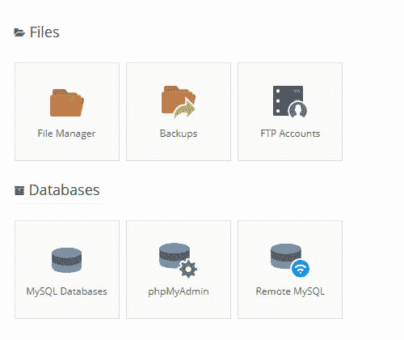
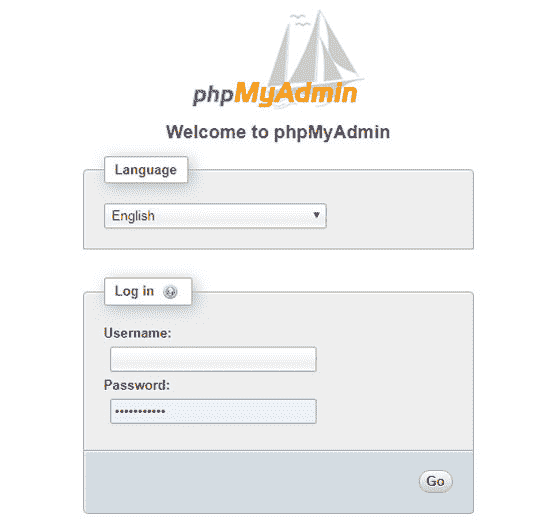
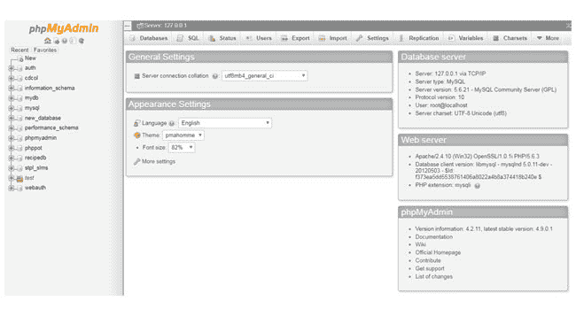
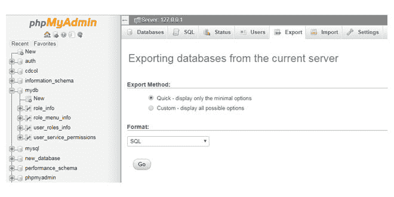
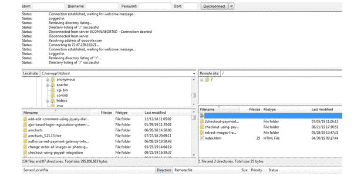

# 如何备份 WordPress 数据库？

> 原文:[https://www . geesforgeks . org/如何备份-wordpress-database/](https://www.geeksforgeeks.org/how-to-backup-wordpress-database/)

WordPress 是一个完整的仓库，我们使用表格、数据库和其他变量来维护和组织我们的网站信息。因此，在网站管理过程中，强烈建议定期或在升级前备份您的文件和数据库。
WordPress 作为最可靠的基于网络和数据库驱动的内容管理系统，为数据库进行备份的行为对于保护您的辛勤工作、时间、金钱和努力极其重要。
即使在高度安全的设置中，这种习惯也会保护网站数据，并在出现问题或发生事故时帮助恢复数据。
简而言之，网站安全和维护需要高度的定期备份责任，因为 WordPress 容易出现漏洞和损坏。

让我们来看看进行 WordPress 数据库备份的一些重要原因:

*   在不利的情况下，如网站黑客、服务器崩溃、系统错误或突然删除，给人以极大的安心。
*   当托管公司暂停用户帐户时，备份有助于轻松访问和恢复个人使用的数据。
*   当黑客将不需要的数据注入数据库时，备份很有帮助。备份有助于清除不需要的数据或表。
*   由于服务器遭到黑客攻击或使用不兼容的插件，网站所有者可能会丢失一些数据或损坏网站。如果我们有知识在备份的帮助下将网站恢复到原来的形式，这种情况会以安全的方式处理。
*   在电子商务网站中，所有重要的数据都不应该在交易跟踪过程中丢失。
*   进行备份是为了避免外来威胁、不可预见的开发人员错误、数据库损坏、网站崩溃或任何其他故障攻击。
*   在网站迁移期间，涉及导出和导入网站数据库的过程可能会丢失一些可以通过备份恢复的数据。
*   完全依赖你的托管公司的仁慈是不可取的。

**我们无法依赖托管公司备份的原因如下:**

*   大多数托管公司的备份都不是专门为 WordPress 设计的。这可能会导致一些不兼容的问题。
*   该公司的备份时间安排可能无法满足突发灾难的所有恢复要求。
*   如果不恢复用户帐户的所有网站，恢复单个网站可能是一项乏味的工作。
*   用户可能不会收到任何备份失败的通知。

**注意:**为了安全起见，用户应该使用任何专为 WordPress 设计的工具来维护自己的一套备份解决方案。

**在决定任何备份解决方案之前需要考虑的因素:**

*   **自动化能力:**应该可以自动化 WordPress 备份。
*   **备份频率:**如果备份频率足以满足恢复要求，用户应检查备份频率。
*   **存储位置:**如果解决方案支持 Google Drive 或者 Dropbox 这样的云存储，已经足够好了。
*   **恢复能力:**用户应该寻找将文件和数据库恢复到我们系统的便利性。
*   **部分或完全备份:**有些备份解决方案只保存数据库，而不存储完整的网站数据。寻找完整备份总是更好。
*   **站点迁移:**应该可以提供 wordpress 迁移服务。

**注意:**在网站迁移过程中，用户可能会面临不支持的网络主机、迁移不完整、超大型网站宕机等问题。

**对于任何 WordPress 站点的完整备份，需要以下内容:**

*   WordPress 博客内容
*   WordPress 文件
*   根目录中的所有配置文件
*   包含网站主题、插件和上传内容的主目录。
*   MySQL 数据库，由帖子、草稿、帖子的标签信息和评论组成。
*   转发的电子邮件、电子邮件过滤器及其配置。
*   你网站的设置。
*   网站注册用户的详细信息。

**进行 WordPress 备份的不同方法:**任何 WordPress 站点或数据库的备份都可以使用任何现成的插件手动或通过编程进行。

1.  **使用 cPanel:** cPanel 只是一个简单的界面，用来安全地管理和备份你的 WordPress 网站。这里可以安排自动备份。
    登录到各自网络主机的控制面板，选择文件部分下的备份向导选项。



1.  Within the cPanel, log into the hosting account backend and naivete to the File Manager section. Inside this, we have complete or partial backup options as required. 

    **注意:**部分备份更可靠，因为如果用户在同一个主机上，它允许用户恢复他的数据库。

2.  **使用命令行:**

```
mysqldump -u [username] -p[password] [DBname] > backupFile.sql
```

1.  Where username is the MySQL username, password is the MySQL password, DBname is the database for which you need to be backed and **backupFile.sql** is the name of the SQL file where the backup script is saved. By default, **backupFile.sql** is stored in the same folder from where the command is run. 

    **注意:**在命令行语法中，请在【用户名】前留一些空格，但在【密码】参数前不要留空格。当用户想要恢复数据库时，在命令行语法中将>替换为<，如下所示:

```
mysqldump -u [username] -p[password] [DBname] backupFile.sql
```

1.  **使用 phpMyAdmin:** 如果 WAMP 或 XAMPP 服务器运行在基于 Linux 的操作系统上，则 phpMyAdmin 是预安装的。在其他情况下，您必须安装 phpMyAdmin 并配置它来管理数据库转储。成功安装后，通过输入登录凭据登录到 phpMyAdmin 工具。



1.  登录后，我们在仪表板屏幕的左栏中有所有的表格。



1.  接下来，用户必须从 WordPress 数据库的左侧选择 WP 前缀数据库选项。
    选择数据库后，选择“*导出*选项卡。



1.  Clicking on the WordPress database or whatever is the name of the database, the user can expand to list of all tables present in that particular DB. 

    导出备份文件有两种方法。它们如下:

    *   **快速–仅显示最小选项:**
        用户可以选择默认选项 SQL 格式或选择任何其他格式，如 CSV、PDF 来保存您的 WordPress 数据库。
        点击 GO 按钮，存储备份文件的最后一步完成。
    *   **自定义–显示所有可能的选项:**用户可以在该自定义选项中选择格式特定选项和许多其他选项。
        **注:**如果主要目的是备份，那么 SQL、CSV、XML 是备份文件的首选格式。
2.  **使用 WordPress 插件:**对于进行 WordPress 站点数据库备份来说，使用备份插件是一个安全快捷的选择。这是确保网站数据库完全恢复的最简单方法。市场上大多数可用的插件都很容易使用，重量轻，并且记录良好。
    其中一些如下:
    *   一体化 WP 迁移
    *   BlogVault
    *   WP 数据库备份
    *   WP 远程
    *   导入导出 WordPress 用户
3.  **手动进行定时备份:**创建一个目标文件夹，用于制作 WordPress 数据库备份，以下载所需文件。为每个备份创建一个新文件夹是更好的做法。每当用户想要从备份中恢复时，它都允许用户更有组织性和效率。
4.  **使用文件传输协议:**可以在 FTP 客户端的仪表盘中新建并选择一个文件夹。下载 WordPress 文件或位于服务器上的所需数据。这可以使用 FTP 客户端来完成，例如**文件服务器**。
    FileZilla 是一个免费、开源、可靠且功能强大的工具，用于将文件传输到服务器。在 FileZilla 中，导航至右侧象限，选择 **public_html** 文件夹查看网站全部内容。 **public_html** 文件夹也叫 www，根文件夹以你的网站命名。要登录到 FTP 客户端，用户需要主机名、用户名、密码和端口。点击**快速连接**按钮连接服务器。


1.  一旦建立连接，它只会给出一条消息说*‘目录列表成功……’*。用户应该能够在面板的右侧找到他的网站文件夹*“远程站点:*”。从服务器选择文件和文件夹，用户可以拖放到面板左侧的本地系统。面板的左侧实际上显示了本地系统文件和文件夹。



1.  根据网站的大小，导出 WordPress 数据库需要一些时间。

**采取 WordPress 数据库备份的其他方法:**

*   使用自动插件恢复任何云服务上的 WordPress 数据库。
*   使用像 **BackupBuddy** 这样的插件，自动存储在谷歌硬盘和许多其他云服务上。
*   安装在用户网站上的自动备份系统。
*   使用自行开发的手动脚本。
*   使用网站托管公司自己的备份系统。
*   将用户备份文件的副本发送到异地。
*   根据每日或每周完整备份计划定期备份。

**结论:**网站对于网站管理者和用户来说都是巨大的资产，因此保护好网站并拥有足够好的备份解决方案是值得的。因此，决定让整个系统回到原来的位置非常关键。这可以通过定期运行 WordPress 数据库的备份来实现，无论如何都不应该忽视。WordPress 备份应该以这样一种方式进行，它最终会完全恢复您的网站。