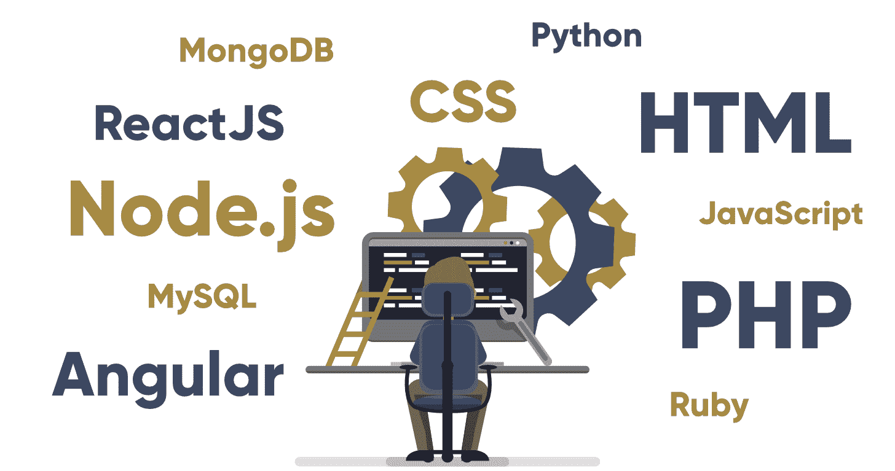

# 如何在 2019 年成为全栈 Web 开发者:完整指南

> 原文:[https://www . geesforgeks . org/如何成为 2019 年全栈网络开发者完整指南/](https://www.geeksforgeeks.org/how-to-become-a-full-stack-web-developer-in-2019-a-complete-guide/)

**你知道什么是 T 型人吗？**(不，不是一个人站在空中举着胳膊！！！)

T 型人是指在一个领域有很深的知识，在其他支持领域有广泛的常识基础的人。你猜怎么着……一个全栈网络开发人员完全符合这个描述(无意双关！).根据[techrepublic.com](https://www.techrepublic.com/article/the-10-most-in-demand-tech-jobs-of-2019/)的数据，这也是第三高需求的科技工作，平均工资为 **[$64，651](https://www.payscale.com/research/US/Job=Full_Stack_Web_Developer/Salary)** 。然而，对于全栈 Web 开发人员的角色仍然有很多困惑。

于是问题出现了**“全栈网络开发者的角色是什么？”**
好吧，一个全栈网络开发人员是在应用程序的前端和后端工作的人，同时也了解各种其他领域，如数据库、版本控制系统、设计等。满足所有这些永无止境的要求需要各种各样的技能。所以现在让我们专注于此！

### 成为全栈网络开发人员所需的技能

每个全叠忍者都必须有他们的工具！因此，对于一个跨不同领域的全栈网络开发人员来说，需要多种技能。其中大部分提到如下:

**1。前端开发**

一直想成为艺术家？好吧，不要害怕！

全栈网络开发人员中的艺术家在前端开发中被完全释放，因为它处理用户可以看到和交互的应用程序部分。前端开发所需的主要技术有**[【html 5】](https://www.geeksforgeeks.org/tag/html5/)****[【CSS3】](https://www.geeksforgeeks.org/category/web-technologies/css/)****[JavaScript](https://www.geeksforgeeks.org/javascript-tutorial/)**。这还不是全部！第三方库的额外知识，如 [jQuery](https://www.geeksforgeeks.org/jquery-tutorials/) 、 [Angular](https://www.geeksforgeeks.org/introduction-to-angularjs/) 、 [ReactJs](https://www.geeksforgeeks.org/reactjs/) 等。也是极其有帮助的。

**2。后端开发**

虽然前端是用户看到的应用程序的一部分，但后端通常是不可见的神秘部分。它处理数据库操作、用户身份验证和应用程序逻辑(是的，所有复杂的事情！).后端开发使用的语言有多种，如**[【Java】](https://www.geeksforgeeks.org/java/)[Python](https://www.geeksforgeeks.org/python-programming-language/)[PHP](https://www.geeksforgeeks.org/php/)【Ruby】[NodeJs](https://www.geeksforgeeks.org/introduction-to-nodejs/)**等。虽然每个开发人员都声称他们最喜欢的语言是最好的，但所有这些语言都有适合项目的市场需求。

**3。数据库**

没有数据，应用程序能管理什么？嗯，什么都没有！

这就是为什么数据库是任何应用程序中最重要的部分，因为它需要存储和访问数据。因此，一个全栈网络开发人员需要知道关系数据库和 NoSQL 数据库之间的区别，以了解每种数据库在哪些情况下是有用的。他们还应该熟悉每种类型的数据库，如**[【MongoDB】](https://www.geeksforgeeks.org/mongodb-an-introduction/)**等。除此之外，对 Redis、Memcached 和 Varnish 等缓存选项的了解只会是一个加分项！

**4。版本控制系统**

一个应用程序有多个版本。现在，如果某个特定的版本需要召回怎么办？这就是版本控制系统的作用。它基本上是一个记录应用程序文件随时间变化的系统，以便以后需要时可以调用特定的版本。

**[Git](https://www.geeksforgeeks.org/git-lets-get-into-it/)** 尤其是一个版本控制系统系统，可以用来获取最新的代码，更新部分代码，也可以更改别人的代码，不会造成重大的混乱！！！

### 有哪些不同的软件栈？

现在，我们已经了解了全栈网络开发人员所需的各种技能，让我们专注于可用的不同软件栈。对于外行来说，堆栈是各种程序的集合，它们一起使用来获得所需的结果。它包括一个操作系统及其应用。

全栈网络开发人员栈的选择完全取决于个人职业目标、当前项目、公司要求等。然而，下面给出了一些最著名的书库供参考。

**1。**灯堆

LAMP 堆栈是一个非常著名的(而且很有启发性！)堆栈，这是 Linux 托管网站的基础。它有以下四个主要组成部分:

**Linux:** 开源操作系统，是栈模型的基础。
**阿帕奇:**一种网络服务器软件，可以从网络浏览器翻译成所需的网站。
**MySQL:** 一个开源数据库，可以通过脚本语言查询来构建网站。
**PHP:** 一种服务器端开源脚本语言

**2。均值叠加**

MEAN 栈是建立在基于 JavaScript 的技术上的栈。虽然它有一个相当粗鲁的名字，但由于它快速、健壮和可维护的生产 web 应用程序，它实际上是非常受欢迎的。它有以下四个主要组成部分:

**MongoDB:** 以二进制 JSON 格式存储数据的 NoSQL 数据库。
**Express:** 一个易用、轻便、便携的网络程序框架。
**Angular.js:** 一个健壮的框架，用于开发 HTML5 和 JavaScript- web 程序
**Node.js:** 一个服务器端的 JavaScript 执行环境。

**3。**MERN 栈

MERN 栈也是建立在基于 JavaScript 的技术之上的，比如 MEAN 栈(虽然它并不那么卑鄙！).它有以下四个主要组成部分:

**MongoDB:** 以二进制 JSON 格式存储数据的 NoSQL 数据库。
**Express:** 一个易用、轻便、便携的网络程序框架。
**React:** 一个用于构建用户界面的 javascript 库。
**Node.js:** 一个服务器端的 JavaScript 执行环境。