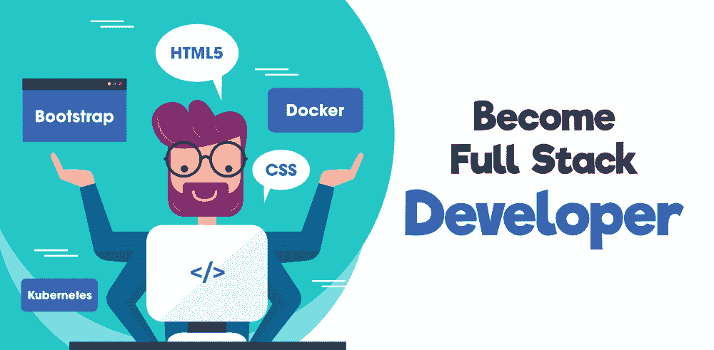

# 2021 年如何成为全栈 Web 开发者？

> 原文:[https://www . geeksforgeeks . org/如何成为 2021 年全栈网络开发者/](https://www.geeksforgeeks.org/how-to-become-a-full-stack-web-developer-in-2021/)

在经历了这么多的试验和测试模板之后，你在网页上创建了第一个登录表单时是什么感觉(不要说你从头开始创建了一切……)？……当你在多次修改后给你的第一个网络应用程序布局时，你有什么感觉(是的……你根据要求参考了其他一些网站或模板……)？……当您成功地在后端处理了数千个用户的敏感信息以构建应用程序时，您有什么感受(这很可怕……)？

大多数网络开发人员都经历了上述所有阶段，最初对他们中的一些人来说可能会感到沮丧，但是当他们看到他们的网站是实时的，并且全世界的人都在使用它时，总体感觉真的很令人兴奋和惊讶。一个 web 开发人员要负责许多任务，从收集需求到设计网站，处理其后端部分，以及让它成功地为用户服务。
每年都有新的技术和工具出现在行业中，以提高开发人员的工作效率，并使网站更好地为用户服务。对他们来说，保持网络开发游戏的领先地位变得具有挑战性。今天我们要讨论的是 2021 年成为网络开发者的完整地图。这将是所有类型的开发人员(前端、后端和全栈)的实用指南。

### 首先决定你的目标或道路

我们将讨论许多技术、趋势和工具，但我们不想让您不知所措，因此您需要首先决定您想做什么来成为一名网络开发人员，因为这将帮助您选择正确的工具和技术来学习。成为一名网络开发者有很多不同的原因，下面给出了一些选择…

*   你想为一家公司工作，作为一名网络开发人员，这是最受欢迎和最常见的原因。
*   你想做一名自由开发者来开创自己的事业或机构。
*   你可以成为其他公司的顾问。
*   你可以创建自己的应用来赚钱。
*   你想用这个技能成为一个内容创作者。
*   代码作为一种爱好。

从上述感兴趣的领域或目标中，您可以选择适合您目标的合适工具和技术。如果你的目标只是成为一名前端开发人员，你可以选择前端开发的工具和技术。后端和全栈开发也是如此。

### 网络开发的基本工具和软件

*   **电脑& OS:** 没有电脑和运行在电脑上的 OS 是写不出代码的。要学习网络开发，你不需要任何花哨的电脑(如果你有一台，那很好……)。您可以使用任何类型的中端笔记本电脑或台式机。对于操作系统，你可以使用 *MacOS、Windows(最新版)*、*或者 Linux* 任何你觉得舒服的。
*   **文本编辑器/ IDE:** 毫无疑问 *VSCode* 适用于大多数情况和大多数语言。它有良好的性能，伟大的扩展，内置终端，以及大量的功能。在 2019 年的 StackOverflow 调查中，VSCode 也是开发者的首选。你也有一些其他不错的选择，如*崇高的文本，Vim* ，*或 Atom* 。如果说 IDEs 那么*Visual Studio*(ASP.net 或者[c#](https://www.geeksforgeeks.org/csharp-programming-language/))*Eclipse**Netbeans*(Java)。都是不错的选择。
*   **网页浏览器:**大多数开发者的首选不是 *Chrome* 就是*火狐*。Chrome 速度很快，它使用了一个 V8 引擎(JavaScript 引擎)。火狐也取得了长足的进步，它的一些好东西不在 Chrome 浏览器中。这两种浏览器都有极好的开发工具来解决 web 开发中的问题。其他需要熟悉的网页浏览器有 *Safari* 、 *Edge* 、*T11】和 *Brave* 。*
*   **终端:**您将使用一些系统命令大量使用命令行界面。您可以在 web 开发项目中使用默认或第三方终端。 *Bash、Zsh、Powershell、Git Bash、iTerm、Hyper* 都是可以使用的选项。
*   **设计(可选):**不是每个人都需要学习这个。在公司里，有一个特定的团队来制作图像、徽标或草图，但是如果你是一名前端开发人员，或者你是一名自由职业者，那么你可能必须学习 *Adobe XD、Photoshop、Sketch* 或 *Figma* 。

### 从 [HTML](https://www.geeksforgeeks.org/html-tutorials/) 和 [CSS](https://www.geeksforgeeks.org/css-tutorials/) 开始

HTML 和 CSS 是网页开发的基本构件。不管你的网络应用有多先进，或者你使用什么框架和后端语言，你都必须使用 HTML 和 CSS 来构建你的前端应用。所以这是在 web 开发中要学习的第一件事。

*   **HTML5** (语义标签、属性、文档类型等)
*   **CSS 基础**颜色、字体、定位、盒型等。
*   **CSS 网格和 Flexbox** 来对齐事物或创建列。
*   **CSS 自定义属性**
*   过渡和动画对于前端开发人员来说非常重要。

### 响应布局

您的应用程序应该可以在各种设备上查看和使用，例如智能手机、平板电脑、台式机、iPad 或任何其他屏幕大小的设备。因此，了解如何创建响应性设计或布局非常重要。让我们看看一些重要的话题。

*   了解如何设置**视口**
*   不同屏幕尺寸的媒体查询。
*   流体宽度
*   联排赛艇
*   移动优先

### 自定义可重用 CSS 组件

与其依赖像 Bootstrap 这样的大型 CSS 框架，不如创建自己的模块化、可重用的 CSS 组件，用于项目中。如果您构建自己的自定义设计，则不需要导入完整的库。您只需要为特定的用户界面创建组件。

最近还出现了一种新的趋势 [Saas](https://www.geeksforgeeks.org/css-preprocessor-sass/) ，这有助于更高效地编写 CSS 代码。如果你已经知道了 CSS，那么你就不需要花那么多精力去学习 Saas 了。Saas 是一个 CSS 预处理器，它为标准 CSS 增加了更多的功能，并使其更加高效。您可以使用变量、嵌套、条件来减少 CSS 的重复，并使其更有效。

Saas 提供变量、混合、函数、嵌套等。您还可以为每个可重用组件创建单独的 Saas 文件。Saas 真的节省了很多时间，所以 2021 年一定要学会。

### CSS 框架

学习 CSS 框架没有去年那么流行了，但是对于不擅长设计的开发人员来说仍然非常相关或者有用。有很多流行的 CSS 框架可供使用，下面给出了其中一些。

*   [**Bootstrap**](https://www.geeksforgeeks.org/bootstrap-tutorials/) 是目前最流行的 CSS 框架(Bootstrap 5 发布)学习。学习 bootstrap 也有助于学习其他框架。
*   [**顺风 CSS**](https://tailwindcss.com/) 是另一个越来越流行的框架，和其他的有点不一样。这是一组实用程序类，这样你就可以创建自己的按钮和其他看起来与众不同的东西。它们也是高度可定制的。
*   [**物化**](https://materializecss.com/) **:** 基于素材设计，这个框架是 HTML、CSS、JavaScript 的组合。这也是一个非常有用和受欢迎的库来设计您的前端应用程序。
*   [**布尔玛:**](https://bulma.io/) 模块化、轻量级的开源 CSS 框架。

### 用户界面设计

对于前端开发人员来说，如果他们能在学习一些 UI 设计原则和实践方面提高自己的技能，那就太好了。在公司里，也许其他人会为你做这些，但是关注一些基本的用户界面设计是很好的。

*   颜色和对比度
*   空格
*   缩放(相对于其他元素的大小)
*   视觉层次结构(按重要性顺序排列)
*   排版(文本字体、大小等)

### Java Script 语言

学习完 HTML 和 CSS，接下来需要学习的就是 JavaScript 了。对于开发人员来说，掌握好 JavaScript 基础知识非常重要。您将在服务器端语言(如 PHP、Python 或 ASP.net)中使用大量的 JavaScript，如果您想使用 React、Angular、NodeJS、Vue 或任何其他 JavaScript 框架或库，那么学习这种语言是非常必要的。下面是一些你应该在 JavaScript 中涉及的重要主题…

*   [**【JavaScript 基础知识】**](https://www.geeksforgeeks.org/javascript-tutorial/) (变量、函数、循环、数组、条件等)
*   **DOM** (文档对象模型)
*   **数组方法** foreach、map、filter、reduce 等。
*   **JSON** (JavaScript 对象符号)
*   **HTTP 请求**获取应用编程接口-获取、发布、放入、删除

### 一些重要的工具

有一些工具，你将在网络开发中使用。这些工具将帮助您进行调试，提高您的工作效率，管理您的代码，与其他开发人员协作，等等。让我们讨论其中的一些工具。

*   [**Git**](https://www.geeksforgeeks.org/git-lets-get-into-it/) **(版本控制)& GitHub** 是 2021 年绝对应该学习的最热门工具。Git 在与其他开发人员协作和管理您的代码方面帮助很大。你也有一些其他的选择，比如 GitLab，Bitbucket，还有一些其他的。
*   了解如何使用**浏览器开发工具**。无论是 Chrome 还是 Firefox，你都应该知道如何使用不同的选项卡，比如元素选项卡、用于 JavaScript 的控制台、用于请求和响应的网络选项卡、应用程序选项卡以及用于不同目的的其他选项卡。
*   大多数 IDEs 或文本编辑器都有能力添加扩展或插件，这对提高生产力和构建网络应用程序非常有帮助。例如，Visual Studio Code 中的 **VSCode Extensions** 有助于下载诸如 live-server 或 live-saas 编译器之类的扩展来与 React 一起工作。
*   学习使用 **NPM** 和**纱等 JavaScript 包管理器。**如果你使用的是 JavaScript 框架或库，比如 React，那么你会经常使用这些包管理器，但是对于其他语言(比如 Python 或 PHP)，你会使用不同的包管理器。
*   如果你想在前端安装 NPM 软件包，那么你必须使用 **JS 模块打包器**，如**网络包、**T4】软件包、**或 roll**。如果您想要创建自己的模块，或者您想要将一个 JavaScript 文件带到另一个 JavaScript 文件，那么您不能仅通过浏览器默认实现这一点，因此您需要 Webpack 或 package 为您捆绑它。
*   您可能还想看看一些有用的文本编辑器扩展和助手。林挺(查找错误)、漂亮(格式化代码)、Live Server、Emmet(编写快速 HTML 和 CSS 代码)、代码片段等。

### 基本前端部署

在这一点上，一旦你知道你应该为前端开发学习什么工具或技术，你就需要知道如何在互联网上部署你的前端网站。

如果您正在为小型企业构建一些微小的应用程序、登录页面或个人网站，那么没有必要仅仅因为 AWS 或 DevOps 闪亮而学习它们。你会让事情变得更加复杂，而不是变得简单。有不同的路线可以走。其中一些在下面给出…

*   域名注册(域名便宜，谷歌域名等。)
*   托管(InMotion、Hostgator、Bluehost 等)
*   静态托管(网络、GitHub 页面)
*   电子邮件托管(名称便宜，Zoho 邮件，CPanel)
*   SSL 证书(让我们加密，Cloudflare，名称便宜)
*   SFTP 文件传输协议适用于小型应用。
*   高级应用的安全外壳。
*   CLI 和 Git。

无论我们到目前为止讨论的工具、技术趋势或步骤是前端开发的一部分。你还不知道框架，但是你可以为个人和小企业建立网站，或者你可以建立一个移动友好的布局。

使用我们到目前为止讨论过的工具或技术来部署您的小应用程序或项目。如果你想申请这份工作，那么最好学习一些前端框架，比如 Vue，或者 Angular，或者像 React 这样的库。

### 前端框架和状态管理

框架允许您进行更高级的前端开发。它为您提供了许多优势，例如可重用的组件、更有条理的用户界面或页面交互。所以使用框架可以节省很多时间。

选择一个前端框架来提高你的技能，并尝试选择一个大多数公司在当前场景中使用的框架。此外，了解国家管理。每个框架都有不同的方法。对于 2021 年，以下是一些流行的框架和状态管理器。

*   [**【React】**](https://www.geeksforgeeks.org/reactjs/)**:**React 库是 web 开发最受欢迎的学习工具，与其他框架和库相比相当容易。React 开发人员也有很多工作机会。可以使用 **Redux** 和**上下文 API 配合 Hooks** 进行状态管理。
*   **Vue:** Vue 也越来越受欢迎，开发者也可以更喜欢学习 Vue。在反应和角度的比较中，Vue 是最容易学习的。 **VueX** 是为观而建的状态管理器。
*   [**棱角分明**](https://www.geeksforgeeks.org/angularjs-tutorials/)T4:这个框架一般用在大型组织中。它有一个漂亮的阶梯学习曲线。你必须学习[打字脚本](https://www.typescriptlang.org/)才能使用 Angular。它允许您使用可选的静态类型并支持 ES2015 的功能。**NgRx****服务**都是这个框架值得学习的好状态管理器。
*   [**Svelte**](https://svelte.dev/)**:**Svelte 基本上是过去一两年非常流行的编译器。它有一个非常简单的学习曲线，但是在使用一些较大的应用程序时，您可能会遇到一些困难。找工作也比其他框架难一点。Svelte 有一个内置的上下文 API 来管理状态。

**可选学习:**

*   你可以学习[类型脚本](https://www.typescriptlang.org/)，这在业内相当流行。它是 JavaScript 的超集，使您的代码更健壮，更不容易出错。TypeScript 非常适合大型项目。
*   了解服务器端渲染。 [NextJS](https://nextjs.org/) (React)、 [NuxtJS](https://nuxtjs.org/) (Vue)和[Angular Universal](https://angular.io/guide/universal)(Angular)是允许你在服务器上运行 React、Vue 和 Angular 的框架。它们都有很好的特性，如更好的搜索引擎优化、文件系统路由、自动代码拆分、静态导出、JS 中的 CSS 以及许多其他特性。
*   **静态站点生成器:** Gatsby (React)，Gridsome (Vue)，11ty(杰基尔的 JS 替代品)，杰基尔(基于 Ruby)，Hugo(基于 go)

我们已经讨论了大多数前端开发工具和技术。现在让我们谈谈成为后端开发人员或全栈开发人员的语言和技术。

### 服务器端语言(选择一种)

您应该至少了解一种服务器端语言。为了在 2020 年选择一种语言，下面给出了一些选项…

*   [NodeJS](https://www.geeksforgeeks.org/nodejs-tutorials/) (不是语言而是运行时环境)
*   [Python](https://www.geeksforgeeks.org/python-programming-language/) (适合绝对初学者)
*   [Java](https://www.geeksforgeeks.org/java-tutorials/) (适合大型组织)
*   [Php](https://www.geeksforgeeks.org/php/) (适合自由职业)
*   [Ruby](https://www.geeksforgeeks.org/ruby-programming-language/)(2020 年不太受欢迎)
*   [C#](https://www.geeksforgeeks.org/csharp-programming-language/)
*   [锅炉](https://www.geeksforgeeks.org/kotlin-programming-language/)
*   [戈朗](https://www.geeksforgeeks.org/golang/)
*   代名词

**注意:**无论您喜欢学习哪种服务器端语言，请确保您了解使用该语言的[数据结构](https://www.geeksforgeeks.org/data-structures/)和[算法](https://www.geeksforgeeks.org/fundamentals-of-algorithms/)。数据结构和算法将帮助您为用户呈现数据，并帮助您在 web 应用程序中优化代码。我们特别建议您关注数组和字符串(最重要的)。你将会在这两方面做很多工作。

同时了解[软件设计模式](https://www.geeksforgeeks.org/design-patterns-understand-the-importance-with-real-life-examples/)。设计模式为常见问题提供了通用的可重用解决方案。学习设计模式将有助于使您的代码可重用、无错误和干净。这会加快你的发展进程。

### 服务器端框架(选择一个)

一旦你学会了自己选择的一种服务器端语言，就可以使用你的语言框架了。你可以从下面给出的选项中选择一个…

*   **node . js**–Express，Koa，Adonis，Feather.js，Nest.js，Loopback
*   **Python:** Django，Flask，
*   **Java:** Spring MVC，Grails
*   **PHP:** Laravel，Symfony，Codeignitor，Slim
*   **红宝石:**铁轨上的红宝石，辛纳特拉
*   **c#:**ASP.NET
*   [**去**](https://www.geeksforgeeks.org/golang/) **:** 狂欢
*   **Kotlin** ： Javalin， KTor

### 数据库(选择一个)

大多数网络应用程序都需要一个存储数据的地方。在某些情况下，某些技术或语言与某些数据库配合得很好。例如:在 Mern 栈中，M 代表 MongoDB，在 LAMP 栈中，M 代表 MySQL，但是你想为你的应用选择哪个数据库完全取决于你。我们将讨论 2020 年的一些流行数据库。

*   **关系数据库:** RDBMS 仍然是最受欢迎的数据库。PostgreSQL、MySQL、MS SQL 仍然是最首选使用的。
*   **NoSQL:** 蒙戈布，CouchDB，弹性搜索
*   **云数据库:** Firebase，Azure can DB，AWS
*   轻量&缓存:重定向，SQLite

**GraphQL:(可选)**可以了解一下现在相当流行的 GraphQL。这是一种针对您的应用编程接口的查询语言。它有一个类似于 JSON 的简单语法，并且相当容易实现。

### 测试

很多开发人员跳过学习测试，他们只是认为这是浪费时间，但是我们建议您学习它，以节省您的时间，并使您作为开发人员的生活更加轻松。

*   [单元测试](https://www.geeksforgeeks.org/unit-testing-software-testing/)
*   [集成测试](https://www.geeksforgeeks.org/software-engineering-integration-testing/)
*   端到端测试

有针对不同语言的测试框架，例如针对 [JS 测试](https://www.geeksforgeeks.org/8-useful-testing-tools-libraries-and-frameworks-for-react-developers/)的 Jest 和 Mocha，以及针对 Python 的 PyTest 和 Robot。

### 内容管理

你绝对应该了解内容管理系统，尤其是如果你是自由职业者。内容管理系统用于向您的网站或应用程序添加内容。客户端能够更新自己的内容是非常棒的。

*   **传统 CMS:** WordPress (PHP)，Drupal(PHP)，Keystone (JavaScript)，endro(JavaScript)
*   **无头 CMS:**(2021 年开始流行)心满意足，Prismic.io，Strapi，理智. io。

### 部署和开发

托管一个全栈应用程序或后端应用程序比仅仅一个前端应用程序要复杂一点，尤其是当你有数据库的时候。确保您知道如何使用命令行界面进行部署。
在大多数公司中，都有一个不同的团队在致力于 DevOps。所以完全可以选择了解 DevOps。如果你在做你自己的项目，你可以了解到这一点。

了解以下内容，以便在服务器上部署您的应用程序。

*   **托管平台:** Heroku、数字海洋、AWS、Azure。，利诺
*   **网络服务器:** NGINX，Apache
*   **集装箱:** [码头工人](https://www.geeksforgeeks.org/introduction-to-docker/) / [库本内斯人](https://kubernetes.io/)，流浪者
*   **图像/视频:**S3 云迪纳利
*   **CI(持续集成)/CD(持续交付)；**詹金斯，特拉维斯 CI，圈 CI

### 最终想法

所有上述技术、工具都足以让你成为前端、后端或全栈开发人员。不要被我们在本文中提到的内容淹没。你不必什么都学。根据您的最终目标选择合适的工具和技术。遵循以下要点，为自己设定正确的道路…

*   根据你想做的事情创建一个学习路径
*   学习基础知识和必要的技术
*   观看教程/视频，阅读文档，但一定要确保你的手脏在编码。根据你所学的知识，做你自己的项目。
*   创建一个投资组合，并根据你的最终目标采取行动。求职，给自己找个客户等等。

jQuery 是一个开源 JavaScript 库，它简化了 HTML/CSS 文档之间的交互，它因而广为人知它的哲学是 **“少写多做”** 。遵循此 [<u>jQuery 教程</u>](https://www.geeksforgeeks.org/jquery-tutorials/) 和 [<u>jQuery 示例</u>](https://www.geeksforgeeks.org/jquery-examples/) 即可从头学习 jQuery。