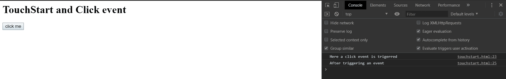
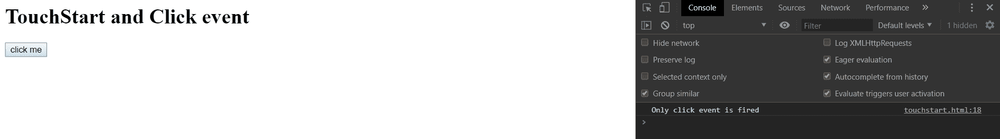

# 如何绑定‘touch start’和‘click’事件但不同时响应？

> 原文:[https://www . geeksforgeeks . org/如何绑定-touch start-and-click-events-但不响应-both/](https://www.geeksforgeeks.org/how-to-bind-touchstart-and-click-events-but-not-respond-to-both/)

当用户触摸一个元素时，touchstart 事件发生。但是当用户单击一个元素时，会触发 click 事件。
通常，touchstart 和 click 事件都是在触摸和 click 使能设备中的同一点击中触发的。因此，在这种情况下，如果浏览器因为单个用户输入而同时触发触摸和鼠标事件，浏览器必须在任何鼠标事件之前触发 touchstart。
解决这个问题有两种流行的方法。

*   使用 preventDefault()或 stopPropagation()方法。
*   使用变量检查它是“touchstart”还是“click”事件。

**使用*****preventDefault()*****或*****stopperpagation()*****方法:**此方法阻止事件处理程序同时响应 touchstart 和 clicks 事件。如果应用程序不希望在特定的触摸目标元素上触发鼠标事件，则该元素的触摸事件处理程序应该调用 preventDefault()或 stopPropagation()，并且不会调度额外的鼠标事件。
**例:**

## 超文本标记语言

```html
<html>

<head>
    <title>Touchstart</title>
</head>

<body>
    <h1>TouchStart and Click event</h1>
    <button id="button">click me</button>
    <script>

        // button element
        var button1 = document.querySelector("button");

        // touchstart handler
        button1.addEventListener("touchStart", onlyTouch, false);

        function onlyTouch(ev) {

            // Call preventDefault() to prevent any further handling
            console.log("Here a touchstart event is triggered");
            ev.preventDefault();
        }

        // click event handler
        button1.addEventListener("click", onlyClick, false);

        function onlyClick(ev) {

            // Call preventDefault() to prevent any further handling
            console.log("Here a click event is triggered");
            ev.preventDefault();
            console.log("After triggering an event");
        }
    </script>
</body>

</html>
```

**触发 touchstart 事件时输出**

```html
Here a touchstart event is triggered
After triggering an event
```



然而，这也阻止了其他默认的浏览器行为(比如滚动)——尽管通常你完全在你的处理程序中处理触摸事件，并且你必须禁用默认的动作。
此外，当用户在移动设备上点击网页中的元素时，尚未设计用于移动交互的页面在 touchstart 事件和鼠标事件(mousedown)的处理之间至少有 300 毫秒的延迟。因此，必须添加一行 HTML 代码来描述页面不需要缩放。

```html
<meta name="viewport" content="width=device-width, user-scalable=no">
```

**使用变量检查是“touchstart”还是“click”事件:**
**示例:**

## 超文本标记语言

```html
<html>

<head>
    <title>Touchstart</title>
</head>

<body>
    <h1>TouchStart and Click event</h1>
    <button id="button">click me</button>
    <script src=
"https://ajax.googleapis.com/ajax/libs/jquery/3.4.1/jquery.min.js">
    </script>

    <script>
        $("#button").on('touchstart click', function(event) {
            if (event.type == "touchstart") {
                $(this).off('click');
                console.log("Only touch event is fired");
            } else if (event.type == "click") {
                $(this).off('touchstart');
                console.log("Only click event is fired");
            }
        });
    </script>
</body>

</html>
```

**输出:**

```html
click event is triggered
After triggering an event
```

