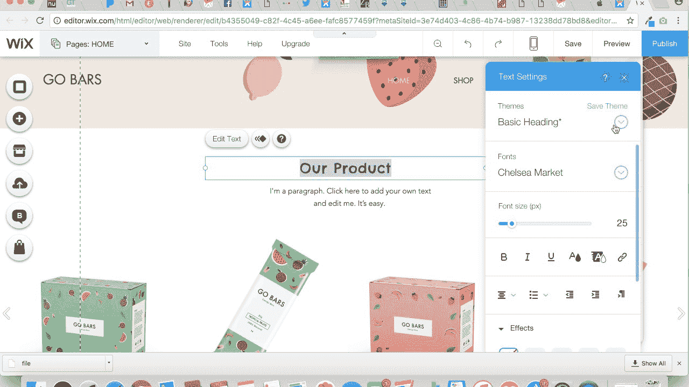
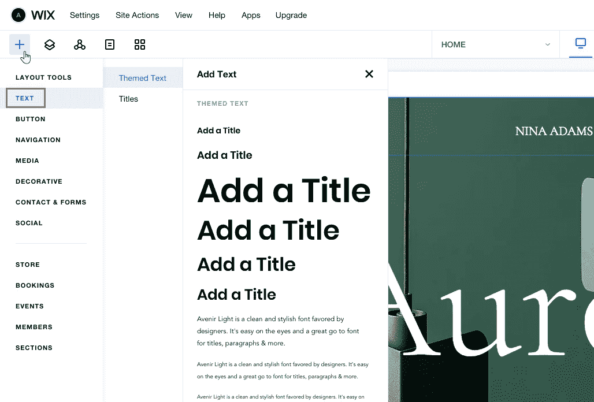
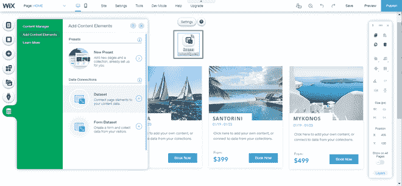
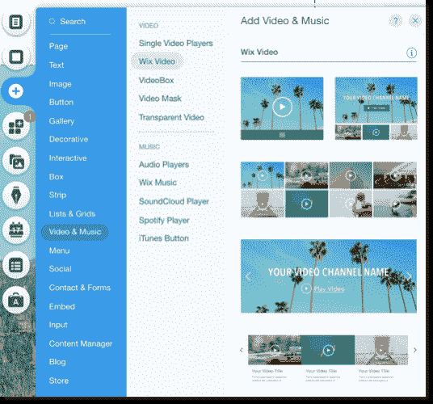

# 如何使用 Wix 搭建网站？

> 原文:[https://www . geeksforgeeks . org/如何使用-wix/](https://www.geeksforgeeks.org/how-to-build-a-website-using-wix/) 构建网站

Wix 是一个在线拖放工具，使用网站构建器创建极其简单的网站。为了学习如何自己编码和建立一个网站，这里有几个基于云的网络开发。在本文中，我们将展示如何使用 Wix 创建一个网站，这只是为了说明的目的而选择的。

**如何开始？**

**开始使用 Wix:**Wix 无需花费太多时间，将提供免费的&易用的网站构建器，让你创建卓越的网站。使用 Wix 网站构建器构建网站时，不需要编码或技术技能。您可以建立&设计您的网站或从提供的模板中选择数百个选项的模板。Wix 提供了这个选项，或者我们可以说是选择一个高级计划，它解锁了许多免费版本通常无法获得的功能和好处。连接域名、附加带宽/存储、删除 Wix 广告等。几乎没有 Wix 的优势。

**报名**

关于 Wix 的基本事情已经解决了，现在我们将看到如何在平台上创建或开发一个帐户，并深入网站建设海洋。程序简单明了，下面是屏幕上的说明，你所要做的就是遵循它们。

要注册 Wix:

*   去 http://www.wix.com
*   按右上角的“登录”。
*   单击“Wix 新功能”旁边的“注册”
*   输入电子邮件。
*   选择密码
*   按“注册”

**编辑现有模板/网站**

从不同的类别 Wix 有不同的模板选项一些著名的类别是商业，电子商务，博客，音乐，摄影等。Wix 已经代表您完成了所有或大部分重要工作，因为您将开始处理现有模板。现在你要做的是做一些最后的改变&添加你认为重要的东西，这意味着所有的模板都是预装的，里面有内容。因此，现有的数据可以由你简单地替换为你的业务类型的文本、图片和徽标，而不必担心网站的字体、栏宽等。

**可在 Wix** 中添加到您的网站的功能

### WIX 的方法

**现在登录一个 Wix 帐户进行演示，我们将根据已经给出的模板构建一个示例网站。**

*   **步骤 1:** 我打开 Wix 主页后，页面被重定向到 https://www.wix.com/my-account/sites/，这意味着所有已发布或未发布的网站都在这个网址下，可以很容易地找到进行管理。当您第一次启动时，会出现一个蓝色按钮，即“创建您的网站”，通过点击该按钮，许多选项都会显示一条消息。比如‘你想创建什么样的网站？’、商业、设计师、博客、美容&健康、投资组合&简历、住宿等等。
*   **第二步:**通过点击网站‘Online Store’网站类别，电商模板进来几百个数字，这时你会想到创建一个电商网站。外观和工作可以由我们在开始或使用任何模板之前探索，无论你想探索什么选项“信息”选项在那里悬停你的鼠标光标。
*   **第三步:**“家居科技商店”是一个可以搭配的模板。点击“编辑”选项后，在我们进入 Wix 网站编辑器之前，它会持续 10-15 秒。这样做最好的一点就是没有遇见陌生人的感觉。如果与 WordPress、Joomla、Drupal 一起工作，你可以很容易地联想到使用它的字体大小、文本大小等是多么的忙碌和耗时。但是 Wix 不会发生这样的事情，因为在你的网站上线之前，一切都在你的眼前，这是你实时知道你的网站看起来的完美的结果&在做出改变后它会是什么样子。

**文字&字体实时就像你在编辑一些 MS Word 文档一样简单**

*   **步骤 4:** 通过创建一个在线数字商店，我们将主页上的特色产品图像替换为数字杂志。数字商店是一个平台，所有访问者都可以了解上个月的数字问题，也可以直接购买。我们需要做的是打开 Wix 网站编辑器>点击已有图片>选择【更改图片】>选择图片>上传图片在更改 logo 或图片种类时遵循此程序。
*   **第五步:**通过替换图片来添加适当的产品描述是不够的，因此我们必须更改文本，这样我们就可以很容易地与 Digit 的 2016 年 8 月版相关联。现在你要点击现有文本>选择【编辑文本】>输入新文本。超链接“预览”&“立即购买”按钮。点击您想要超链接的文本或按钮>点击“更改文本”选项>旁边的“更改链接”图标，在您想要发送受众的位置插入网址。对于我们希望在 https://techtsp.wixsite.com/buy-digit.网站上访问所有其他对象&内容，请遵循此程序

**编辑现有内容&替换为您在 wix 中的内容**

**从头开始做网站**

通过使用空白模板，我们将从头开始创建一个类似鬼屋的网站，在那里你不能不填充令人兴奋的和必要的控制，我们看到。

*   **第一步:**打开 https://www.wix.com 我们的账户里有一个来自数字商店的电子商务网站，屏幕上会出现一条信息‘创建你的网站’。我们之前的将在这里列出。创建新的网站去右上角的图标，现在登陆模板选择页面，我们不需要担心类别，因为在零开始，我们正在创建没有现成内容的网站。
*   **步骤 2:** 转到空白模板有些模板不是空白的，但使用预定的布局&做其他事情会更容易。因此，在没有任何帮助的情况下，我们将选择模板名称“从头开始”。
*   **步骤 3:** Wix 网站编辑器提示您将名称设置为网址该名称将出现在网址中，因此我们决定使用名称“techtsp”，因此网址将是 https://techtsp.wixsite.com/techtsp.您可以从 https://wix.com>更改该名称选择您的网站>单击“管理网站”>转到“网站地址”>中的“管理”进行更改。
*   **步骤 4:** 空白模板分为 3 部分——页眉、页面、页脚，用于内容定位。页眉由网站标志&菜单栏组成，页面是正文，页脚有简短的生物&标志。
*   **第五步:**现在探索在你的网站中添加你想要的东西，左边有控件。我们的任务是从左侧的‘背景选项’添加像样的背景>选择图像>选择上传图像>选择上传图像>按下更改背景。
*   **步骤 6:** 现在在标题中添加站点标题，转到“添加”>选择“文本”>选择“站点标题”>将文本放在标题中。如果想从下拉列表中添加新页面>重命名要添加到菜单栏的页面。

**添加视频，页面一加载就自动播放**

*   **步骤 7:** 什么时候给联系人页面添加内容，你就有了联系人表单。转到左侧的“添加”>选择“联系人”>选择联系人布局现在输入您想要接收通过联系人表单发送的消息的电子邮件地址。通过【应用市场】>将 YouTube 视频添加到主页，在搜索框>【添加视频支付方】>中搜索 YouTube，插入视频网址。

这里有太多的东西，我们讨论的只是永远不够，但相关和信息丰富。