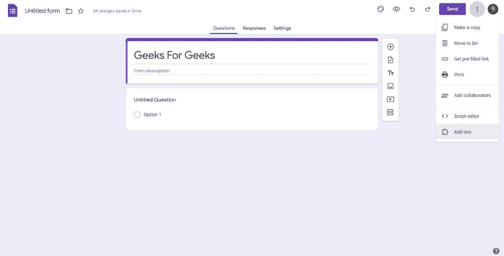
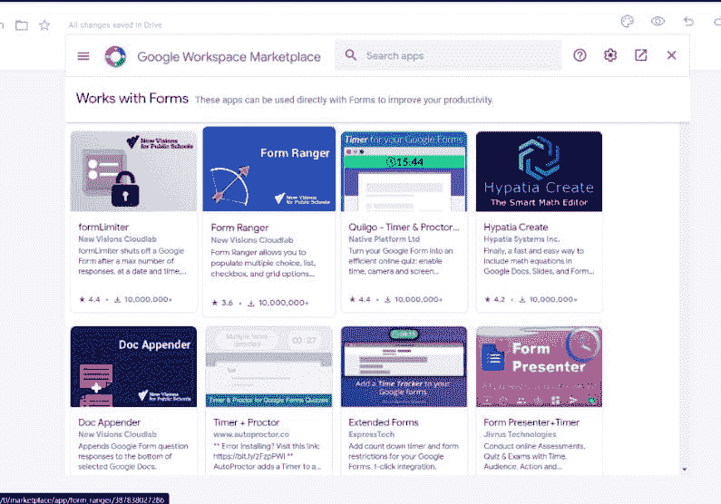
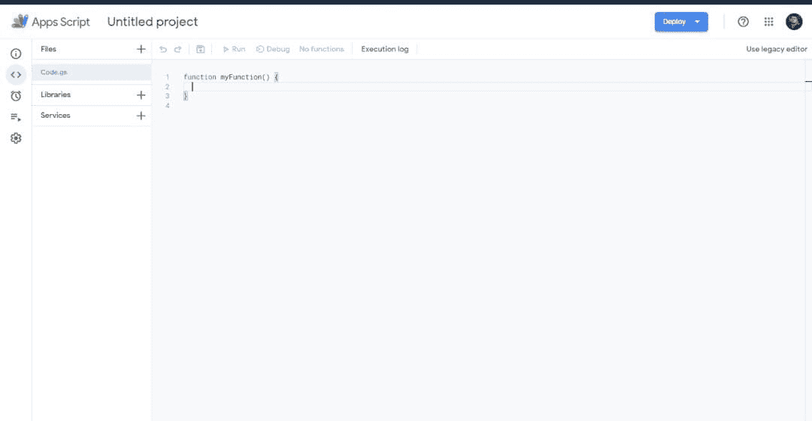
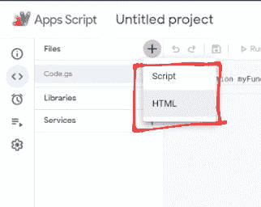
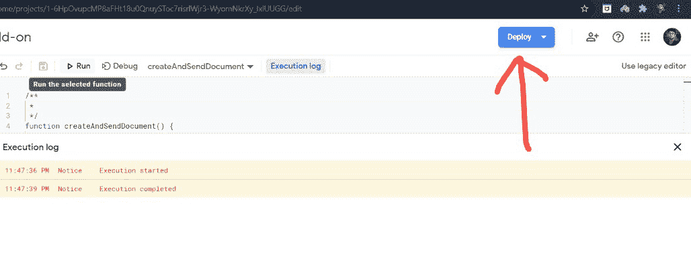
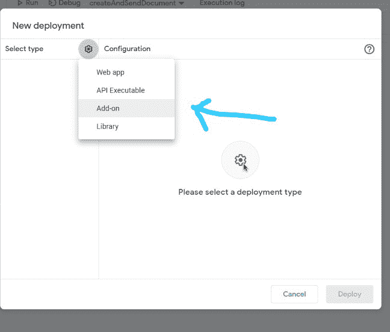

# 如何用谷歌 app 脚本构建 G 套件插件？

> 原文:[https://www . geeksforgeeks . org/how-build-g-suite-add-with-Google-apps-script/](https://www.geeksforgeeks.org/how-to-build-g-suite-add-ons-with-google-apps-script/)

**G Suite** 是一项谷歌服务，提供对一组核心应用程序的访问，如 Gmail、日历、驱动器、文档、工作表、幻灯片、表单、会议等。附加组件是指对已有通用套件产品的扩展(如上所述)。开发人员可以为这些产品添加许多额外的功能。附加组件总是在 G 套件产品中运行。我们可以创建边栏、对话框、模态，并以无缝的方式向它们添加功能。通常，我们使用来自 G 套件市场的附加组件。

**附加组件示例:**

 

### **自己编写插件:**

在这里，我们将创建一个从谷歌文档发送电子邮件的附件。按照以下步骤创建附加组件:

**第一步:**转到**>**创建空白文档 **>** 工具 **>** 这将调出(< >脚本编辑器)如下所示:



确保您使用任何谷歌帐户登录。从今以后，您可以继续执行**应用程序脚本。**

这里**。gs** 文件扩展名与 Google Apps Script 相关联，这是一种基于 JavaScript 的脚本语言，用于 G Suite 产品。

点击加号按钮后，将出现一个包含两个选项 **(HTML 和脚本)的下拉菜单。**



这些 HTML 和脚本文件用于添加我们的定制设计。

**步骤 2:** 这是要添加到**的应用程序脚本代码。gs** 文件。

## java 描述语言

```
/**
 * Send an E-mail with the help of Google Docs.
 */
function createAndSendDocument() {
  // Create a new Google Doc named 'Hello, Geeks For Geeks!'
  var doc = DocumentApp.create('Hello, Geeks For Geeks!');

  // Access the body of the document, then add a paragraph.
  doc.getBody().appendParagraph('My custom Add-on');

  // Get the URL of the document.
  var url = doc.getUrl();

  // Active User's E-mail address.
  var email = Session.getActiveUser().getEmail();

  // Get the name of the document to be used.
  var subject = doc.getName();

  // Append a new string to the "url" variable to use as an email body.
  var body = 'Link to your doc: ' + url;

  // Send yourself an email with a link to the document.
  GmailApp.sendEmail(email, subject, body);
}
```

**步骤 3:** 运行如下所示的代码。你会收到一封电子邮件，上面写着“你好，极客们！”成功执行代码后的消息。我们已经完成了第一个应用程序脚本。现在，要将此作为附加组件发布到 G 套件市场，您需要在[workspace.google.com](workspace.google.com)上设置项目后部署更改

**步骤 4:** 按照步骤部署您的插件。点击【部署】按钮 **>** 新建部署 **>** 选择类型(插件)。

 

您将从您的谷歌工作区收到一个项目编号。使用它，您最终可以将您的加载项发布到市场。