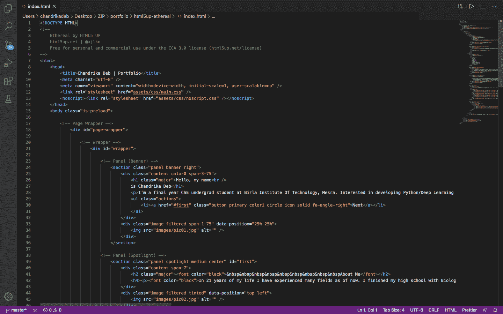
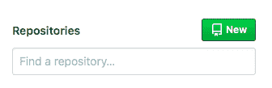
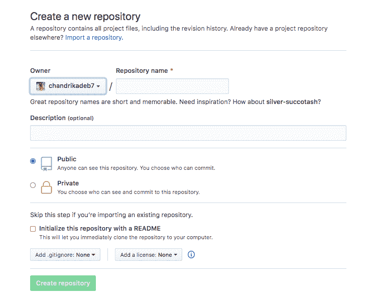
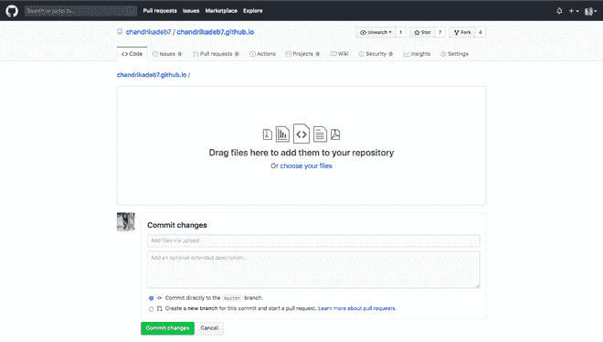
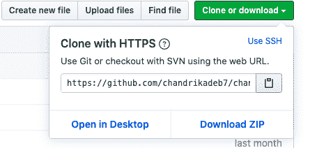
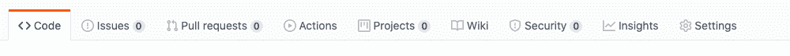

# 如何建立作品集网站并在 GitHub 页面托管？

> 原文:[https://www . geeksforgeeks . org/how-to-build-portfolio-网站和主机-it-on-github-pages/](https://www.geeksforgeeks.org/how-to-build-portfolio-website-and-host-it-on-github-pages/)

在本文中，您将了解到

*   如何建立自己的**投资组合网站？**
*   如何在 GitHub Pages 上免费托管你的网站？

你可以在简历上展示这个投资组合。让我们开始吧！！

### 下载投资组合网站模板

我们将寻找一些令人敬畏的，反应灵敏的投资组合设计模板在线免费。网站**HTMl5up**([https://html5up.net/](https://html5up.net/))有很多不错的选择，适合拥有大量职业过渡和 CSS/Bootstrap 素材的个人投资组合。

#### 下面列出了模板的一些不错的选择:

*   [https://html5up.net/story](https://html5up.net/story)
*   [https://html5up.net/solid-state](https://html5up.net/solid-state)
*   [https://html5up.net/miniport](https://html5up.net/miniport)
*   [https://html5up.net/dimension](https://html5up.net/dimension)

点击右上角**下载选项**，将模板下载为 ZIP。

### 相应地定制！

现在从 ZIP 文件中提取文件，仔细看看。您可能会看到文件夹，如“**”、“**”和文件，如“***【index.html】***”、“ ***license.txt*** 和“ ***readme.txt*** ”。****

*   ****删除**和 ***自述文件。*********
*   ****在您的代码编辑器中打开***【index.html】***文件，如 **VS 代码**或**崇高**以及您的浏览器。****
*   ****从代码编辑器中开始对文本进行必要的更改，并通过刷新浏览器来反映这些更改。****

******你也可以通过改变图片文件夹中的图片来放置你自己的图片和背景，但是要记得放入和它一样的“文件名”。******

****一旦你完成并满意，你可以改变 CSS 和样式。如果你是一个完全的新手，那是完全可以选择的。****

****

用于编辑文件的 VS 代码编辑器**** 

### ****上传到 GitHub 存储库中****

****最后，您的文件现在需要被推送到一个新的 GitHub 存储库中，并且必须使用 **GitHub 页面**托管。要在 GitHub 中推送您的投资组合网站的必要文件，请遵循给定的步骤:****

*   ****登录[https://github.com/](https://github.com/)并点击左侧窗格中仓库旁边的**新建**选项。****

****

单击新建选项**** 

*   ****将存储库命名为“***your-username . github . io***”。(例如，如果您的用户名是 *chandrikadeb7* ，则将存储库命名为 *chandrikadeb7.github.io* )。****
*   ****点击**创建存储库**。****

****

输入必要的详细信息，然后单击创建存储库**** 

******可以通过两种方式从电脑上传所有需要的文件:****** 

#### ****1.使用浏览器中的 GitHub 网站拖放/上传选项****

*   ****从您新创建的存储库中点击**上传文件**选项。****
*   ****选择**选项选择您的文件**从您的本地计算机上传它们。****
*   ****或者只需**拖放**该屏幕上的文件夹。****

****

上传必要的文件，然后单击提交更改**** 

#### ****2.使用 Git 版本控制****

*   ****您可以使用 **Git 版本控制系统**将文件推送到您的存储库。****
*   ****参见本指南**安装 Git**[https://Git-SCM . com/book/en/v2/入门-安装-Git](https://git-scm.com/book/en/v2/Getting-Started-Installing-Git)****
*   ****将当前工作目录更改为您的本地项目。****
*   ****将本地目录初始化为 Git 存储库。****

```
**$ git init** 
```

*   ****将文件添加到新的本地存储库中。这为第一次提交做好了准备。****

> ****去给我。****
> 
> ****#将文件添加到本地存储库中，并转移它们进行提交。要打开文件，请使用“git reset HEAD YOUR-FILE”。****

*   ****提交您在本地存储库中暂存的文件。****

> ****$ git 提交-m“首次提交”****
> 
> ****#提交跟踪的更改，并准备将其推送到远程存储库。要删除此提交并修改文件，请使用“git reset-soft HEAD ~ 1”并再次提交并添加文件。****

*   ****在 GitHub 存储库的快速设置页面顶部，单击**剪贴板图标**复制远程存储库的网址。****

****

单击剪贴板图标复制网址**** 

*   ****在终端中，添加将在其中推送本地存储库的远程存储库的 URL。****

```
**$ git remote add origin remote repository URL
# Sets the new remote
$ git remote -v
# Verifies the new remote URL** 
```

*   ****将本地存储库中的更改推送到 GitHub。****

```
**$ git push -u origin master
# Pushes the changes in your local repository up to the remote repository you specified as the origin** 
```

### ****使用 GitHub 页面托管****

*   ****现在转到上面的**设置**标签，向下滚动寻找 **GitHub 页面**选项。****
*   ****现在在源代码下拉列表中选择**主分支**，一个通知将会出现，说明您准备在一两分钟内发布您的站点。****

********

*   ****点击通知超链接，就可以了..**你的作品集免费托管在 GitHub 页面！******

****[](https://miro.medium.com/max/1000/1*D4yp87vUoKIKKdlj7bwiGg.png)****

****您的个人投资组合网站发布在***https://<your-github-username>. github . io*******

****你可以在这里看看我的——https://chandrikadeb7.github.io/T2****