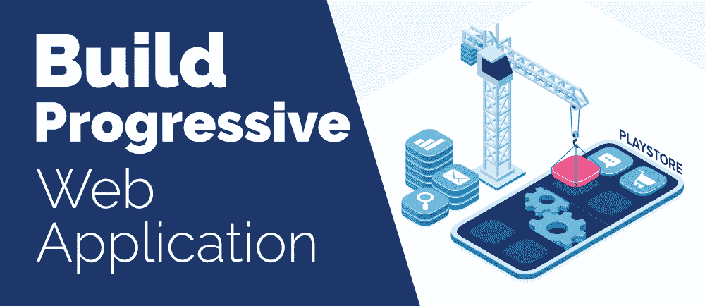
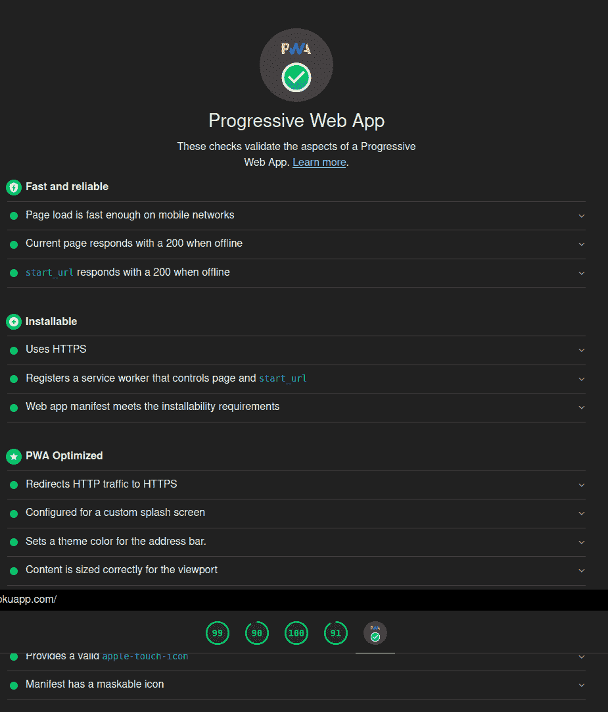
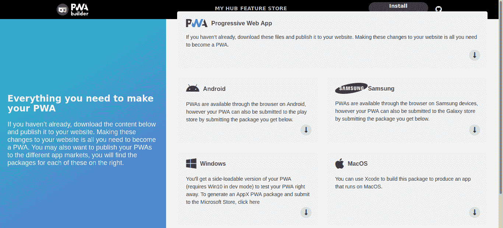
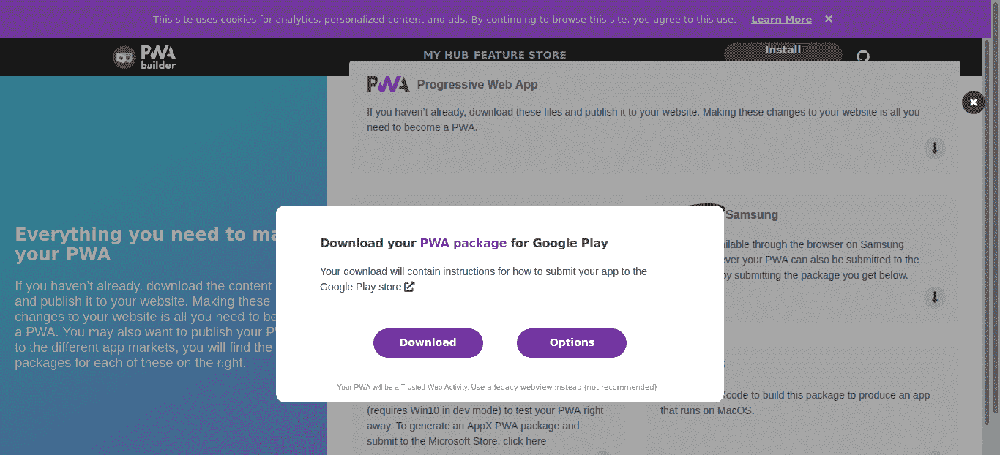

# 如何构建渐进式 Web 应用并提交到 Play Store？

> 原文:[https://www . geeksforgeeks . org/如何构建-渐进-web-应用-提交-播放-商店/](https://www.geeksforgeeks.org/how-to-build-progressive-web-application-and-submit-it-to-the-play-store/)

[**渐进式网络应用程序(PWA)**](https://www.geeksforgeeks.org/general-introduction-to-progressive-web-appspwa/)是一种使用网络技术开发的应用程序，可以像传统应用程序一样安装在任何设备上。创建一个简单的 PWA 非常容易，因为它涉及到向项目添加两个重要的文件，即 **manifest.json** 和 **serviceworker.js** 。之后，PWA 就可以安装在任何操作系统上了。



按照[在 5 分钟内制作一个简单的 PWA](https://www.geeksforgeeks.org/making-a-simple-pwa-under-5-minutes/)教程来构建一个 PWA(或者)按照下面给出的步骤来创建一个 PWA。

**步骤 1:** 在放置 index.html 文件的同一目录下创建一个 **manifest.json** 文件。这个文件包含应用名称，开始网址，主题颜色和一些更基本的 JSON 格式的应用信息

## java 描述语言

```
{ 
"name": "Django Blogiee", 
"short_name": "Django Blogiee", 
"description": "PWA for django Blogiee", 
"start_url": "/", 
"display": "standalone", 
"scope": "/", 
"orientation": "any", 
"background_color": "#ffffff", 
"theme_color": "#000000", 
"status_bar": "default", 
"icons": [
       {
       "src": "/static/icons/Django-Blogiee.1b98d36d50a7.png", 
       "sizes": "512x512", 
       "purpose": "any maskable"
       }
       ],
   "dir": "ltr", 
"lang": "en-US" }
```

**第二步:**创建 **serviceworker.js** ，一个与 manifest.json 位于同一目录的 JavaScript 文件，负责 PWA 应用的安装和缓存。

## java 描述语言

```
var staticCacheName = "django-blogiee-v" + new Date().getTime();
var filesToCache = [
    '/static/icons/Django-Blogiee.1b98d36d50a7.png',
];

self.addEventListener("install", event => {
    this.skipWaiting();
    event.waitUntil(
        caches.open(staticCacheName)
            .then(cache => {
                return cache.addAll(filesToCache);
            })
    )
});

self.addEventListener("fetch", event => {
    event.respondWith(
        caches.match(event.request)
            .then(response => {
                return response || fetch(event.request);
            })
            .catch(() => {
                return caches.match('/offline/');
            })
    )
});
});
```

**步骤 3:** 使用 index.html 的<脚本>标签将 serviceworker.js 链接到 index.html。

## java 描述语言

```
<script type="application/javascript">
    // Initialize the service worker
    if ('serviceWorker' in navigator) {
        navigator.serviceWorker.register('/serviceworker.js', {
            scope: '/'
        }).then(function (registration) {
            // Registration was successful
            console.log('django-blogiee: ServiceWorker registration successful with scope: ', registration.scope);
        }, function (err) {
            // registration failed 
            console.log('django-blogiee: ServiceWorker registration failed: ', err);
        });
    }
</script>
```

最后，你做了一个 PWA。PWA 可以帮助你把你的网站变成用户智能手机里的一个应用。**谷歌地图 Go、Twitter lite** 和 **Instagram Lite** 的一些例子。如果你看清楚普华永道的，他们没有使用传统的 APK 文件进行安装。所以这些 PWA 可以提交到 play store，但是我们可以从 play store 安装上面所有的例子。这是由谷歌利用一项名为**可信网络活动(TWA)** 的技术实现的。

谷歌称“*一个受信任的网络活动让你的安卓应用程序无需任何浏览器界面就能启动全屏浏览器标签。此功能仅限于您拥有的网站，您可以通过设置数字资产链接来证明这一点。数字资产链接基本上由指向您的应用程序的网站文件和指向您的网站的应用程序中的一些元数据组成。当您启动受信任的网络活动时，浏览器将检查数字资产链接是否已签出，这称为验证。如果验证失败，浏览器将返回以自定义选项卡显示您的网站。*”

在本教程中，我们使用 django-blogiee.herokuapp.com 网站。你可以查看它的[清单. json](https://django-blogiee.herokuapp.com/manifest.json) 和 serviceworker.js。

**有以下三种方法可以做到:**

*   如果你是安卓开发者，你可以自己构建，你不需要遵循这个教程(硬方法)
*   即使你不是安卓开发者，但有使用 NodeJs、NPM、JDK 和安卓命令行工具和命令行界面的经验，你也可以使用 [Bubblewrap](https://github.com/GoogleChromeLabs/bubblewrap) 项目。(中等方式，但需要大量下载)
*   如果你使用预建的内容管理系统(如 WordPress、Ghost 及其插件)来运行你的博客，你可以遵循本教程。(简单的方法)

确保您的网站是完全兼容的 PWA。你可以使用谷歌灯塔工具看起来像下图。



灯塔报告

现在如果你对你的 PWA 很好，去微软的网站 [PWABuilder](https://www.pwabuilder.com/) 放上你网站的网址，点击开始。如果你看到你的网站得分为 100，那么点击建立我的 PWA。你会看到类似下图的东西。



pwabuilder.com 报告

然后你可以下载你的安卓包，并提交到游戏商店。甚至你可以下载苹果应用商店、视窗商店和银河商店的软件包。



下载 APK 软件包

提取下载的压缩文件以获得 APK 文件，从而添加数字资产文件“assetlinks.json”。请确保您的 assetlinks.json 文件可以在网址 https:// <your domain="">/上找到。知名/asset link . JSON。</your>