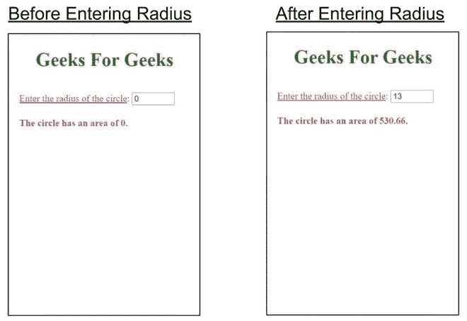

# 如何在 Google AMP 中使用 AMP-bind-宏动态计算圆的面积？

> 原文:[https://www . geeksforgeeks . org/如何动态计算圆面积-使用-amp-bind-macro-in-Google-amp/](https://www.geeksforgeeks.org/how-to-calculate-area-of-circle-dynamically-using-amp-bind-macro-in-google-amp/)


借助 amp-bind-macro，可以创建一个 HTML 程序来动态计算圆的面积。当给出输入时，页面将响应用户输入，找到具有所提供半径的圆的区域，并在不刷新页面的情况下打印出来。

**设置:**要在我们的 amp 页面中使用 amp-bind-macro，我们必须在文档的头部导入 amp-bind 脚本。

## 超文本标记语言

```html
<script async custom-element="amp-bind" src=
"https://cdn.ampproject.org/v0/amp-bind-0.1.js">
</script>
```

#### 示例:

## 超文本标记语言

```html
<!doctype html>
<html amp>

<head>
    <meta charset="utf-8">
    <title>Foofle AMP amp-bind</title>

    <link rel="canonical" href=
"https://amp.dev/documentation/examples/components/amp-bind/index.html">

    <meta name="viewport" content=
"width=device-width,minimum-scale=1,initial-scale=1">

    <script async src=
        "https://cdn.ampproject.org/v0.js">
    </script>

    <!-- Import amp-bind component in header -->
    <script async custom-element="amp-bind" 
src="https://cdn.ampproject.org/v0/amp-bind-0.1.js">
    </script>

    <style amp-boilerplate>
        body {
            -webkit-animation: -amp-start 8s 
                steps(1, end) 0s 1 normal both;

            -moz-animation: -amp-start 8s 
                steps(1, end) 0s 1 normal both;

            -ms-animation: -amp-start 8s 
                steps(1, end) 0s 1 normal both;

            animation: -amp-start 8s 
                steps(1, end) 0s 1 normal both
        }

        @-webkit-keyframes -amp-start {
            from {
                visibility: hidden
            }

            to {
                visibility: visible
            }
        }

        @-moz-keyframes -amp-start {
            from {
                visibility: hidden
            }

            to {
                visibility: visible
            }
        }

        @-ms-keyframes -amp-start {
            from {
                visibility: hidden
            }

            to {
                visibility: visible
            }
        }

        @-o-keyframes -amp-start {
            from {
                visibility: hidden
            }

            to {
                visibility: visible
            }
        }

        @keyframes -amp-start {
            from {
                visibility: hidden
            }

            to {
                visibility: visible
            }
        }
    </style>

    <noscript>
        <style amp-boilerplate>
            body {
                -webkit-animation: none;
                -moz-animation: none;
                -ms-animation: none;
                animation: none
            }
        </style>
    </noscript>

    <style amp-custom>
        h1 {
            color: forestgreen;
            text-align: center;
        }
    </style>
</head>

<body>
    <h1>
        Geeks For Geeks
    </h1>

    <!-- [`amp-bind-macro`] makes it possible 
        to reuse expressions across different 
        actions -->
    <div style="padding: 1em;
                  color: crimson;">
        <amp-bind-macro id="circleArea" 
            arguments="radius" 
            expression="3.14 * radius * radius">

            <label>
                <u>Enter the radius of the circle</u>: 
            </label>
            <input type="number" min="0" max="100" 
                value="0" on="input-throttled:AMP.setState({
                      radius: event.value })">
            <br>

            <div>
                <h4>
                    The circle has an area of
                    <span ="circleArea(radius)">0</span>.
                </h4>
            </div>
        </amp-bind-macro>
    </div>
</body>

</html>
```

**输出:**

