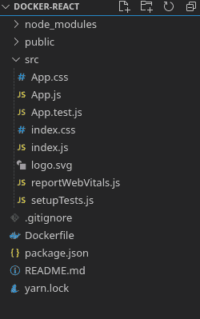
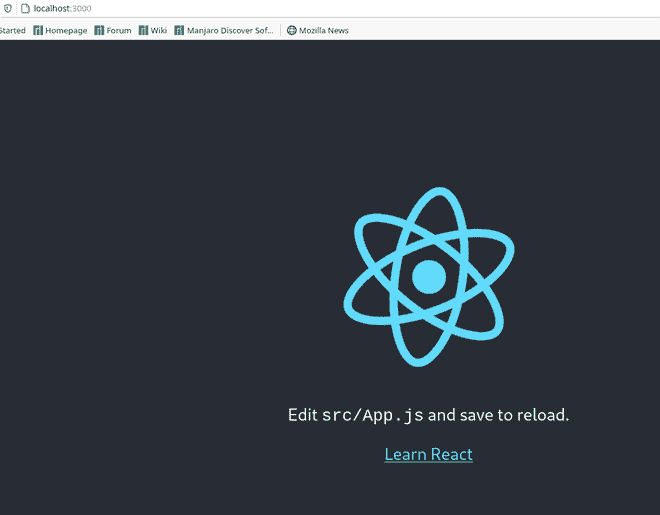

# 如何通过 docker 调用‘NPM start’？

> 原文:[https://www . geesforgeks . org/how-to-call-NPM-start-through-docker/](https://www.geeksforgeeks.org/how-to-call-npm-start-though-docker/)

下面的文章介绍如何通过 docker 调用 ***npm start*** 。在此过程中，我们将记录一个简单的反应应用程序。

[Docker](https://docs.docker.com/get-started/overview/) 是一个运行、运输和管理应用程序的开源平台。它使我们能够像管理应用程序一样管理基础架构。

它在一种称为容器的隔离环境中运行应用程序。容器是轻量级的，包含运行应用程序所需的一切。多个容器可以在同一个主机上运行，它们也可以在它们之间安全地共享数据。

**创建反应应用程序:**

*   **步骤 1:** 使用以下命令创建一个 React 应用程序。

    ```html
    npx create-react-app docker-react
    ```

*   **步骤 2:** 创建项目文件夹(即 docker-react)后，使用以下命令移动到该文件夹。

    ```html
    cd docker-react
    ```

*   **第三步:**在你的应用程序根目录下创建一个名为 ***Dockerfile*** 的文件。

**项目结构:**会是这样的。



**写文件:**在你的*文件*上写下以下几行。

```html
FROM node:alpine
RUN mkdir /app
WORKDIR /app
COPY package.json /app
RUN npm install
COPY . /app
CMD ["npm", "start"]
```

**说明:**

*   首先，我们加载基础映像 ***节点:alpine*** ，这是一个轻量级的 Linux 发行版，其中安装了一个节点。
*   然后我们将包含应用依赖关系的****文件直接复制到我们的工作中。****
*   ****然后我们安装依赖项，并将项目文件复制到我们的工作目录中。****
*   ****最后，我们运行 ***npm 启动命令。**T3】*****

******创建 docker 映像:**从项目的根目录运行以下命令。确保您的 ***码头工人守护程序*** 正在运行。****

```html
**docker build -t <yourname/projectname> .**
```

******运行应用程序的步骤:**从文件夹的根目录使用以下命令运行应用程序。****

```html
**docker run -d -it -p 3000:3000 <yourname/projectname>**
```

****这里我们需要将我们的*本地主机*端口映射到一个容器，在我们的例子中是 3000。****

******输出:**现在打开浏览器，转到*****http://localhost:3000/***，会看到如下输出。******

********