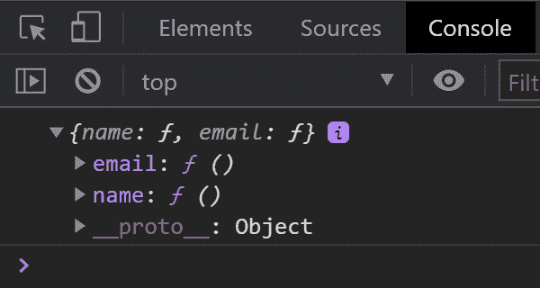

# 如何调用对象的键但作为方法返回，而不是字符串？

> 原文:[https://www . geeksforgeeks . org/如何调用一个对象的键，但作为方法返回，而不是字符串/](https://www.geeksforgeeks.org/how-to-call-the-key-of-an-object-but-returned-as-a-method-not-a-string/)

默认情况下，对象键作为字符串返回，但也可以作为方法返回。

步骤如下:

*   获取对象密钥。
*   为每个键分配功能。
*   将它们分配给一个对象。
*   返回对象。

**示例 1:** 上述方法是使用 JavaScript 函数 [Object.keys()](https://www.geeksforgeeks.org/object-keys-javascript/) 和 [forEach()](https://www.geeksforgeeks.org/javascript-array-foreach-method/) 实现的。

## java 描述语言

```html
<script>
let person = {
    name : "Raktim Banerjee",
      email: "example@gmail.com"
}

const getObjectKeyAsMethod = obj =>{
 let newObject = {};

 //returned object keys in an array
 Object.keys(obj)
     //iterate the array
    .forEach(key => {
      //assign function to key
      newObject[key] = function(){}
  })
 return newObject;
}

let result = getObjectKeyAsMethod(person);

console.log(result);
</script>
```

**输出:**



**示例 2:****代码后面的是使用 [Object.entries()](https://www.geeksforgeeks.org/object-entries-javascript/) 和“[新函数](https://javascript.info/new-function)实现的。**

## **java 描述语言**

```html
<script>
let person = {
    name : "Raktim Banerjee",
    email: "example@gmail.com"
}

let result = {}
for(let [key] of Object.entries(person)){
    result[key] = new Function()
}

console.log(result);
</script>
```

****输出:****

**

对象键功能**