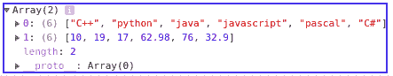
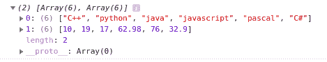

# 只有元素是数组时，如何调用 map 方法？

> 原文:[https://www . geesforgeks . org/如果元素是数组，如何调用映射方法/](https://www.geeksforgeeks.org/how-to-call-the-map-method-only-if-the-element-is-an-array/)

给定一个对象文字，让我们说“人”。它有许多不同类型的属性。这里的任务是仅当属性本身是数组时才映射属性的值。除了对象，我们还可以对数组执行相同的操作集。

为了实现上述任务，我们可以在 JavaScript 中使用 Array filter()方法，然后映射结果。

[Array filter()](https://www.geeksforgeeks.org/javascript-array-filter/) 方法用于从给定的数组中创建一个新的数组，该数组只包含那些满足自变量函数设置的条件的元素。

JavaScript 中的[数组映射()](https://www.geeksforgeeks.org/javascript-array-map-method/)方法通过对父数组中的每个元素调用特定的函数来创建一个数组。

**步骤:**

1.  使用 Object.values()方法将对象值转换为数组。让它被逮捕。
2.  使用 filter 方法迭代数组(arr)。如果元素的类型为“object”，则筛选器返回 true。
3.  使用 Map 方法映射结果数组。

下面是给定问题的变体:

**示例 1:** 从对象文字映射上述方法的问题在于，过滤器和映射方法都不能用于迭代对象。[为了解决这个问题，反对。应使用数值](https://www.geeksforgeeks.org/object-values-javascript/)。对象。值将一个对象作为参数，并返回该对象中所有值的数组。现在我们可以在这个数组上应用数组 map()和数组 filter()方法。

```html
const person = {
 first_name : 'John',
 last_name : 'Doe',
 skill_set : ['C++', 'python', 'java', 
              'javascript', 'pascal', 'C#' ],
 fav_numbers : [10, 19, 17, 62.98, 76, 32.9],
 email : 'john@someplace.com'
 }

 Output: (2) [Array(6), Array(6)]
      0: (6) ["C++", "python", "java",
              "javascript", "pascal", "C#"]
      1: (6) [10, 19, 17, 62.98, 76, 32.9]
```

## java 描述语言

```html
<script>
    // The object literal Person from which we
    // need to extract the arrays
    const Person = {
     first_name : 'John',
     last_name : 'Doe',
     skill_set : ['C++', 'python', 'java',
                  'javascript', 'pascal', 'C#' ],
     fav_numbers : [10, 19, 17, 62.98, 76, 32.9],
     email : 'john@someplace.com'
     }

    // Method 1 : Object.values converts the object
    // literal into an array of its values
     const result = Object.values(Person).filter(function(per){
       //typeof array in javascript is 'object'
       // we can also do (typeof per) === (typeof []) here
       return (typeof per) === 'object';
     }).map(function(per){
       return per;
     })

     //output the array containing the required arrays
     console.log(result);
 </script>
```



控制台输出

**例 2 :** 映射从一个数组，我们可以在这里直接使用数组 map()和数组 filter()方法。

```html
const Person = ['John',8.6,['C++', 'python', 'java', 
                     'javascript', 'pascal', 'C#' ],
   'john@someplace.com',[10, 19, 17, 62.98, 76, 32.9]];

 Output: (2) [Array(6), Array(6)]
         0: (6) ["C++", "python", "java", 
                 "javascript", "pascal", "C#"]
         1: (6) [10, 19, 17, 62.98, 76, 32.9]      
```

## java 描述语言

```html
<script>
  const P = ['John',8.6,['C++', 'python', 'java',
             'javascript', 'pascal', 'C#' ],
   'john@someplace.com',[10, 19, 17, 62.98, 76, 32.9]];

   const res = person.filter(function(per){
     // The typeof array in javascript is 'object'
     // We can also do (typeof per) === (typeof []) here
     return (typeof per) === 'object';
   }).map(function(per){
     return per;
   })

   // Output the array containing the required arrays
   console.log(res);
</script>
```



控制台输出