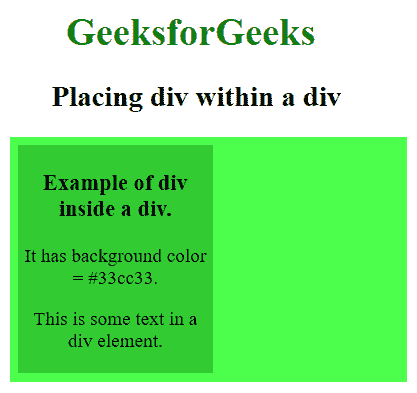
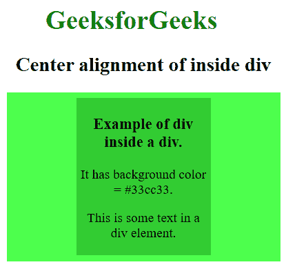
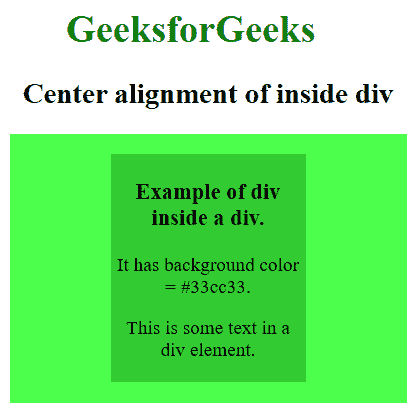
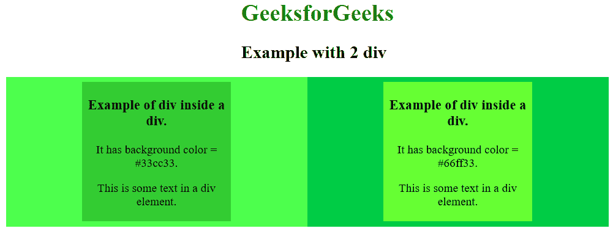

# 一个 div 如何在另一个 div 内居中？

> 原文:[https://www . geesforgeks . org/how-to-center-a-div-in-other-div/](https://www.geeksforgeeks.org/how-to-center-a-div-within-another-div/)

**div** 标签用于构建 HTML 文档的一个分区或部分，其中放置了 HTML 的其他元素，该分区/部分的工作方式类似于一个容器，其 CSS 样式可以作为一个单元完成，或者 javascript 可以用于在该容器上执行各种任务。

**语法:**

```html
<div>
  <h3>'This is a div of the web page.>/h3>
  <p>This is some text in a div element.</p>
</div>

```

要了解 div 标签的广泛用法及其在 HTML 中的实现，请单击此处的。

**示例:**这个示例描述了如何将一个 div 放入另一个 div 中。

```html
<!DOCTYPE html>
<html>
<meta name="viewport" content="width=device-width, initial-scale=1.0">
<head>
<title>Placing div within a div</title>
<style>
h1 { 
     color:green;
     text-size:2vw;
     padding-left : 47px; 
   }
h2 { 
     padding-left: 35px;
     text-size:1vw; 
    } 
</style> 
</head>
<body>
<h1>GeeksforGeeks</h1> 
<h2>Placing div within a div</h2>
<div style="background-color:#4dff4d;width:20%;text-align:center;padding:7px;">
<div style="background-color:#33cc33;width:50%;text-align:center;padding:2px;">
  <h3 style="font-size:2vw;">Example of div inside a div.</h3>
  <p style="font-size:2vw;">It has background color = #33cc33.</p>
  <p style="font-size:2vw;">This is some text in a div element.</p>
</div>
</div>
</body>
</html>
```

**输出:**


正如我们所看到的，内部 div 容器占据了内部空间的左侧部分。要将内部 div 容器移动到父 div 的中心，我们必须使用 **[样式](https://www.geeksforgeeks.org/html-style-attribute/)** 属性的 **[边距](https://www.geeksforgeeks.org/css-margins-padding/)** 属性。我们可以通过这个边距属性调整任何 HTML 元素周围的空间，只需向它提供所需的值。

现在这个属性在调整内部 div 中的作用来了。如果边距值设置为 0，即**边距:0** ，则告知浏览器 HTML 元素(此处为内部 div)的上下边距将为 0。此外，如果我们将边距的值写成**边距:0 自动**，它会命令浏览器根据 HTML 元素的宽度自动将左右边距调整为相同的大小。

**内部 div 的语法:**

```html
<div style="width:50%;margin:0 auto">
<!-- content of div container -->
</div>

```

**示例:**这个示例描述了我们如何在 div 中居中一个 div。

```html
<!DOCTYPE html>
<html>
<meta name="viewport" content="width=device-width, initial-scale=1.0">
<head>
<title>Center alignment of inside div</title>
<style>
h1 { 
     color:green;
     padding-left : 47px;
     text-size:2vw; 
   } 
h2 { 
     padding-left: 11px;
     text-size:1vw; 
   }
</style> 
</head>
<body>
<h1>GeeksforGeeks</h1> 
<h2>Center alignment of inside div</h2>
<div style="background-color:#4dff4d;width:20%;text-align:center;padding:7px;">
<div style="background-color:#33cc33;width:50%;text-align:center;padding:2px;margin:0 auto">
  <h3 style="font-size:2vw;">Example of div inside a div.</h3>
  <p style="font-size:2vw;">It has background color = #33cc33.</p>
  <p style="font-size:2vw;">This is some text in a div element.</p>
</div>
</div>
</body>
</html>
```

**输出:**


您也可以将第一个参数的任意值提供给边距值，以提供从顶部和底部到 HTML 元素的一些间隙。要将内部 div 调整到中心位置，只需在第二个参数中写入 **auto 即可。**

**内部 div 的语法:**

```html
<div style="width:50%;margin:10px auto">
<!-- content of div container -->
</div>
```

**示例:**此示例显示了如何在边距属性的第一个参数为非零值的 div 内居中 div。

```html
<!DOCTYPE html>
<html>
<meta name="viewport" content="width=device-width, initial-scale=1.0">
<head>
<title>Center alignment of inside div</title>
<style>
h1 { 
     color:green;
     padding-left : 47px;
     text-size:2vw; 
   } 
h2 { 
     padding-left: 11px;
     text-size:1vw; 
    }
</style> 
</head>
<body>
<h1>GeeksforGeeks</h1> 
<h2>Center alignment of inside div</h2>
<div style="background-color:#4dff4d;width:20%;text-align:center;padding:7px;">
<div style="background-color:#33cc33;width:50%;text-align:center;padding:2px;margin:10px auto">
  <h3 style="font-size:2vw;">Example of div inside a div.</h3>
  <p style="font-size:2vw;">It has background color = #33cc33.</p>
  <p style="font-size:2vw;">This is some text in a div element.</p>
</div>
</div>
</body>
</html>
```

**输出:**


**示例:**这个示例描述了我们如何并排放置 2 个 div，每个 div 内部都有一个中心对齐的 div。

```html
<!DOCTYPE html>
<html>
<meta name="viewport" content="width=device-width, initial-scale=1.0">
<head> 
<title>2 div example</title>
<style>
h1 { 
     color:green;
     text-size:2vw; 
   }
h2{
text-size:1vw;
} 
h1, h2 { 
     padding-left: 100px; 
    }
</style> 
</head> 
<body>
<h1>GeeksforGeeks</h1> 
<h2>Example with 2 div</h2>
<div style="background-color:#4dff4d;width:25%;text-align:center;padding:7px;float:left;">
<div style="background-color:#33cc33;width:50%;text-align:center;padding:2px;margin:0 auto">
  <h3 style="font-size:2vw;">Example of div inside a div.</h3>
  <p style="font-size:2vw;">It has background color = #33cc33.</p>
  <p style="font-size:2vw;">This is some text in a div element.</p>
</div>
</div>
<div style="background-color:#00cc44;width:25%;text-align:center;padding:7px;float:left;">
<div style="background-color:#66ff33;width:50%;text-align:center;padding:2px;margin:0 auto">
  <h3 style="font-size:2vw;">Example of div inside a div.</h3>
  <p style="font-size:2vw;">It has background color = #66ff33.</p>
  <p style="font-size:2vw;">This is some text in a div element.</p>
</div>
</div>
</body>
</html>
```

**输出:**
