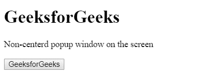
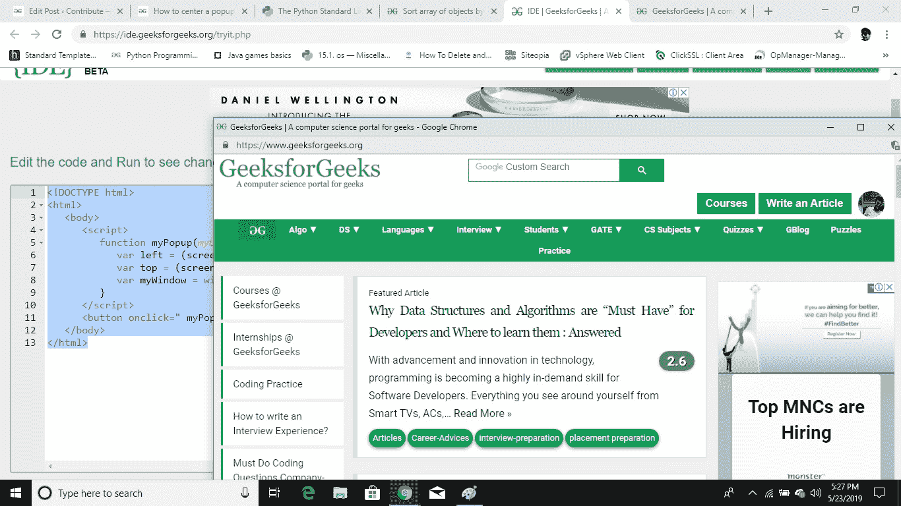
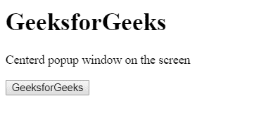
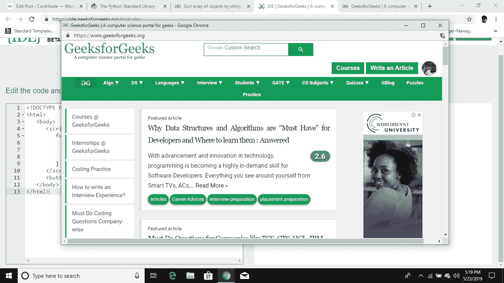

# 如何在屏幕上居中弹出窗口？

> 原文:[https://www . geeksforgeeks . org/如何在屏幕上居中弹出窗口/](https://www.geeksforgeeks.org/how-to-center-a-popup-window-on-screen/)

JavaScript [window.open()方法](https://www.geeksforgeeks.org/javascript-window-open-window-close-method/)用于打开弹出窗口。该弹出窗口将位于屏幕中央。

*   **弹出窗口高度:**屏幕上弹出窗口的高度。
*   **弹出窗口宽度:**屏幕上弹出窗口的宽度。

**示例 1:** 本示例创建弹出窗口，但不将其放在中心。

```html
<!DOCTYPE html>
<html>

<head>  
    <title>  
        Non-centerd popup window
        on the screen
    </title> 
</head>

<body>
    <h1>GeeksforGeeks</h1>

    <p>
        Non-centerd popup window
        on the screen
    </p>

    <script>
        function createPopupWin(pageURL, pageTitle,
                    popupWinWidth, popupWinHeight) {
            var left = (screen.width ) ;
            var top = (screen.height ) ;
            var myWindow = window.open(pageURL, pageTitle, 
                    'resizable=yes, width=' + popupWinWidth
                    + ', height=' + popupWinHeight + ', top='
                    + top + ', left=' + left);
        }
    </script>

    <button onclick = "createPopupWin('https://www.geeksforgeeks.org',
            'GeeksforGeeks Website', 1200, 650);">
        GeeksforGeeks
    </button>
</body>

</html>
```

**输出:**

*   **点击按钮前:**
    
*   **点击按钮后:**
    

**使弹出窗口居中:**为了使弹出窗口居中，我们将 open()方法的参数值更改如下:

*   left =(screen . width–PopupwinWidth)/2
*   top =(屏幕.高度–弹出窗口)/ 4

**示例 2:** 本示例创建弹出窗口，并将其置于中心。

```html
<!DOCTYPE html>
<html>

<head>  
    <title>  
        Centerd popup window
        on the screen
    </title> 
</head>

<body>
    <h1>GeeksforGeeks</h1>

    <p>
        Centerd popup window
        on the screen
    </p>

    <script>
        function createPopupWin(pageURL, pageTitle,
                    popupWinWidth, popupWinHeight) {
            var left = (screen.width - popupWinWidth) / 2;
            var top = (screen.height - popupWinHeight) / 4;

            var myWindow = window.open(pageURL, pageTitle, 
                    'resizable=yes, width=' + popupWinWidth
                    + ', height=' + popupWinHeight + ', top='
                    + top + ', left=' + left);
        }
    </script>

    <button onclick = "createPopupWin('https://www.geeksforgeeks.org',
            'GeeksforGeeks Website', 1200, 650);">
        GeeksforGeeks
    </button>
</body>

</html>
```

**输出:**

*   **点击按钮前:**
    
*   **点击按钮后:**
    