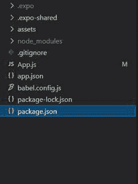
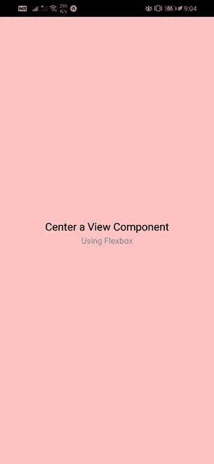
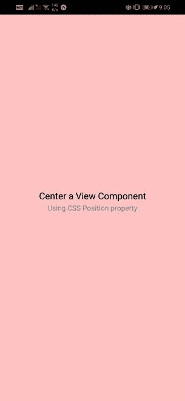

# 如何在屏幕上居中视图组件？

> 原文:[https://www . geesforgeks . org/如何在屏幕上居中查看组件/](https://www.geeksforgeeks.org/how-to-center-a-view-component-on-screen/)

视图组件是创建用户界面的基本构件。它可以直接映射到不同平台的原生视图，如 UIView、

、android.view 等。视图组件可以由嵌套的视图组件以及其他本机组件(子组件)组成。

**方法:**要使视图组件在屏幕上居中，我们可以使用两种方法:

*   **使用 flexbox:** 这是最常用的方法，用于对任何组件/元素进行居中。引入 flexbox 模型是为了在不使用浮动或定位属性的情况下创建响应性布局。要使用 flexbox 将任何组件居中，我们只需简单地将 flex 属性设置为 1，以及 justifyAlign 和 alignItems 属性。
*   **使用 CSS 位置属性:**位置属性在 React Native 中用于居中任何组件的范围较小。position 属性的值被设置为“绝对”，以确保它相对于最近的祖先进行定位。然后，顶部、底部、左侧和右侧属性以及“对齐”和“对齐”属性被设置为 0，它们被设置为“居中”。

**示例:**通过示例，让我们看看如何使用上述方法在屏幕上居中视图组件:

*   **步骤 1:** 打开终端，通过以下命令安装 expo-cli。

    ```
    npm install -g expo-cli
    ```

*   **步骤 2:** 现在通过以下命令创建一个项目。

    ```
    expo init demo-app
    ```

*   **第三步:**现在进入你的项目文件夹，即演示应用程序

    ```
    cd demo-app
    ```

**项目结构:**项目目录应该如下所示:



**示例 1:使用 flexbox**
我们将使用一个包含嵌套文本组件的视图组件作为其子组件。为了使视图组件居中，我们将使用设置为 1 的 flex 属性，以及 justifyAlign 和 alignItems 属性(这两个属性都设置为居中，因为视图组件需要在屏幕上居中)。

## App.js

```
import React from "react";
import { View, Text, StyleSheet } from "react-native";

export default function App() {
  return (
    <View style={styles.centered}>
      <Text style={styles.title}>Center a View Component</Text>
      <Text style={styles.subtitle}>Using Flexbox</Text>
    </View>
  );
}

const styles = StyleSheet.create({
  centered: {
    flex: 1,
    justifyContent: "center",
    alignItems: "center",
    backgroundColor: "#ffc2c2",
  },
  title: {
    fontSize: 18,
    marginVertical: 2,
  },
  subtitle: {
    fontSize: 14,
    color: "#888",
  },
});
```

**运行应用程序的步骤:**使用以下命令启动服务器:

```
expo start
```

**输出:**



**示例 2:使用 CSS 位置属性**
我们将使用一个嵌套文本组件的视图组件作为其子组件。为了使视图组件居中，我们将使用位置属性，该属性设置为绝对。我们还将使用顶部、底部、左侧和右侧的值，并将它们设置为 0(因为视图组件需要在屏幕上居中)。与之前一样，我们还将要求 justifyAlign 和 alignItems 属性的值设置为居中。

## App.js

```
import React from "react";
import { View, Text, StyleSheet } from "react-native";

export default function App() {
  return (
    <View style={styles.centered}>
      <Text style={styles.title}>Center a View Component</Text>
      <Text style={styles.subtitle}>Using CSS Position property</Text>
    </View>
  );
}

const styles = StyleSheet.create({
  centered: {
    position: "absolute",
    top: 0,
    left: 0,
    right: 0,
    bottom: 0,
    justifyContent: "center",
    alignItems: "center",
    backgroundColor: "#ffc2c2",
  },
  title: {
    fontSize: 18,
    marginVertical: 2,
  },
  subtitle: {
    fontSize: 14,
    color: "#888",
  },
});
```

**运行应用程序的步骤:**使用以下命令启动服务器:

```
expo start
```

**输出:**

